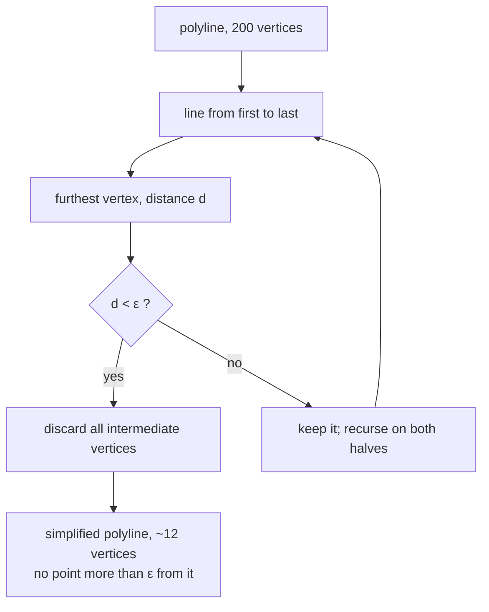

# Ramer–Douglas–Peucker simplification

Reducing a polyline to fewer points while keeping its shape, by recursively
discarding every vertex that is close enough to the line between its neighbours.

## What it is

A traced contour has hundreds of vertices, most of which sit on nearly straight
runs and carry no information. RDP removes them.

The algorithm is a divide-and-conquer:

1. Draw a line from the first vertex to the last.
2. Find the vertex furthest from that line.
3. If its distance is below a tolerance **ε**, discard every vertex in between —
   the straight line represents them well enough.
4. Otherwise keep that vertex, and recurse on the two halves it creates.

The guarantee is exactly what you want: **no original point is further than ε
from the simplified line.** It is a bounded-error approximation, not a
heuristic smoothing.

ε is the only parameter, and it has units — distance. Setting it well means
knowing what "close enough" means for the consumer.

## The picture



On a traced stone outline:

```
original:    ·············································   187 points
                (most on nearly straight runs)

ε = 1.2% of perimeter:
simplified:  ·      ·      ·       ·      ·      ·          14 points
                (the corners that actually define the shape)
```

## Where this project uses it

`poggio_webapp/pipeline/detect_features.py`, at the point a candidate becomes
storable output:

```python
epsilon = 0.012 * perimeter
approximated_contour = cv2.approxPolyDP(
    contour,
    epsilon,
    True,
)

inverse_scale = 1.0 / scale

points = [
    [
        round(float(point[0][0]) * inverse_scale, 1),
        round(float(point[0][1]) * inverse_scale, 1),
    ]
    for point in approximated_contour[:80]
]
```

Four decisions in five lines.

**ε as a fraction of perimeter**, not a pixel constant. `0.012 × perimeter`
means the tolerance scales with the object: a small stone is simplified gently,
a large one more aggressively, and both keep roughly the same *proportional*
fidelity. A fixed pixel ε would over-simplify small features into triangles.

**`True`** — the polyline is closed, so the algorithm treats it as a loop rather
than an open curve.

**`inverse_scale`** maps the points back from the downsampled analysis image to
full-resolution coordinates. See
[multi-scale analysis](multi-scale-analysis.md).

**`[:80]`** — a hard cap on stored vertices. Simplification usually brings a
contour well under this, and a pathologically wiggly one would not be allowed to
bloat the job's JSON. It is a bound on the *output contract*, not on the
algorithm.

Note the ordering. Simplification happens **after** all the shape measures —
[area](contour-area-and-perimeter.md), [perimeter](contour-area-and-perimeter.md),
[circularity](circularity.md), [solidity](solidity.md) — have been computed on
the full contour. Measuring first and simplifying second means the filter's
decisions are made on the real geometry, and only the stored representation is
approximate.

`detect_markers.py` does not use RDP at all: a marker is stored as a single
centre point, so there is no polyline to simplify.

## Why this and not something else

The goal is a polygon compact enough to store in JSON and draw in a browser,
faithful enough that a reviewer recognises the shape they are approving.

| Alternative | How it would work here | Why it lost |
|---|---|---|
| **Store every contour point** | No simplification | Hundreds of points per feature, times up to 250 features, in a JSON file the browser parses on every page load — for detail invisible at review zoom. |
| **Uniform subsampling** | Keep every Nth point | Trivial, and shape-blind: it discards a sharp corner and keeps points along a straight run with equal enthusiasm. RDP keeps exactly the points that carry the shape. |
| **RDP** *(chosen)* | Recursive furthest-point elimination | Bounded error, one parameter with a clear meaning, and it preserves corners — which is what makes a simplified stone still look like that stone. |
| **Visvalingam–Whyatt** | Repeatedly remove the vertex forming the smallest triangle | Often produces more natural-looking results, especially on smooth curves, and is preferred in cartography. Its parameter is an *area*, which is less intuitive here than a distance, and it has no per-point error bound. |
| **Curve fitting (splines, Bézier)** | Fit smooth curves through the points | Compact and smooth, and it introduces geometry that was never traced — a smoothed outline is a *claim* about the shape. On a project that separately hunts for [fabricated geometry](fabrication-detection.md), an approximation whose every point lies within a stated tolerance of real data is a much better fit than one that invents a curve. |
| **Store a bitmap mask per feature** | Keep the pixels | Exact, and orders of magnitude larger, and not directly drawable as an SVG overlay. |

The deciding property is the **error bound**. RDP lets the code state precisely
what was given up: no stored point is further than 1.2% of the perimeter from
the traced outline. A spline fit cannot make that promise.

## What it costs

O(n log n) on average, O(n²) worst case for a pathological polyline. Contour
vertex counts are already small — `CHAIN_APPROX_SIMPLE` collapsed straight runs
during [tracing](contour-tracing.md) — so this is one of the cheaper steps.

The cost is fidelity, bounded and stated. Since features are **proposals a human
reviews and can adjust**, a small geometric approximation is acceptable in a way
it would not be for [marker](../workflows/03-markers-and-features.md)
coordinates, which pass through the pipeline verbatim and are never simplified.

Two representations, two fidelity requirements, two different decisions — the
same split as [downsampling](area-averaging-downsampling.md) between the two
detectors.

## Where else you meet it

- **Map rendering.** Every zoom-dependent coastline simplification; GeoJSON
  pipelines use RDP or Visvalingam constantly.
- **GPS track compression** in fitness and navigation apps.
- **`svgo`** and other SVG optimisers, reducing path point counts.
- **Animation**, simplifying motion-capture curves.
- **Data visualisation**, downsampling long time series for plotting.
- **Robotics**, simplifying planned paths into fewer waypoints.

## Related pages

- [Contour tracing](contour-tracing.md) — produces the polyline.
- [Multi-scale analysis](multi-scale-analysis.md) — why the points are scaled
  back.
- [Linear interpolation](linear-interpolation.md) — the straight-line model RDP
  measures error against.
- [Polygon self-intersection](polygon-self-intersection.md) — a property
  simplification can, in principle, introduce.
- [Markers, features, and finds](../concepts/markers-features-and-finds.md) —
  why feature geometry tolerates approximation and marker geometry does not.
