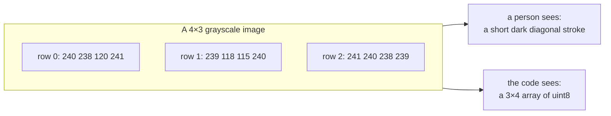

# Raster images and pixels

A scan is a grid of numbers. Everything this project does to a drawing starts
by accepting that, and ends by escaping it.

## What it is

A raster image is a rectangular grid of *pixels*. Each pixel holds one number
per colour channel, describing how much light was recorded at that spot. There
is no line, no circle, no boundary in the file: only a grid of intensities
that a human eye assembles into a drawing.

Two facts follow, and both shape this repository.

**Pixel coordinates are not measurements.** A pixel index says "column 1420,
row 883." It says nothing about metres. Converting one to the other requires an
external fact (a known real distance between two identifiable points), which
is what [calibration](../archaeology/index.md) supplies.

**The row axis points down.** By near-universal convention the origin is the
*top-left* corner and `y` increases downward. This happens to suit
archaeological sections, where depth also increases downward, and the project
leans on that coincidence deliberately.

## The picture



The dark stroke a person recognises is, to the program, three numbers that
happen to be lower than their neighbours. Every technique in
[edges, lines, and contours](canny-edge-detection.md) exists to turn the second reading into
the first.

## Where this project uses it

The transition from grid to geometry happens in exactly one place per path. In
`poggio_webapp/pipeline/manual_extraction.py`:

```python
def convert(self, point):
    px, py = float(point[0]), float(point[1])
    dx, dy = px - self.origin_x, py - self.origin_y
    x_m = (dx * self.ux + dy * self.uy) / self.px_per_m
    depth_m = (dx * self.vx + dy * self.vy) / self.px_per_m
    return round(x_m, 4), round(depth_m, 4)
```

Above that line everything is pixels; below it everything is metres. The
project treats that boundary as a real one. See
[coordinate spaces](../concepts/coordinate-spaces.md), which names three
distinct spaces a point can be correct in.

Traced points keep their origin, so nothing is lost by converting:

```python
point = {
    "xMeters": x,
    "depthMeters": max(0.0, depth),
    "confidence": "human-traced",
    "sourcePixel": [pixel_x, pixel_y],  # the grid position it came from
}
```

`sourcePixel` lets the browser overlay redraw a boundary at the exact pixel it
was clicked, rather than round-tripping through metres and accumulating error.

## Why this and not something else

The alternative to raster is *vector*: store the drawing as a list of strokes
rather than a grid of samples.

| Alternative | How it would work here | Why it lost |
|---|---|---|
| **Vector source (SVG, DXF, PDF paths)** | Ask the illustrator for the original vector artwork and read the paths directly | Would be strictly better where it exists: no detection needed at all. But the sources are a 1980 pen-and-ink sheet and a phone photograph of graph paper. Neither has vectors to recover. A PDF here is a *scan* wrapped in PDF, so `pdf2image` rasterises it back. |
| **Photogrammetry / point cloud** | Photograph the trench wall itself and reconstruct 3D geometry | Answers a different question. This project's inputs are *drawings*, including archival ones from excavations backfilled decades ago. The wall is gone; the drawing is the evidence. |
| **Manual data entry from the sheet's own numbers** | Type the coordinates the recorder wrote down | Where a sheet carries a full coordinate table this is more accurate than any image processing. It is not what these sheets carry. They carry a drawing plus tie labels. |

Raster is not a choice the project made; it is the format the evidence arrived
in. What the project chooses is how quickly to leave it.

## What it costs

| | |
|---|---|
| Memory | width × height × channels × bytes-per-channel. A 4284 × 5712 colour photo at 8 bits is ~73 MB in memory, decoded. |
| A 2× upscale | four times the memory, four times the per-pixel work downstream |

That cost is the reason `detect_features.py` analyses a copy capped at 2200 px
and maps results back (see [multi-scale analysis](multi-scale-analysis.md)), and the reason
extraction caps the longest side at 3072 px before sending an image anywhere.

## Where else you meet it

- Every photograph, screenshot, and scan you have ever opened.
- Medical imaging: a CT slice is the same grid with different units.
- Satellite and aerial imagery, where the pixel-to-ground conversion is
  called georeferencing and is exactly this project's calibration problem at
  planetary scale.
- Game textures and framebuffers: the screen itself is a raster.

## Related pages

- [Colour spaces and channels](colour-spaces-and-channels.md): what the
  numbers in each pixel mean.
- [Bit depth and dynamic range](bit-depth-and-dynamic-range.md): how many
  distinct values a pixel can hold.
- [Similarity transforms](similarity-transforms.md): the arithmetic that
  leaves pixel space.
- [Coordinate spaces](../concepts/coordinate-spaces.md): the three spaces a
  point can live in here.
