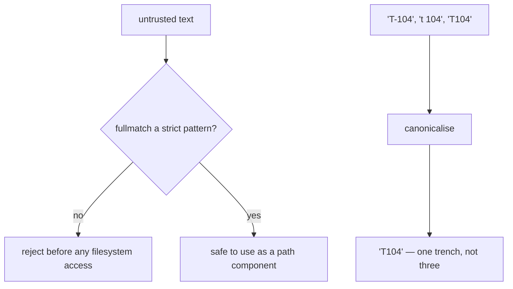

# Regular expressions

A compact language for describing text patterns. Used here for three distinct
jobs — rejecting unsafe identifiers, canonicalising a label typed three
different ways, and reading a notation off a drawing.

## What it is

A regular expression describes a set of strings. The building blocks used in
this repository:

| Pattern | Matches |
|---|---|
| `[0-9a-f]` | one lowercase hex digit |
| `{12}` | exactly twelve of the preceding |
| `^` `$` | start and end of string |
| `(...)` | a capture group |
| `?:` | a group that does not capture |
| `+` `*` `?` | one-or-more, zero-or-more, optional |

Two Python distinctions that matter for correctness:

- **`fullmatch` vs `match`.** `match` anchors only at the start, so
  `re.match(r"[0-9a-f]{12}", "abc123abc123../../etc")` **succeeds**.
  `fullmatch` requires the whole string. Every identifier validator here uses
  `fullmatch` or an explicit `^…$`.
- **Compile once.** Module-level `re.compile` avoids recompiling on every call
  and puts the pattern where it can be commented.

## The picture



## Where this project uses it

### Validating identifiers before they touch the filesystem

`poggio_webapp/backend/harris_store.py`:

```python
_MATRIX_ID = re.compile(r"[0-9a-f]{12}")


def _validate_matrix_id(matrix_id: str) -> str:
    if not isinstance(matrix_id, str) or _MATRIX_ID.fullmatch(matrix_id) is None:
        raise InvalidMatrixIdError(
            "Matrix ID must be exactly 12 lowercase hexadecimal characters."
        )
    return matrix_id
```

The order is the point: **validate, then touch the disk.** The check happens
before `_matrix_path()` is ever called, so a traversal attempt never reaches a
path join. `harris_import._validate_job_id` does the same for job IDs.

That is the discipline the `/api/jobs/<job_id>/file` route lacked before it was
fixed — see [path traversal and containment](path-traversal-and-containment.md).

A regex is also the filter for *discovery*, so a stray directory cannot be
mistaken for a matrix:

```python
if (
    not matrix_directory.is_dir()
    or _MATRIX_ID.fullmatch(matrix_directory.name) is None
):
    continue
```

### Canonicalising a label typed three ways

`poggio_webapp/naming.py`:

```python
# "T104", "T-104", "t 104", "CA 100" -> letters + digits, no separator.
# Property abbreviations are short (T, CA); four characters is generous.
_TRENCH_SHAPE = re.compile(r"^([A-Za-z]{1,4})[\s._-]*(\d+)$")

# "5", "Locus 5", "locus5" -> "5".
_LOCUS_SHAPE = re.compile(r"^(?:locus\s*)?(\d+)$", re.IGNORECASE)
```

```python
def canonical_trench(value) -> str:
    label = clean_label(value)
    match = _TRENCH_SHAPE.match(label)
    if not match:
        return label
    letters, digits = match.groups()
    return f"{letters.upper()}{digits}"
```

Two decisions worth naming.

**A non-match returns the input unchanged**, and the docstring says why:

> Only a label that actually looks like an identifier is rewritten. Anything
> else comes back merely stripped, because a label this function does not
> recognise is more likely to be something it should not be mangling than a
> misspelt trench.

A canonicaliser that mangles what it does not understand is worse than one that
declines.

**Digits are preserved exactly** — `T007` does not become `T7` — because
collapsing a leading zero would only ever change a label nobody meant to write.

The stakes are concrete. `trench_builder.grouped_members` groups jobs by this
exact string, so `T-104` and `T104` would build two half-trenches, each a
confident model of half a pit.

### Parsing the site's own identifier formats

`poggio_webapp/pipeline/site_vocab.py` encodes the formats from Poggio
Civitate's recording standards:

```python
_MATERIAL_PART = r"[A-Za-z](?:-[A-Za-z]+)?"
_SPECIAL_FIND = re.compile(
    r"^sf-([A-Za-z]{1,4}\d+)-(\d{4})-(\d+)-(\d+)$", re.IGNORECASE
)
_BULK_FIND = re.compile(
    rf"^bf-([A-Za-z]{{1,4}}\d+)-(\d{{4}})-(\d+)-({_MATERIAL_PART})$",
    re.IGNORECASE,
)
_CATALOGUED = re.compile(r"^(pc|vdm)\s*(\d{4})(\d{4})$", re.IGNORECASE)
```

`re.IGNORECASE` is not laxness — the module docstring records the reason:

> hand-written tags use lowercase (`sf-t108-2024-2-2`) while the Kobo form
> examples use the canonical trench spelling (`sf-T111-2025-1-1`). Both name
> the same find, so parsing is case-insensitive and construction emits the
> canonical form.

Parse permissively, emit canonically — the postel-style split, applied to an
identifier that exists on paper tags as well as in a database.

Note `_MATERIAL_PART` is composed into `_BULK_FIND` with an f-string, and the
literal braces are doubled (`{{1,4}}`). Building patterns from named parts keeps
each piece explainable.

### Reading a notation off a drawing

`poggio_webapp/static/shared/munsell-color.js`:

```javascript
const chromatic = normalized.match(
  /(?:^|[\s_(])(\d+(?:\.\d+)?)\s*(YR|GY|BG|PB|RP|R|Y|G|B|P)[\s_]+(\d+(?:\.\d+)?)\s*(?:\/|[\s_])\s*(\d+(?:\.\d+)?)(?=$|[\s_)])/,
);
```

Deliberately **not** anchored, because the notation is embedded in a longer
label like `Locus 2 (10YR 5/6 yellowish brown)`. Instead it uses a leading
boundary alternation and a lookahead `(?=$|[\s_)])`, so it matches a whole token
rather than a fragment.

The hue alternation is ordered `YR|GY|BG|PB|RP|R|Y|G|B|P` — **two-letter
families first**. Regex alternation is first-match, so listing `R` before `YR`
would match the `R` of `10YR` and mis-parse every yellow-red reading.

And the pattern only proposes; the ranges are checked afterwards in code:

```javascript
if (
  hueNumber >= 0 && hueNumber <= 10
  && valueNumber >= 0 && valueNumber <= 10
  && chroma >= 0 && chroma <= 30
) {
```

A regex can match digits but cannot easily express "0 to 10". Splitting
syntax from range is what keeps the pattern readable.

### As a type constraint

`poggio_webapp/pipeline/harris_matrix.py` moves the pattern into the schema:

```python
UnitId = Annotated[str, StringConstraints(pattern=r"^unit-[0-9a-f]{12}$")]
```

so no function has to check it. See
[JSON and schema design](json-schema-design.md).

## Why this and not something else

| Alternative | How it would validate an ID | Why it lost |
|---|---|---|
| **Manual character checks** | `len(s) == 12 and all(c in "0123456789abcdef" for c in s)` | Equivalent and correct, and it scatters the format across several statements instead of stating it once. |
| **A parser combinator or grammar** | A formal grammar | Warranted for a nested language. These are flat, fixed-shape identifiers. |
| **`str.split` and index** | `parts = text.split("-")` | Works for `sf-T111-2025-1-1` and gets fragile fast: it cannot express "1–4 letters then digits", and the bulk-find material part contains its own hyphen (`O-Slag`), which splitting would break. |
| **`fnmatch` / glob** | `sf-*-*-*-*` | No character classes, no repetition counts, no capture. |
| **Compiled regex with `fullmatch`** *(chosen)* | One pattern, one commented line | The format is stated in one place, anchored by construction, and the groups fall out for free. |

The recurring discipline is **anchoring**. Every validator here uses `fullmatch`
or explicit `^…$`; the only unanchored pattern is the Munsell reader, where
matching inside a longer string is the requirement, and it compensates with
boundary alternation and a lookahead.

## What it costs

Compiled patterns match in linear time for these shapes. Compilation happens
once at import.

The costs:

- **Catastrophic backtracking** is the classic regex hazard — nested quantifiers
  like `(a+)+` can go exponential, and a user-supplied string then becomes a
  denial of service. None of the patterns here has nested quantifiers.
- **`match` versus `fullmatch` is a real trap**, and the difference is a
  security boundary for the ID validators.
- **Readability.** The Munsell pattern is long enough to need its docstring:
  *"Read standard chromatic notation such as `10YR 5/3`, neutral notation such
  as `N 5/`, or notation embedded in a locus/surface label."*
- **Alternation order matters** and is invisible unless you know to look.

## Where else you meet it

- **Input validation** in every web form and API.
- **Log parsing and `grep`**, the original use.
- **Syntax highlighting and linters**, including `ruff`'s own rules.
- **URL routing** — Flask's `<job_id>` converter compiles to one.
- **Data cleaning**, where canonicalising inconsistently typed identifiers is
  exactly `canonical_trench`'s job at scale.

## Related pages

- [Path traversal and containment](path-traversal-and-containment.md) — why
  validation precedes filesystem access.
- [Input sanitisation](input-sanitisation.md) — the wider discipline.
- [JSON and schema design](json-schema-design.md) — patterns as type
  constraints.
- [Content-addressed identifiers](content-addressed-identifiers.md) — the ID
  format being validated.
- [Find identifiers](../archaeology/find-identifiers.md) — what the site's
  formats mean.
