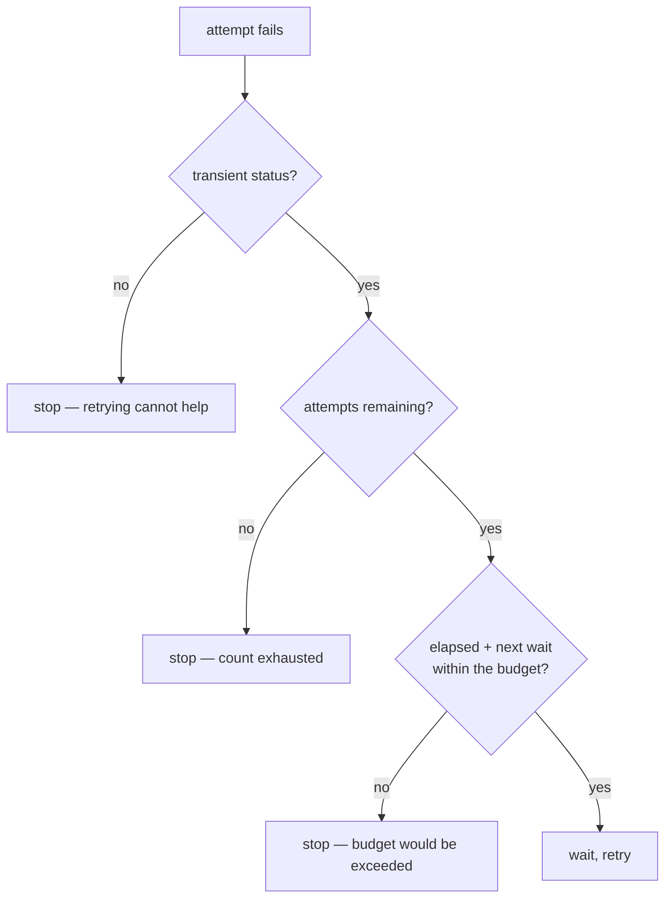

# Retry budgets

Bounding retries by what they *cost*, not only by how many there are. When each
attempt spends the user's metered quota, an attempt count is the wrong limit.

## What it is

The usual retry bound is a count: try five times, then give up. That is right
when a retry is free.

When a retry costs something — money, quota, a multi-megabyte upload, the user's
time — the count alone is insufficient. Five attempts against a fast-failing
service is 15 seconds; five against a service that times out after two minutes
each is ten minutes and five full image uploads.

A **budget** bounds the total instead. Usually wall-clock, sometimes a token or
currency allowance. Both bounds run together: stop at whichever is reached first.

The subtler part is **looking ahead**. Checking "have I exceeded the budget?"
after sleeping means the sleep was wasted. Checking "would the *next* wait exceed
it?" stops before spending anything more.

## The picture



Three independent reasons to stop, evaluated together.

## Where this project uses it

`poggio_webapp/pipeline/_extract_common.py`:

```python
def generate_with_retry(client, progress_cb=None, max_attempts=5,
                        max_total_seconds=600, **kwargs):
    """...
    max_total_seconds caps the whole retry loop's wall clock. Every retry
    re-sends the full image as input tokens, so an outage at Google's end
    shouldn't be allowed to quietly spend the user's quota five times over —
    past the budget we stop and tell them, rather than keep paying to fail."""
    t0 = time.time()
    for attempt in range(max_attempts):
        try:
            return client.models.generate_content(**kwargs)
        except errors.ServerError as e:
            code = getattr(e, "code", None)
            wait = 2 ** attempt
            elapsed = time.time() - t0
            out_of_budget = elapsed + wait > max_total_seconds
            if (code in TRANSIENT_STATUS_CODES
                    and attempt < max_attempts - 1 and not out_of_budget):
                ...
                time.sleep(wait)
            else:
                if progress_cb and code in TRANSIENT_STATUS_CODES:
                    progress_cb(f"giving up after {attempt + 1} attempt(s) / "
                                f"{elapsed:.0f}s — not retrying further to "
                                "avoid spending more quota on a failing "
                                "request.")
                raise
```

The docstring states the cost model explicitly: **"Every retry re-sends the full
image as input tokens."** That single fact is why an attempt count is not
enough — a request that spends 30 seconds uploading before failing costs far
more than one that fails instantly, and only a wall-clock bound distinguishes
them.

**`elapsed + wait > max_total_seconds`** is the look-ahead. Sleeping eight
seconds and *then* discovering the budget is spent would waste the user's time
to learn nothing.

**The give-up message explains the reasoning**, not just the outcome: "not
retrying further to avoid spending more quota on a failing request." A user who
sees that understands the decision rather than reading it as a bug.

### The manual retry budget

The automatic budget stops the machine. `poggio_webapp/backend/errors.py` then
addresses the human, who has their own retry loop:

```python
if code in (504, 503, 500, 502):
    return (
        f"Gemini's servers failed with a {code} on every retry attempt. "
        "This is a problem on Google's side, not with your scan or this "
        "app. What to do: (1) wait 15–30 minutes and try once more — "
        "don't hammer re-run, each attempt re-sends the whole image and "
        "uses your quota; (2) if it persists, check Google's status at "
        "https://status.cloud.google.com and the AI Studio forum; "
        "(3) as a workaround, shrink the request — lower "
        "max_output_tokens, or reduce MAX_SEND_DIMENSION in the "
        "extraction module. If it still fails after a day, report it "
        "on this project's issue tracker with the log above."
    )
```

"Don't hammer re-run" is a retry budget expressed as advice — and it gives the
same reason the code gives itself.

The quota case goes further and says retrying is *pointless*:

```python
if code == 429:
    return (
        "Gemini says your API key is out of quota (429). Retrying will "
        "not help until the quota resets. ..."
    )
```

429 is in `TRANSIENT_STATUS_CODES`, so the machine does retry it — a 429 can be
a momentary rate limit rather than an exhausted daily cap. But once the retries
are spent, the human is told the distinction and told not to repeat them.

## Why this and not something else

| Alternative | How it would bound retries | Why it lost |
|---|---|---|
| **Attempt count only** | "Five tries" | The standard bound, and it ignores duration. Five attempts against a service timing out after two minutes each is ten minutes and five full uploads. |
| **Wall clock only** | "Ten minutes" | Bounds cost, and permits hundreds of fast retries in that window against a service returning instant 503s. |
| **Both, checked after the wait** | Elapsed time compared post-sleep | Correct outcome, wasted sleep. |
| **Both, with look-ahead** *(chosen)* | Count, plus `elapsed + wait` | Stops before spending anything further, and reports both numbers to the user. |
| **Token or currency budget** | Count actual API spend | The most direct measure of what is being conserved, and it needs per-request cost accounting the SDK does not readily expose. Wall clock is the available proxy. |
| **Circuit breaker** | Stop calling entirely after N failures | The right pattern for a service called continuously. Extraction is user-initiated and occasional, so there is no ongoing call rate to break. |

The generalisable point: **bound the resource that is actually scarce.** Here
that is API quota and the user's patience, neither of which an attempt count
measures. Naming the real constraint in the docstring is what lets a later
maintainer adjust the right number.

## What it costs

Two extra comparisons per attempt.

The costs:

- **The budget can cut short a retry that would have succeeded.** 600 seconds is
  generous; a genuinely slow recovery is sacrificed to bounding the spend. A
  deliberate trade, and stated.
- **Wall clock is a proxy for cost**, not a measurement. A fast expensive request
  and a slow cheap one are treated alike.
- **The user's manual retries are unbounded.** Nothing prevents clicking re-run
  twenty times; the only defence is the error message asking them not to. A rate
  limit on the route would be stronger, and would also block legitimate use of a
  local single-user tool.
- **`time.time()` is wall clock**, so a system clock adjustment mid-retry
  distorts the budget. `time.monotonic()` would be the strictly correct choice.
  Irrelevant in practice over a ten-minute window, and worth knowing.

## Where else you meet it

- **Google's SRE practice**, where client-side retry budgets are standard —
  capped as a fraction of total requests to prevent retry storms.
- **Envoy and Istio**, which implement retry budgets as a first-class
  configuration.
- **Circuit breakers** (Hystrix, resilience4j), the related pattern for
  continuous call rates.
- **CI systems**, which cap total job time rather than only step count.
- **Cloud cost controls**, where a spend limit stops runaway automation.

## Related pages

- [Exponential backoff](exponential-backoff.md) — the retry strategy this bounds.
- [Error taxonomies](error-taxonomies.md) — transient versus permanent, and the
  user-facing translation.
- [Fail-closed design](fail-closed-design.md) — what happens after the budget is
  spent.
- [Troubleshooting](../reference/troubleshooting.md) — the messages a user sees.
