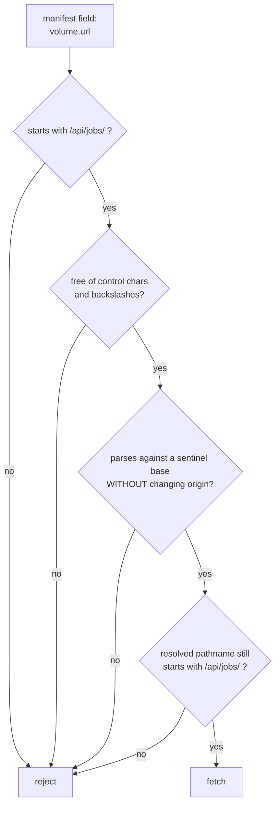

# Same-origin URL validation

Checking that a URL from a data file points back at this application before
fetching it. Otherwise a manifest becomes a way to make the browser talk to
somewhere else.

## What it is

A JSON document that carries a URL is a document that can *direct* the code
reading it. If the browser fetches whatever the field contains, the file's author
controls where the request goes.

The risks:

- Exfiltration. A URL pointing at another host makes the browser send a
  request there, carrying cookies, a referrer, and the fact that this user has
  this file.
- Injection. `javascript:` and `data:` URLs can execute.
- Server-side request forgery, when the fetch happens on the server rather
  than in the browser.

The defence is to require the URL to be **same-origin** and to match the
expected shape, rather than merely to be well-formed.

The subtlety is that `new URL(value, base)` is *permissive*: it resolves relative
paths, accepts schemes, and normalises `..`. Parsing alone proves nothing.

## The picture



## Where this project uses it

`poggio_webapp/static/visualizer/volume3d-core.mjs`:

```javascript
function validatedVolumeUrl(value) {
  const expected = "volume.url must be a same-origin /api/jobs/ URL";
  if (
    typeof value !== "string"
    || value.trim() !== value
    || !value.startsWith("/api/jobs/")
    || /[\u0000-\u0020\\]/u.test(value)
  ) {
    throw new TypeError(expected);
  }

  let parsed;
  try {
    parsed = new URL(value, "https://volume.invalid");
  } catch {
    throw new TypeError(expected);
  }
  if (
    parsed.origin !== "https://volume.invalid"
    || !parsed.pathname.startsWith("/api/jobs/")
  ) {
    throw new TypeError(expected);
  }
  return value;
}
```

Four layers, each closing something the previous cannot.

**`value.trim() !== value`** rejects leading or trailing whitespace. Browsers
strip whitespace when resolving URLs, so `" //evil.com"` would resolve to a
protocol-relative URL pointing elsewhere, while failing a naive
`startsWith("/api/jobs/")` check only *before* trimming. Requiring the string to
be already-trimmed removes the discrepancy.

**`startsWith("/api/jobs/")`** is a cheap prefix check on the raw string. It
alone is insufficient (`/api/jobs/../../evil` passes it), which is why it is not
the last word.

**`/[\u0000-\u0020\\]/u`** rejects control characters, spaces, and
**backslashes**. Backslash matters: some parsers treat `\` as `/`, so
`/api/jobs/\\evil.com` can be read as a host in one context and a path in
another. Excluding it removes the ambiguity entirely.

**Parsing against a sentinel base** is the clever part.
`https://volume.invalid` is a base that cannot exist: `.invalid` is reserved by
RFC 2606 for exactly this. Resolving the value against it and then checking that
the origin is *unchanged* proves the value did not specify its own origin. An
absolute URL, a protocol-relative `//evil.com`, or a `javascript:` scheme all
change the origin and are caught.

**Re-checking `parsed.pathname`** after resolution catches traversal:
`/api/jobs/../../x` has a raw prefix of `/api/jobs/` but a *resolved* pathname of
`/x`. Checking the normalised form is the same principle as
[path containment](path-traversal-and-containment.md): compare the resolved
value, not the input.

### The server side of the same contract

The URLs in the manifest are built by the server, from paths it has already
contained. From `poggio_webapp/backend/services/viewer_files.py`:

```python
def _resolve_manifest_artifact(manifest_directory, job_directory, path_str):
    if not isinstance(path_str, str) or not path_str:
        return None
    relative = Path(path_str)
    if relative.is_absolute() or ".." in relative.parts:
        return None
    candidate = (manifest_directory / relative).resolve()
    if not _is_within(candidate, job_directory) or not candidate.is_file():
        return None
    return candidate
```

and only then turned into a URL:

```python
volume["url"] = rel_url(job_id, volume_path)
```

So the browser's check is **defence in depth**: the server already validated the
path, and the browser validates the URL anyway. Neither trusts the other, which
is the same posture as the
[binary format contract](binary-serialisation.md) asserted on both sides.

## Why this and not something else

| Alternative | How it would validate `volume.url` | Why it lost |
|---|---|---|
| **Trust the manifest** | Fetch whatever is there | The manifest is a file on disk, which can be edited. A JSON field becomes a way to direct the browser. |
| **`startsWith("/api/jobs/")` only** | Prefix check | Defeated by `/api/jobs/../../x`, by leading whitespace, and by backslash ambiguity. |
| **Regex on the raw string** | Match an expected shape | Better, and it validates the *input* rather than the *resolved* value. Normalisation happens after the check. |
| **`new URL(value)` and inspect** | Parse, then check the host | The right instinct, and a relative URL throws without a base, so a base is needed, and the sentinel-base trick is what makes the origin check meaningful. |
| **A Content Security Policy** | Browser-enforced connect-src | Genuinely strong and complementary. It is a deployment concern rather than an application one, and this app is served from a local Flask process with no CSP configured. |
| **Layered: shape, characters, sentinel-base origin, resolved path** *(chosen)* | Four checks | Each closes a distinct bypass, and the failure message is one clear sentence. |

The generalisable lesson is the one shared with
[path traversal](path-traversal-and-containment.md): **validate the resolved
form, not the input form.** A prefix check on a string that has not been
normalised is checking something the consumer will never see.

## What it costs

One URL parse and three string tests. Microseconds, once per load.

The costs:

- It is strict. Only `/api/jobs/` URLs are accepted, so serving the volume
  from a CDN would require changing this function. Correct: that change should
  be deliberate.
- The sentinel base is non-obvious. `https://volume.invalid` reads as a
  mistake until you know the technique. The error message and the `.invalid`
  reservation are the clues.
- It cannot verify the content. A same-origin URL can still return the wrong
  file, which is why the [decode](binary-serialisation.md) separately checks
  length and shape.
- Only this one URL is validated. Mesh and lithology URLs come from the same
  manifest and are validated server-side rather than in the browser. Defensible
  (the server built them from contained paths), and an asymmetry worth knowing
  about.

## Where else you meet it

- The same-origin policy itself, the foundation of browser security.
- Open redirect vulnerabilities, where a `?next=` parameter sends a user to
  an attacker's site: the identical failure to trust a URL from data.
- Server-side request forgery, where a server fetches a URL from user input
  and reaches internal services.
- OAuth redirect URI validation, which must be an exact allowlist match for
  the same reason.
- Content Security Policy, which enforces this at the browser level rather
  than in application code.

## Related pages

- [Path traversal and containment](path-traversal-and-containment.md): the same
  principle for filesystems.
- [Validation at trust boundaries](validation-at-trust-boundaries.md): where
  this sits.
- [Binary serialisation](binary-serialisation.md): the contract on the fetched
  bytes.
- [Input sanitisation](input-sanitisation.md): the wider discipline.
