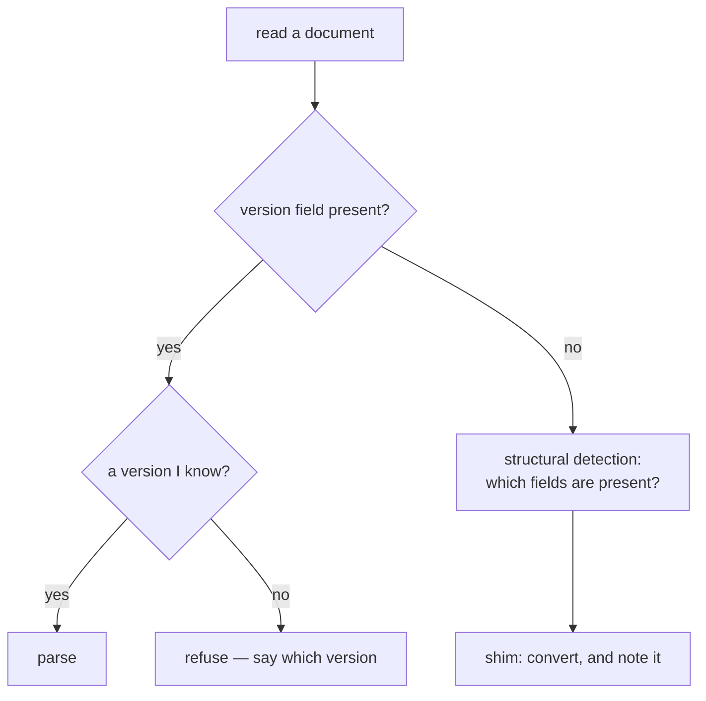

# Schema versioning

Stamping data with the shape it was written in, so a reader can tell whether it
understands the file. The alternative is a reader that misinterprets a future
format confidently.

## What it is

Data outlives the code that wrote it. A job directory saved this year will be
opened by next year's version. Three strategies:

**Version field.** The document declares its schema version; the reader checks
it and refuses what it does not know.

**Structural detection.** Infer the shape from which fields are present. Works
for data written before any version field existed.

**Compatibility shims.** Accept an old shape, convert it, and say so.

They are complementary, and this repository uses all three — for data of
different ages and different provenance.

The hardest decision is what to do with a **newer** version. Refusing is safe and
inconvenient; guessing is convenient and can silently misread.

## The picture



## Where this project uses it

### A literal version, pinned by the type

`poggio_webapp/pipeline/harris_matrix.py`:

```python
class HarrisMatrix(_HarrisModel):
    schema_version: Literal[1]
    matrix_id: MatrixId
    revision: NonNegativeInteger
    ...
```

`Literal[1]` — not `int`. A document declaring version 2 fails Pydantic
validation immediately, with a message naming the field. The refusal is in the
type, so no function has to check it.

Note the two different numbers: `schema_version` is the *shape*,
`revision` is the [edit count](optimistic-concurrency-control.md). Conflating
them would make a shape change look like an edit.

### Version plus format declarations, in the viewer manifest

`poggio_webapp/pipeline/build_gempy.py` writes:

```python
manifest = {
    # 2 adds surfaces[].label. A version 1 manifest has no labels and is
    # still valid: the viewer falls back to the surface name, which is what
    # it always displayed.
    "schema_version": 2,
    "kind": "gempy-surface-model",
    "coordinate_system": {"units": "m", "up_axis": "Z"},
    ...
}
```

and separately for the volume:

```python
manifest["volume"] = {
    "schema_version": 1,
    "format": "raw",
    "dtype": "uint16-le",
    "layout": "C",
    "axes": ["x", "y", "z"],
    ...
}
```

Two independently versioned sub-documents, because the surface model and the
volume can evolve separately — and they have: the manifest is at 2 (labels
added), the volume still at 1.

The reader checks strictly — `poggio_webapp/backend/services/viewer_files.py`:

```python
type(manifest.get("schema_version")) is int
and manifest["schema_version"] == 1
and manifest.get("kind") == "gempy-surface-model"
```

`type(...) is int` rather than `isinstance` because `bool` subclasses `int` and
`True == 1`. Without that, `{"schema_version": true}` would pass.

As of this writing the sides disagree: the writer stamps 2 and the browser's
`model3d-core.mjs` accepts `[1, 2]`, but this backend check still pins `== 1`,
so a freshly built manifest fails it. The strictness is working as designed;
the pin was not bumped alongside the writer.

And the browser checks again — `volume3d-core.mjs`:

```javascript
if (raw.schema_version !== SUPPORTED_SCHEMA_VERSION) {
    throw new TypeError("volume.schema_version must be 1");
}
if (raw.dtype !== SUPPORTED_DTYPE) {
    throw new TypeError('volume.dtype must be "uint16-le"');
}
```

`kind` is worth noting alongside the version. A version alone says "which
revision of *something*"; `kind` says *what*. Together they mean a reader can
distinguish "a manifest I am too old for" from "not a manifest at all."

### Structural detection, for data with no version field

`poggio_webapp/pipeline/convert_coords.py`:

```python
def is_field_wall(data):
    """True for a FieldWallProfile extraction (T104-style field sheet)."""
    return "trenchProfiles" not in data and ("loci" in data or "layers" in data)
```

and `harris_import._schema_type`:

```python
def _schema_type(document: dict) -> str:
    if isinstance(document.get("trenchProfiles"), list):
        return "ArchaeologicalDiagram"
    if isinstance(document.get("layers"), list) and _FIELD_WALL_FIELDS.intersection(
        document
    ):
        return "FieldWallProfile"
    raise HarrisImportError("Source document has an unsupported extraction schema.")
```

No `schemaType` field is required in the payload. The extraction documents
predate any versioning scheme, and adding a required field would invalidate
every stored job. Structural detection reads what is there.

It still **refuses** what it cannot classify, rather than defaulting.

### Compatibility shims, with a migration note

`poggio_webapp/pipeline/assign_markers.py` accepts a classification made under
an older convention:

```python
# Keep proposals made before the locus-top fix finalizable. New
# classifications never use these two legacy kinds.
elif kind == "surface":
    legacy_surface.append(by_id[mid])
elif kind == "bottom":
    ...
```

and tells the user:

```python
if using_legacy_bottoms:
    warnings.append(
        "finalized a classification made with the old bottom-of-locus "
        "convention; re-run marker assignment to use named locus tops"
    )
```

Saved work is not lost, **and** the user is told the data is in an old shape and
what to do about it. It also refuses to mix the two:

```python
if using_legacy_bottoms:
    warnings.append(
        "classification mixes locus-top and legacy bottom-of-locus "
        "labels — legacy-labelled markers were ignored"
    )
```

`convert_coords.fieldwall_to_profiles` carries the same pattern for a missing
`topBoundary`:

```python
notes.append(
    f"locus {num or i} has no topBoundary — using its bottomBoundary "
    "as a legacy fallback; re-extract to avoid a one-line locus shift"
)
```

A shim that is silent is a trap. A shim that says "this worked, but re-run it"
is a migration path.

## Why this and not something else

| Alternative | How it would handle an unknown version | Why it lost |
|---|---|---|
| **No versioning** | Parse and hope | A future format is misread as the current one. On a lithology volume that means rendering noise as geology. |
| **Version, ignored on read** | Write it, never check it | Documentation, not protection. |
| **Version, refuse mismatches** *(chosen)* | Error naming the expected version | Safe. The cost is that a newer file is unreadable by an older reader, which is the correct failure. |
| **Forward-compatible parsing** | Ignore unknown fields, use known ones | Reasonable for additive changes, and `extra="forbid"` deliberately rejects them — because in this data a new field may *change the meaning* of existing ones. Ignoring it would silently misread. |
| **Migration on read** | Convert old to new automatically | What the shims do for specific known cases. Doing it generally means maintaining every historical shape forever. |
| **Structural detection** *(chosen where no version exists)* | Infer from the fields present | The only option for pre-existing data, and it refuses what it cannot classify. |

The judgement worth extracting is the third row against the fourth. Being strict
about unknown fields is unusual — most systems ignore them for forward
compatibility. Here the data is **archaeological evidence**, and a field whose
absence changes an interpretation is exactly the kind of thing that must not be
silently dropped.

## What it costs

A few bytes per document and a comparison on read.

The costs:

- **Strictness cuts both ways.** A document from a newer version is unreadable
  by an older reader. Intended, and it means a shape change requires thought
  about deployment order.
- **Shims accumulate.** Two legacy paths exist in `assign_markers` today. Each
  is code that must keep working, and the warnings exist to make removal
  eventually possible.
- **Structural detection is fragile.** `is_field_wall` keys on the *absence* of
  `trenchProfiles`, so a future shape carrying both would be misclassified.
- **Bumping a version is a migration**, not a code change — every stored
  document needs converting or the reader needs to accept both.

## Where else you meet it

- **File formats** — PNG chunks, PDF version headers, ELF.
- **Database migrations**, where a schema version table drives the upgrade path.
- **API versioning**, in the URL, a header, or a content type.
- **Protocol negotiation** — TLS version agreement is exactly this.
- **Serialisation frameworks** — Protobuf and Avro build schema evolution into
  the format.

## Related pages

- [JSON and schema design](json-schema-design.md) — the shapes being versioned.
- [Validation at trust boundaries](validation-at-trust-boundaries.md) — where
  the version is checked.
- [Binary serialisation](binary-serialisation.md) — the volume's format
  declarations.
- [Error taxonomies](error-taxonomies.md) — how a version mismatch is reported.
- [Data schemas](../reference/data-schemas.md) — the two extraction formats.
