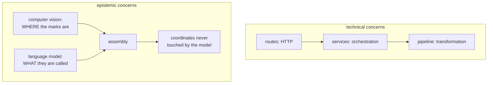

# Separation of concerns

Each piece of code answers one kind of question. In this repository the
principle is applied at an unusual place — between what a machine may decide and
what a person must — and that boundary is the project's central design idea.

## What it is

A **concern** is one axis of responsibility: rendering, persistence, geometry,
validation, HTTP. Separation means each unit addresses one, so it can be
understood, tested, and changed without disturbing the others.

The usual test is a sentence: *"this module does X."* If the sentence needs an
"and", there are probably two modules.

The interesting question is always **which axis to separate along**. The obvious
ones are technical — presentation, logic, storage. This project also separates
along an epistemic axis: *who is entitled to decide this?*

## The picture



## Where this project uses it

### The epistemic separation

`poggio_webapp/pipeline/assign_markers.py` opens by stating the division:

```python
"""assign_markers.py — close the gap detectFieldWallMarkers left open: decide
which locus/boundary each CV-detected marker belongs to.

Division of labor, per the note at the bottom of the original tool:
  - the marker COORDINATES come from computer vision and are immutable —
    they pass through this module verbatim, byte for byte
  - Gemini only CLASSIFIES each fixed point (top boundary of locus N /
    final section base / noise) and reads the sheet's labels (loci Munsell
    colors, tie points, metadata) — a task it did fine on even in the runs
    whose geometry was fabricated
The final FieldWallProfile JSON is then assembled deterministically here,
so there is no path by which the model can invent, move, or drop a vertex:
if it misassigns one, the point is on the wrong boundary but still a real
point from the paper, and the validator's spacing checks stay meaningful.
"""
```

And the separation is **enforced by construction**, not by instruction:

```python
def _assemble(markers, result_dict):
    """Build the FieldWallProfile dict. Coordinates come exclusively from
    `markers`; `result_dict` contributes only labels and classifications.
    Returns (profile_dict, warnings:list[str])."""
```

```python
def pt(m):
    return {"xMeters": m["x_m"], "depthMeters": m["depth_m"],
            "confidence": None}
```

`pt` reads only from `m`, a CV-detected marker. There is no code path by which
`result_dict` can supply a coordinate. The model's schema does not even have a
field for one:

```python
class MarkerAssignment(BaseModel):
    markerId: int
    kind: str
    locusNumber: str | None = None
```

An ID, a category, a label. No geometry. Separating the concerns *in the schema*
is what makes the guarantee structural rather than aspirational. See
[human-in-the-loop review](human-in-the-loop-review.md).

### Separating by *reason*, not just by topic

`poggio_webapp/backend/services/viewer_files.py` is a service rather than a
pipeline module, and explains why:

```python
"""Reading and validating a job's 3D viewer manifest.
...
This was ~300 of the 422 lines in backend/routes/pages.py. It is validation and
path resolution, not routing. It lives in services rather than pipeline because
it builds /api/jobs/<id>/file URLs, which is a web concern.
"""
```

Two boundaries decided in one paragraph: not a route (it is not routing), not
pipeline (it builds URLs). The placement follows from what the code *depends
on*, not from what it is about.

### Geometry with no domain knowledge

`poggio_webapp/pipeline/editor/geometry.py`:

```python
"""Plane-geometry primitives for polygon validation.

Nothing here knows about editors, faces or jobs -- these are orientation,
segment intersection and self-intersection on lists of points.
"""
```

`_polygon_self_intersects` takes a list of dicts with `x` and `y`. It has no
idea what a face is. That is what lets it be tested with three literal points,
and what lets the *same* algorithm exist in `layer-fill.mjs` and
`canvas/grid.mjs` without dragging any domain concept along.

The domain layer sits above and adds meaning:

```python
if _polygon_self_intersects(vertices):
    raise SelfIntersectingPolygonError(
        f'Face "{face_name}" polygon {polygon_id} '
        "self-intersects.")
```

Geometry decides *whether*; the validator decides *what it means* and *how to
say it*.

### Pure logic separated from the DOM

The frontend splits by file extension, which is a separation of concerns encoded
in a naming convention:

- `.mjs` — pure functions, testable under `node --test`
- `.js` — DOM shells that consume them

`coordinates.mjs`, `layer-fill.mjs`, `viewbox.mjs`, `view-mode.mjs`,
`schema-core.mjs`, `model3d-core.mjs`, `volume3d-core.mjs`, `grid.mjs`,
`core.mjs`, `munsell-color.js` — each is arithmetic or validation with no
document access.

That is why **the browser tests run headless**, as plain `node` scripts. See
[pure functions and testability](pure-functions-and-testability.md).

### One blueprint per concern

Seventeen route modules — `scans`, `preprocess`, `extraction`, `markers`,
`features`, `manual`, `processing`, `gempy`, `harris`, `trenches`, `finds`,
`editor`, `jobs`, `pages`, `task_status`, `text_metadata`, `demo`. Each covers
one stage or one entity. See
[blueprint and plugin registries](blueprint-and-plugin-registries.md).

## Why this and not something else

| Alternative | How it would organise marker assignment | Why it lost |
|---|---|---|
| **One module doing detection, classification, and assembly** | A single `extract_markers.py` | The guarantee "the model cannot move a point" would be a code-reading exercise rather than a structural fact. Any future edit could break it silently. |
| **Let the model return geometry, validate afterwards** | Ask for coordinates, check them | This is what was tried, and what failed — the extraction prompt forbade fabrication and fabrication happened anyway. See [fabrication detection](fabrication-detection.md). |
| **Separate by technical layer only** | routes / services / pipeline | Necessary and insufficient. The CV/model boundary cuts *across* those layers and is the one that matters most for trustworthiness. |
| **Separate by feature** | `markers/{detect,assign,assemble}` | Vertical slicing keeps related code together, and here several features share pipeline stages, so horizontal grouping matches the reuse. |
| **Technical layers plus an epistemic boundary** *(chosen)* | Both axes | The layers make it testable; the epistemic split makes it trustworthy. |

The judgement worth extracting: **separate along the axis where a mistake would
be most expensive.** For most software that is change frequency. Here it is
*provenance* — and the resulting boundary is what lets the module claim, and
mean, that no model touched the geometry.

## What it costs

More modules, more files, more imports.

The costs:

- **Indirection.** Marker detection spans `detect_markers`, `assign_markers`,
  two routes, and a browser review step.
- **Boundaries need justifying, repeatedly.** Why is `viewer_files` a service?
  Why is `manual_extraction` pipeline rather than a route? Each is a paragraph
  in a docstring, and each of those paragraphs is a small ongoing cost.
- **Over-separation is real.** Fourteen exception classes in
  `editor/errors.py` is defensible; twenty would not be.
- **Duplication across a language boundary.** The
  [calibration](similarity-transforms.md) exists in Python twice and JavaScript
  once, because the concern spans runtimes. Mitigated by each side pinning its
  arithmetic to fixed expected values in its own tests.

## Where else you meet it

- **MVC and its descendants**, separating presentation from domain.
- **Unix philosophy** — one tool, one job, composed by pipes.
- **CSS versus HTML versus JavaScript**, the classic web separation.
- **Microservices**, which separate along deployment and team boundaries.
- **Editorial and engineering separation** in journalism and in scientific
  publishing — the closest analogue to the epistemic boundary here.

## Related pages

- [Layered architecture](layered-architecture.md) — the technical axis.
- [Human-in-the-loop review](human-in-the-loop-review.md) — the epistemic axis.
- [Pure functions and testability](pure-functions-and-testability.md) — what the
  separation buys.
- [Provenance and data lineage](provenance-and-data-lineage.md) — recording
  which side produced what.
- [Dependency direction and leaf modules](dependency-direction-and-leaf-modules.md) —
  keeping the boundaries acyclic.
