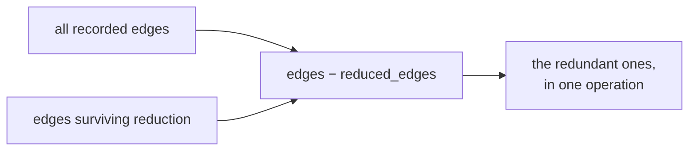

# Sets and membership

An unordered collection with no duplicates and O(1) membership testing. Used
here for allowlists, for "have I seen this," and — most interestingly — for set
*algebra* that expresses an algorithm in one line.

## What it is

A set stores distinct values with no order. Built on the same
[hash table](hash-tables.md) machinery, so:

- `x in s` is O(1)
- adding a duplicate is a no-op
- `|`, `&`, `-`, `^` give union, intersection, difference, and symmetric
  difference — each O(size)

The last point is what makes sets more than a deduplicating list. Whole
algorithms reduce to one operator.

The cost is that **iteration order is unspecified**. Any output derived from
iterating a set is irreproducible unless it is sorted first.

## The picture



## Where this project uses it

### Set difference as the algorithm

`poggio_webapp/pipeline/harris_matrix.py`, where
[transitive reduction](transitive-reduction.md) needs "which edges were
dropped":

```python
reduced_edges = _transitive_reduction_edges(edges)
display_edges = sorted(reduced_edges)

for edge in sorted(edges - reduced_edges):
    warnings.append(_issue(
        "redundant-relation",
        f"Saved relation {edge[0]} -> {edge[1]} is implied by "
        "a longer path and is omitted from display edges.",
        list(edge),
        relation_ids_by_edge[edge],
    ))
```

`edges - reduced_edges` is the entire computation. With lists it would be a
nested loop; with sets it is one operator — and `sorted()` around it restores
determinism for the reported output.

`poggio_webapp/pipeline/merge_walls.py` uses the same idiom to report
correlation keys that matched nothing:

```python
for num in sorted(set(renames) - applied):
    notes.append(f"correlation key {label}:{num} matched no locus on "
                 f"wall {label!r} -- check the map for typos")
```

The `applied` set was built during the rename pass; the difference is exactly
the typos.

And in `merge_walls._validate_sheets`, intersection detects clashes:

```python
listed = set()
...
if num and num in canon and num not in listed:
```

### Allowlists

`poggio_webapp/backend/config.py`:

```python
ALLOWED_SCAN_EXT = {
    ".png",
    ".jpg",
    ".jpeg",
    ".pdf",
    ".tif",
    ".tiff",
}
```

and `poggio_webapp/pipeline/editor/schema.py`:

```python
ALLOWED_SCHEMA_TYPES = {"ArchaeologicalDiagram", "FieldWallProfile"}
EDITOR_ENVELOPE_KEYS = {
    "schemaType", "finalizeState", "gridConfig", "editorState", "resumeState",
}
```

A set literal is the clearest possible expression of "these and nothing else,"
and membership is the check. See [input sanitisation](input-sanitisation.md).

`EDITOR_ENVELOPE_KEYS` is used with intersection to answer a shape question:

```python
def _is_editor_envelope(state) -> bool:
    return (
        isinstance(state, dict)
        and bool(EDITOR_ENVELOPE_KEYS.intersection(state))
    )
```

"Does this payload carry any of the envelope keys?" — one intersection, no loop.

### Seen-tracking

`poggio_webapp/pipeline/harris_import.py`:

```python
imported_job_ids = set(imported_matrix.source_job_ids)
requested_job_ids = set()

for job_id in job_ids:
    job_id = _validate_job_id(job_id)
    if job_id in requested_job_ids:
        continue
    requested_job_ids.add(job_id)
```

Two sets for two different questions: what has already been imported, and what
this request has already handled. Requesting the same job twice in one call is
silently deduplicated rather than double-importing — part of what makes the
operation [idempotent](idempotency.md).

### Frozen sets for constants

`poggio_webapp/pipeline/harris_import.py`:

```python
_FIELD_WALL_FIELDS = frozenset(
    {"faceLabel", "gridSquareCm", "loci", "trenchLabel"}
)
```

`frozenset` is immutable and hashable — the right type for a module-level
constant nobody should mutate. `backend/tasks.py` uses one for the same reason:

```python
_FINISHED = frozenset({"done", "error"})
```

## Why this and not something else

| Alternative | How it would work here | Why it lost |
|---|---|---|
| **List with `in`** | `if ext in ALLOWED_LIST` | O(n) per check instead of O(1), and it permits duplicates that mean nothing. For a six-element extension list the speed is irrelevant; the *intent* is not — a set says "membership is the only question." |
| **Nested loops for difference** | `[e for e in edges if e not in reduced]` | O(n·m) instead of O(n), and it buries a one-line idea in a comprehension. |
| **Sorted list with `bisect`** | O(log n) membership, ordered | Keeps order for free, which this codebase values — and it makes every insertion O(n) and the set algebra manual. Sorting at the point of output is cheaper. |
| **Dictionary with dummy values** | `{k: None}` | What a set is, with noise. |
| **Sets, sorted at every output point** *(chosen)* | O(1) membership, one-operator algebra | Fast, expressive, and the ordering concern is handled where order is observable rather than by choosing a slower container. |

## What it costs

O(1) membership, O(size) for the algebra operations, memory roughly 2–3× the
stored elements.

The costs:

- **Unspecified iteration order.** Every place a set's contents reach the user —
  a warning list, a diagram, an error message — this codebase wraps it in
  `sorted()`. Missing one produces output that varies between runs on identical
  input.
- **Elements must be hashable**, so tuples not lists.
- **Sets discard multiplicity.** Where a count matters — how many relations
  assert an edge — `merge_walls` and `harris_matrix` use a
  `defaultdict(list)` instead.

## Where else you meet it

- **SQL** `DISTINCT`, `UNION`, `INTERSECT`, and `EXCEPT` are these operators.
- **Access control**, where permissions are set membership.
- **Feature flags and tag filtering.**
- **Search engines**, where a boolean query is set intersection over posting
  lists.
- **Version control**, where "which files changed" is a set difference.

## Related pages

- [Hash tables](hash-tables.md) — the underlying structure.
- [Determinism and stable sorting](determinism-and-stable-sorting.md) — why
  every observable iteration is sorted.
- [Transitive reduction](transitive-reduction.md) — the set-difference
  algorithm.
- [Input sanitisation](input-sanitisation.md) — allowlists as sets.
- [Idempotency](idempotency.md) — what the seen-tracking sets protect.
