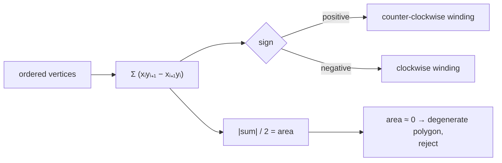

# Shoelace formula

The area of any simple polygon, from its vertices alone, in one pass. Also
called the surveyor's formula — which is apt, given what this project is for.

## What it is

For a polygon with vertices `(x₀,y₀) … (xₙ₋₁,yₙ₋₁)` in order:

```
A = ½ |Σᵢ (xᵢ·yᵢ₊₁ − xᵢ₊₁·yᵢ)|          indices wrap around
```

Each term is twice the signed area of the triangle formed by the origin and one
edge — an [orientation test](signed-area-and-orientation-test.md). Summing them
around the boundary makes the contributions outside the polygon cancel exactly,
leaving the enclosed area.

The name comes from the way the cross-multiplications lace together when the
coordinates are written in two columns.

Two properties matter here:

- **Signed.** Drop the absolute value and the sign tells you the winding
  direction: positive for counter-clockwise, negative for clockwise. That is why
  `cv2.contourArea` can return a negative number.
- **Exact on exact inputs.** Only multiplication, subtraction, and a halving —
  no division by a computed quantity, no square roots.

It requires the polygon to be **simple** — not self-intersecting. On a
self-crossing polygon the overlapping regions cancel, and the result is
meaningless rather than merely inaccurate.

## The picture



A unit square, counter-clockwise:

```
(0,0) (1,0) (1,1) (0,1)

(0·0 − 1·0) + (1·1 − 1·0) + (1·1 − 0·1) + (0·0 − 0·1)
   = 0      +      1      +      1      +     0       = 2
area = |2| / 2 = 1                                    ✓
```

Reverse the order and the sum is −2 — same area, opposite winding.

## Where this project uses it

### Explicitly, to reject degenerate layer fills

`poggio_webapp/static/visualizer/layer-fill.mjs`:

```javascript
function polygonArea(points) {
  return Math.abs(points.reduce((sum, point, index) => {
    const next = points[(index + 1) % points.length];
    return sum + ((point.x * next.y) - (next.x * point.y));
  }, 0)) / 2;
}
```

`(index + 1) % points.length` is the wraparound that closes the polygon. Used as
one of three final validity gates:

```javascript
if (
  polygon.length < 3
  || polygonArea(polygon) <= EPSILON
  || selfIntersects(polygon)
) {
  return null;
}
return polygon.map(({ x, y }) => ({ x, y }));
```

The polygon here is built by joining a layer's top boundary to its bottom
boundary reversed — see [polyline clipping](polyline-clipping.md). If the two
boundaries coincide, or the clipped span collapses, the result has near-zero
area. Returning `null` rather than an invisible degenerate shape is
[fail-closed design](fail-closed-design.md): the layer simply is not filled, instead of the
viewer rendering a sliver that looks like a hairline crack in the section.

Note that the self-intersection test runs alongside, because the shoelace result
is only meaningful on a simple polygon.

### Implicitly, in every contour measurement

`cv2.contourArea` is the shoelace formula. Both detectors rely on it:

```python
# detect_markers.py
area = cv2.contourArea(contour)
if area <= 0 or perimeter <= 0:
    continue
```

```python
# detect_features.py
area = abs(float(cv2.contourArea(contour)))
...
hull_area = abs(float(cv2.contourArea(convex_hull)))
```

The `abs()` in the second is the signed-area property showing through: a
clockwise contour returns a negative number, and every ratio built on it —
[circularity](circularity.md), [solidity](solidity.md),
[extent](extent-and-fill-ratio.md) — would come out negative.

That single `abs()` is a whole class of bug prevented by understanding that the
formula is signed.

## Why this and not something else

| Alternative | How it would compute area | Why it lost |
|---|---|---|
| **Pixel counting** | Count foreground pixels in the region | Equivalent for a filled region, and unavailable when the shape is a *boundary*. `detect_features` works on [Canny](canny-edge-detection.md) edges, where the interior is not foreground; `layer-fill.mjs` works on abstract coordinates with no raster at all. |
| **Triangulate, then sum triangle areas** | Fan or ear-clipping decomposition | Correct and O(n log n) for a general polygon, against O(n) for shoelace. Triangulation is what you need for *rendering*, not for measuring. |
| **Green's theorem numerically** | Integrate around the boundary | The shoelace formula **is** Green's theorem applied to a polygon; the general numeric form would only be needed for curved boundaries. |
| **Monte Carlo sampling** | Throw random points, count hits | Approximate, non-deterministic, and needs a containment test per sample. Against [determinism](determinism-and-stable-sorting.md) as a design requirement. |
| **[Bounding box](bounding-boxes.md) area** | `w × h` | Not the area of the shape at all — and used here deliberately as [extent](extent-and-fill-ratio.md)'s denominator, precisely as a contrast. |
| **Shoelace** *(chosen)* | One pass over the vertices | O(n), exact on exact inputs, gives winding direction for free, works on abstract coordinates as readily as on traced pixels. |

## What it costs

O(n) in vertex count, two multiplies and a subtraction per edge, one final
halving. It is the cheapest way to get an area from a polygon.

Two real constraints:

**The polygon must be simple.** On a self-crossing polygon the overlapping
lobes cancel and the answer is meaningless. `layer-fill.mjs` checks for this
explicitly with [self-intersection](polygon-self-intersection.md) in the same
guard.

**Vertex order matters.** The vertices must be in boundary order. A shuffled
list produces a number with no meaning — which is why
[contour tracing](contour-tracing.md) returning an *ordered* boundary is what
makes all of this possible.

There is also a floating-point consideration: the sum accumulates terms that may
be large and of alternating sign, so a polygon far from the origin loses
precision. Translating vertices to be centred near the origin first is the
standard remedy. This project's coordinates are small — pixels, or metres in the
low hundreds — so it does not arise.

## Where else you meet it

- **Surveying**, where it is the standard method for computing a parcel's area
  from corner coordinates, and where it got its other name.
- **GIS.** Every polygon area in PostGIS, Shapely, or QGIS.
- **Game physics**, computing polygon mass and centre of mass.
- **CAD and CAM**, deriving material usage from a profile.
- **Computer graphics**, where backface culling uses the *sign* to decide which
  way a triangle faces.

## Related pages

- [Signed area and the orientation test](signed-area-and-orientation-test.md) —
  the per-triangle term.
- [Contour area and perimeter](contour-area-and-perimeter.md) — where
  `cv2.contourArea` is used.
- [Polygon self-intersection](polygon-self-intersection.md) — the precondition.
- [Polyline clipping](polyline-clipping.md) — how the layer-fill polygon is
  built.
- [Convex hull](convex-hull.md) — whose area is measured the same way.
