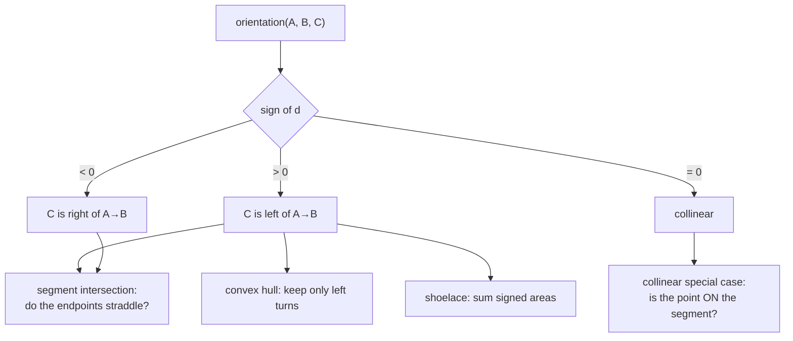

# Signed area and the orientation test

One expression that answers "does this turn left or right?" It is the primitive
beneath segment intersection, convex hulls, polygon area, and self-intersection
checks (everywhere in this repository that geometry is validated).

## What it is

For three points A, B, C:

```
d = (Bₓ − Aₓ)(C_y − A_y) − (B_y − A_y)(Cₓ − Aₓ)
```

This is twice the signed area of triangle ABC, and equivalently the
z-component of the [cross product](cross-product.md) of `AB` and `AC`.

Its **sign** is the useful part:

| `d` | Meaning |
|---|---|
| `> 0` | C is to the left of the directed line A→B (counter-clockwise turn) |
| `= 0` | A, B, C are collinear |
| `< 0` | C is to the right (clockwise turn) |

Four multiplies and three subtractions. No division, no square root, no
trigonometry, so on integer or exactly-represented inputs it is **exact**.

That exactness is why it, rather than any angle-based test, is the foundation of
computational geometry.

## The picture



```
A = (0,0)   B = (4,0)

C = (2, 3)  → d = 4·3 − 0·2 = +12   left
C = (2,−3)  → d = 4·(−3) − 0·2 = −12  right
C = (2, 0)  → d = 0                   collinear
```

## Where this project uses it

Three implementations, in two languages, all identical in structure.

### Editor polygon validation

`poggio_webapp/pipeline/editor/geometry.py`:

```python
def _direction(start, end, point):
    return (end[0] - start[0]) * (point[1] - start[1]) - (end[1] - start[1]) * (
        point[0] - start[0]
    )


def _point_on_segment(point, start, end):
    return (
        _direction(start, end, point) == 0
        and min(start[0], end[0]) <= point[0] <= max(start[0], end[0])
        and min(start[1], end[1]) <= point[1] <= max(start[1], end[1])
    )
```

Note `== 0`, an **exact** comparison, with no tolerance. That is only safe
because the expression involves no division: the inputs are user-clicked
coordinates and the arithmetic is exact multiplication and subtraction. See
[epsilon comparison](epsilon-comparison.md) for why most float comparisons
cannot do this.

### Browser layer-fill validation

`poggio_webapp/static/visualizer/layer-fill.mjs`:

```javascript
function orientation(a, b, c) {
  return (
    ((b.x - a.x) * (c.y - a.y))
    - ((b.y - a.y) * (c.x - a.x))
  );
}

function onSegment(a, b, point) {
  return (
    Math.abs(orientation(a, b, point)) <= EPSILON
    && point.x >= Math.min(a.x, b.x) - EPSILON
    ...
  );
}
```

Here an `EPSILON` **is** used, and the difference from the Python is
instructive: these coordinates have already been through
[interpolation](linear-interpolation.md) during
[polyline clipping](polyline-clipping.md), so they carry accumulated rounding.
Exact comparison would be wrong. The editor's do not, so it can be exact.

The same primitive, two tolerance policies, each correct for its input.

### Canvas drawing validation

`poggio_webapp/static/canvas/grid.mjs`:

```javascript
function pointOnSegment(point, start, end) {
  const crossProduct = (
    ((point.y - start.y) * (end.x - start.x))
    - ((point.x - start.x) * (end.y - start.y))
  );

  if (Math.abs(crossProduct) > Number.EPSILON) {
    return false;
  }
  ...
```

## Why this and not something else

| Alternative | How it would answer "left or right?" | Why it lost |
|---|---|---|
| **Compare angles** | `atan2` both directions, subtract | Two inverse trig calls plus wraparound handling at ±180°, to extract one bit. Slow, and the wraparound is a classic bug source. |
| **Compute the line equation** | `y = mx + c`, compare | Vertical lines have infinite slope. Every implementation needs a special case, and the special case is where bugs live. |
| **[Dot product](dot-product.md) with a perpendicular** | Rotate `AB` 90°, dot with `AC` | Algebraically identical: this *is* the cross product, written differently. |
| **Normalise first, then test** | Unit vectors, then cross | Introduces division and therefore rounding, destroying the exactness that lets `== 0` be safe. |
| **Signed area** *(chosen)* | Four multiplies, three subtractions | Exact on exactly-represented inputs, no special cases, no division, and its magnitude is also useful (twice the triangle area). |

The deciding property is **exactness**. Because there is no division, the result
on integer or short-decimal inputs is exact, so `d == 0` genuinely means
collinear rather than "close to collinear." Every predicate built on it inherits
that reliability, which is why computational geometry libraries define it as
the fundamental primitive and build everything else from it.

## What it costs

Four multiplies, three subtractions. O(1).

The failure mode is **catastrophic cancellation** on nearly-collinear points
with large coordinates: subtracting two nearly-equal large products loses
precision, and the sign can flip. Robust geometry libraries address this with
adaptive-precision arithmetic (Shewchuk's predicates).

This project is safe from it for a concrete reason: coordinates are image pixels
or metres in the low hundreds, and points are clicked far enough apart to be
distinguishable on screen. Nothing here approaches the regime where the
predicate becomes unreliable, and where accumulated error *is* present, the
JavaScript implementations use an epsilon rather than pretending otherwise.

## Where else you meet it

- Convex hull algorithms. Graham scan and Andrew's monotone chain keep only
  left turns; the whole algorithm is a loop around this test.
- Delaunay triangulation and Voronoi diagrams, where the related in-circle
  predicate plays the same role.
- Point-in-polygon via winding number.
- Polygon clipping in graphics: Sutherland–Hodgman uses it to classify
  vertices as inside or outside.
- Path planning, testing which side of an obstacle edge a robot is on.
- CAD, determining surface orientation and which side is material.

## Related pages

- [Cross product](cross-product.md): the 3D operation this is the z-component
  of.
- [Shoelace formula](shoelace-formula.md): summing signed areas around a
  polygon.
- [Line segment intersection](line-segment-intersection.md): the predicate
  built directly on this.
- [Polygon self-intersection](polygon-self-intersection.md): what that
  predicate is used for.
- [Convex hull](convex-hull.md): another algorithm built on it.
- [Epsilon comparison](epsilon-comparison.md): when `== 0` is safe, and when it
  is not.
