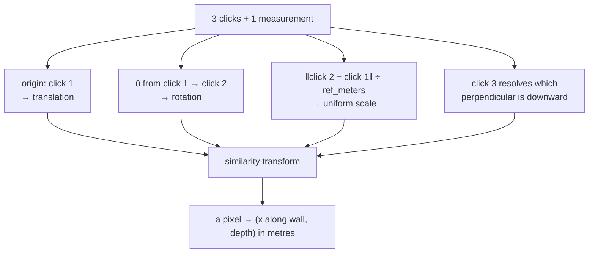

# Similarity transforms

Translate, rotate, and scale uniformly — nothing else. The transform family this
project's calibration belongs to, chosen because it is the least expressive one
that can represent a flat drawing photographed square-on.

## What it is

A similarity transform is the composition of a translation, a rotation, and a
**uniform** scale. It preserves:

- **angles** — a right angle stays a right angle;
- **shape** — a circle stays a circle, never becoming an ellipse;
- **ratios of distances** — if A is twice as far as B, it still is.

It does *not* preserve absolute distances, because of the scale.

In 2D it has four degrees of freedom: two for translation, one for rotation, one
for scale. Two corresponding point pairs determine it exactly — which is why
this project asks for two calibration clicks plus one real measurement.

The family sits between rigid motion and affine:

```
rigid ⊂ similarity ⊂ affine ⊂ projective
```

Each step adds expressiveness and removes a guarantee.

## The picture



What each family can absorb:

```
rigid        ▭ → ▭   (moved and turned)
similarity   ▭ → ▭   (moved, turned, resized — still a rectangle)
affine       ▭ → ▱   (sheared into a parallelogram)
projective   ▭ → ⬟   (keystoned; parallel edges converge)
```

## Where this project uses it

Three implementations, one specification.

`poggio_webapp/pipeline/manual_extraction.py` — the supported manual path:

```python
@dataclass(frozen=True)
class Calibration:
    origin_x: float
    origin_y: float
    ux: float
    uy: float
    vx: float
    vy: float
    px_per_m: float
    ref_x: float
    ref_y: float

    def convert(self, point):
        px, py = float(point[0]), float(point[1])
        dx, dy = px - self.origin_x, py - self.origin_y
        x_m = (dx * self.ux + dy * self.uy) / self.px_per_m
        depth_m = (dx * self.vx + dy * self.vy) / self.px_per_m
        return round(x_m, 4), round(depth_m, 4)
```

Every component of the transform is visible: `origin_*` is the translation,
`(ux, uy)` and `(vx, vy)` are the [rotation](orthonormal-bases.md), `px_per_m`
is the single uniform scale.

`poggio_webapp/pipeline/detect_markers.py` — the CV path, with the reason in its
docstring:

```python
def create_section_coordinate_transform(top_left, top_right, lowest_point,
                                        reference_width_m):
    """
    Create a rotation-aware pixel-to-section transform.

    The line from top_left to top_right defines the section's horizontal axis.
    lowest_point determines which perpendicular direction is downward.

    This corrects measurements when the photographed or scanned section is
    tilted in the image.
    """
```

`poggio_webapp/static/visualizer/coordinates.mjs` — the browser overlay, which
must reproduce the same mapping so a redrawn boundary lands on the ink it was
traced from:

```javascript
function projectMeters(point, axes) {
  const coordinates = meterCoordinates(point);
  const xPixels = coordinates.x * axes.pxPerMeter;
  const depthPixels = coordinates.depth * axes.pxPerMeter;

  return {
    x: axes.origin.x + (xPixels * axes.u.x) + (depthPixels * axes.v.x),
    y: axes.origin.y + (xPixels * axes.u.y) + (depthPixels * axes.v.y),
  };
}
```

That is the *inverse* transform — metres back to pixels — and because the basis
is orthonormal, the inverse is the transpose. No matrix solve, no division.

The browser also short-circuits when it can:

```javascript
if (Object.prototype.hasOwnProperty.call(point, "sourcePixel")) {
  return requirePixelPair(point.sourcePixel, "point.sourcePixel");
}
```

A point that recorded where it was clicked is drawn there exactly, rather than
round-tripping through metres and accumulating floating-point error.

## Why this and not something else

| Alternative | Degrees of freedom | Why it lost |
|---|---|---|
| **Rigid (no scale)** | 3 | Cannot convert pixels to metres at all — scale is the whole point of calibration. |
| **Similarity** *(chosen)* | 4 | Exactly what a flat sheet photographed square-on requires: it may be shifted, turned, and at any zoom, but it is not stretched or skewed. |
| **[Affine](affine-transforms.md)** | 6 | Adds shear and non-uniform scale. Would fit a stretched or skewed sheet — and would also **silently absorb a mis-clicked calibration point** as apparent geometry, producing a self-consistent but wrong coordinate system. A similarity transform has nowhere to put that error, so a bad click shows up as a visibly wrong overlay. |
| **Projective (homography)** | 8 | Corrects perspective from an angled photograph. Needs four clicks, and is sensitive to the accuracy of each. This is the real limitation of the current design and a genuine [roadmap](../project/roadmap.md) candidate. |
| **Polynomial or thin-plate warp** | many | Can fit almost any distortion, including one that is not there. On a project that separately hunts for [fabricated geometry](fabrication-detection.md), a transform that can bend to fit noise is the wrong tool. |

The principle worth naming: **choose the least expressive transform that can
represent the truth.** Extra degrees of freedom are not free capability — they
are places for user error to hide. Over-fitting a coordinate system is
over-fitting.

## What it costs

Four parameters, derived in a handful of operations. Application is two
multiplies and an add per axis, plus one division.

What it cannot represent — and none of these is corrected anywhere in the
pipeline:

- **Perspective**, from a photograph taken at an angle. Scale then varies across
  the sheet, and the error grows with distance from the calibration points.
- **Non-uniform stretch**, from paper that has aged unevenly.
- **Lens distortion**, near the edges of a wide-angle phone photograph.

The mitigation is procedural — the
[drawing guidelines](../reference/drawing-guidelines.md) ask for a square-on
photograph — and the honest framing is that these are known unmodelled errors
rather than solved problems. See
[accuracy and provenance](../concepts/accuracy-and-provenance.md).

## Where else you meet it

- **Image registration**, aligning two photographs of the same scene.
- **Map georeferencing**, where two known control points fix a scan to a
  coordinate system — the identical problem to this project's calibration.
- **Feature matching** — SIFT and ORB descriptors are designed to be invariant
  under similarity transforms precisely because that is what a moving camera
  produces at a distance.
- **CAD and vector graphics**, where a "transform" handle offers move, rotate,
  and uniform scale by default.
- **Point-set registration** (Procrustes analysis), which finds the best
  similarity transform between two labelled point sets.

## Related pages

- [Translation, rotation, and scaling](translation-rotation-scaling.md) — the
  three components.
- [Orthonormal bases](orthonormal-bases.md) — how the rotation is represented.
- [Affine transforms](affine-transforms.md) — the next family up, and why it was
  not chosen.
- [Vector projection](vector-projection.md) — what applying it computes.
- [Coordinate spaces](../concepts/coordinate-spaces.md) — the spaces it connects.
