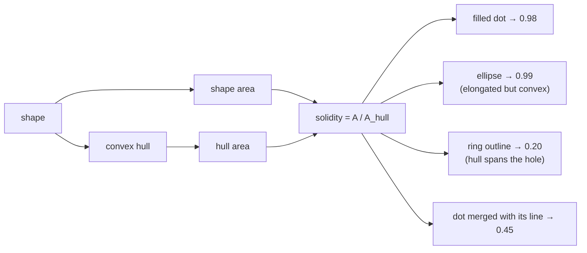

# Solidity

The ratio of a shape's area to the area of its [convex hull](convex-hull.md).
One number for "how dented is this?", and the measure that keeps a drawn stone
outline from being mistaken for a recorder's dot.

## What it is

```
solidity = area / convex hull area
```

The hull is always a superset of the shape, so solidity is always in `(0, 1]`.

- **1.0** — the shape is convex. No dents at all.
- **near 1** — a filled disk, a blob, an ellipse.
- **low** — a crescent, a star, a ring, a cross, a stroke junction.

What makes it valuable is that it isolates one specific defect.
[Circularity](circularity.md) falls for two different reasons — a shape can be
non-circular because it is *elongated* or because it is *ragged*. Solidity is
blind to elongation: a long convex ellipse scores ≈ 1.0. It responds only to
concavity.

Two shapes, both with circularity ≈ 0.3:

| Shape | Circularity | Solidity |
|---|---|---|
| long smooth ellipse | 0.30 | **0.99** |
| ragged crescent | 0.30 | **0.55** |

Circularity cannot tell them apart. Solidity can.

## The picture



## Where this project uses it

### A hard gate at 0.9 — marker detection

`poggio_webapp/pipeline/detect_markers.py`:

```python
hull_area = cv2.contourArea(
    cv2.convexHull(contour)
)

solidity = (
    area / hull_area
    if hull_area > 0
    else 0
)

if (
    min_d <= diameter <= max_d
    and circularity >= min_circularity
    and solidity >= min_solidity        # default 0.9
    and fill >= 0.5
):
```

The module docstring names its purpose:

> solidity/fill filters + dedupe: dots are small FILLED disks; **stone outlines
> and nested contour duplicates are not**

A pencil dot is convex, so 0.9 is easily cleared. Anything with a dent falls
well short — including the two failure cases this module was tuned against: a
drawn stone's outline (the hull spans its hollow middle) and a dot that
[morphological opening](morphological-opening.md) did not fully separate from
its boundary line (a concave junction).

### A weak reject *and* a scoring term at 0.34 — feature detection

`poggio_webapp/pipeline/detect_features.py`:

```python
convex_hull = cv2.convexHull(contour)
hull_area = abs(float(cv2.contourArea(convex_hull)))

solidity = area / hull_area if hull_area > 0 else 0.0
extent = area / float(width * height)

# Layer boundaries and grid lines generally have low extent or
# solidity. Small text loops are mostly removed by size limits.
if solidity < 0.34 or extent < 0.09:
    continue

score = 0.45 * compactness + 0.35 * min(1.0, solidity) + 0.20 * min(1.0, extent)
```

**0.34, not 0.9** — nearly three times looser, because the target is different.
A recorder's dot is manufactured and therefore convex. A stone is a *natural*
object: lobed, irregular, sometimes lensed. A 0.9 gate would reject most real
features.

So here solidity plays two roles at once: a permissive floor that removes
obviously linear structures, and the second-heaviest term (0.35) in a weighted
score that ranks candidates for review.

The same measure with thresholds an order of magnitude apart, in two modules, is
the clearest demonstration that a shape descriptor means nothing without its
threshold and its purpose.

## Why this and not something else

| Alternative | What it measures | Why it lost |
|---|---|---|
| **[Circularity](circularity.md) alone** | Elongation *and* raggedness | Conflates them. Cannot separate a smooth ellipse from a dented blob — the pair that matters when deciding whether a mark is a manufactured dot. |
| **[Extent](extent-and-fill-ratio.md)** | `area / bounding-box area` | Also used. Orientation-dependent: a diagonal convex ellipse has low extent despite being perfectly convex. Solidity has no orientation bias, because the hull rotates with the shape. |
| **[Fill ratio](extent-and-fill-ratio.md)** | `area / enclosing-circle area` | Also used, and it catches hollowness of a different kind — a ring whose hull happens to be tight. The two overlap but are not equivalent. |
| **Convexity defects** | The individual dents and their depths | Strictly more informative — how many, how deep. It returns a variable-length list, so it cannot be a threshold or a score term. Right for counting fingers; wrong for "dented at all?" |
| **Concave hull / alpha shape** | A tighter non-convex boundary | Would fit an irregular stone better, and needs an alpha length-scale parameter — reintroducing exactly the tuning that solidity avoids. |
| **Perimeter of hull vs perimeter of shape** | A perimeter-based convexity ratio | More sensitive to small boundary wobbles, since perimeter is noisier than area on a digitised contour. Area integrates, and integration smooths. |
| **Solidity** *(chosen)* | Concavity alone, in one number | Parameter-free, scale-invariant, rotation-invariant, and it isolates a defect the other measures cannot. |

## What it costs

The [convex hull](convex-hull.md) is O(n log n) — the most expensive
per-contour measure in either detector. The division itself is free.

Because of that, it is computed **last**, after
[area](contour-area-and-perimeter.md) bands and
[bounding-box](bounding-boxes.md) tests have already eliminated most candidates.
The filters are ordered cheapest-first deliberately.

Two limitations:

- It is **lossy**. Solidity says how much area is missing, never where. Two very
  different shapes can share a value.
- It is **blind to interior holes** that do not reach the boundary. A shape
  drawn with a hollow centre and a closed outer edge has solidity 1.0 by this
  measure. That is what [fill ratio](extent-and-fill-ratio.md), measured against
  the [minimum enclosing circle](minimum-enclosing-circle.md), covers.

Together, circularity, solidity, extent, and fill cover elongation,
raggedness, orientation-relative spread, and hollowness. Each is blind to
something the others catch, which is why `detect_markers.py` requires all four
in conjunction rather than trusting any one.

## Where else you meet it

- **Cell biology**, distinguishing round cells from spread or lobed ones.
- **Sedimentology**, classifying grain angularity.
- **Gesture recognition**, where a low-solidity hand indicates extended fingers.
- **Handwriting analysis**, separating characters with enclosed regions from
  simple strokes.
- **Quality control**, detecting chips and voids in moulded parts.

## Related pages

- [Convex hull](convex-hull.md) — the denominator, and how it is computed.
- [Circularity](circularity.md) — the complementary measure.
- [Extent and fill ratio](extent-and-fill-ratio.md) — the hollowness measures.
- [Contour area and perimeter](contour-area-and-perimeter.md) — the numerator.
- [Morphological opening](morphological-opening.md) — the step that prevents the
  merged dot-and-line case.
