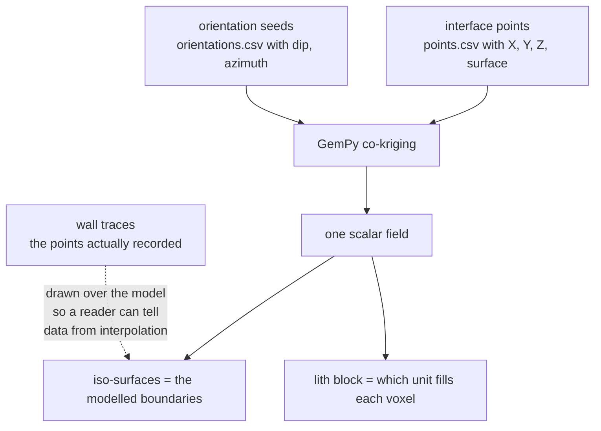

# Spatial interpolation and kriging

Estimating a surface everywhere from measurements at scattered points. The step
that turns a handful of traced boundaries into a solid model, and the step
where the output stops being a measurement and becomes a hypothesis.

## What it is

Given values measured at scattered locations, estimate the value everywhere
else. Every method differs in what it assumes about the space between.

**Inverse distance weighting**: a weighted average of nearby points, weights
falling off with distance. Simple, and it produces bullseye artefacts around
each sample.

**Radial basis functions**: sum a smooth kernel centred on each point. Smooth,
and with no notion of uncertainty.

**Kriging**: a weighted average whose weights are derived from a *model of
spatial correlation* (the variogram: how quickly values become unrelated with
distance). It is the best linear unbiased estimator under its assumptions, and
uniquely it returns a **variance** alongside each estimate.

**Implicit potential-field interpolation**: what GemPy does. Rather than
interpolating each surface separately, it fits one scalar field whose
iso-surfaces are the geological interfaces. Interface points constrain where the
field takes a given value; **orientation seeds constrain its gradient**. The
implementation is co-kriging over both kinds of constraint.

That last point is why this project produces orientations at all. A boundary
traced on one wall says where a surface *is* along that wall; the
[fitted slope](ordinary-least-squares.md) says which way it *tilts*, which tells
the interpolator how to leave the wall.

## The picture



The honesty problem this creates:

```
along a traced wall:     the surface passes through recorded points     ← evidence
one metre away:          the interpolator's estimate                    ← inference
across the whole extent
from a single wall:      an extrapolation with nothing to constrain it  ← hypothesis
```

All three render identically.

## Where this project uses it

The interpolation itself is GemPy's. What `poggio_webapp/pipeline/build_gempy.py`
owns is the **contract around it**, and most of that contract is about keeping
the three cases above distinguishable.

### Naming the surfaces that are extrapolated

```python
coverage = points.groupby("surface")["face"].unique()
single_face = {surf: faces[0] for surf, faces in coverage.items() if len(faces) == 1}
single_face_note = None
if single_face:
    single_face_note = (
        "These surfaces have points from only ONE face and will still be "
        "interpolated across the whole model extent: "
        + ", ".join(f"{surf!r} (only on {face})" for surf, face in single_face.items())
    )
    log("NOTE: " + single_face_note)
```

The note travels into the viewer manifest, so the warning reaches whoever looks
at the model rather than only whoever ran the build.

### Exporting the evidence alongside the inference

```python
def wall_traces(points):
    """One polyline per (face, surface): the points actually traced on that
    wall, in along-wall order.

    A viewer can draw these over the interpolated surfaces so a reader can
    tell data from interpolation -- everything away from a trace is the
    interpolator's guess. ...
    """
```

That docstring is the clearest statement of the project's position anywhere in
the codebase. The model is drawn; the data is drawn *on top of it*; the
difference is visible.

The ordering detail matters too:

> The points are ordered along the wall rather than by X and then Y: a wall
> running north-south has one X for every point, so sorting by X first would
> leave the group in whatever order the file happened to carry.

```python
x_span = group["X"].max() - group["X"].min()
y_span = group["Y"].max() - group["Y"].min()
ordered = group.sort_values("X" if x_span > y_span else "Y", kind="stable")
```

### Bounding the model extent

```python
def infer_extent(points, pad_xy, pad_z):
    ...

    def pad(lo, hi, minimum):
        span = hi - lo
        p = max(span * 0.1, minimum)
        return lo - p, hi + p
```

10% of the data's own span, with a floor. The model is not extrapolated
arbitrarily far beyond where anything was recorded.

### Improving the constraints before interpolating

`poggio_webapp/pipeline/true_dip.py` exists because the orientation seeds are
the *only* thing telling the interpolator how a surface leaves a wall, and on a
merged trench the per-wall apparent dips disagree:

> one surface arrives carrying a seed that dips toward the north wall's bearing
> and another that dips toward the east wall's, and an apparent dip is always
> shallower than the true dip, so GemPy fits a compromise plane that matches
> neither drawing.

Better constraints in, better interpolation out. And where they cannot be
improved, nothing is emitted rather than a guess.

## Why this and not something else

The choice of *interpolator* is GemPy's; the choice of **GemPy** was this
project's.

| Alternative | How it would model the stratigraphy | Why it lost |
|---|---|---|
| **Interpolate each surface independently** (RBF, IDW, splines) | Fit each boundary separately | Simpler, and surfaces can then **cross each other**, producing a layer that is above another in one place and below it elsewhere. The [validator](piecewise-linear-functions.md) treats crossing as an error in 2D; a modeller that permits it in 3D undoes that. |
| **Triangulated surfaces between traces** | Mesh directly between recorded points | Honest: it interpolates only between data. It produces surfaces only where walls exist, which for a four-wall trench means four ribbons and no solid. It also cannot use orientation information at all. |
| **Kriging per surface with a variogram** | Classical geostatistics | Gives an uncertainty estimate per point, which this project would genuinely benefit from. It needs a fitted variogram, which needs more samples than a few traced boundaries provide, and it still permits crossing. |
| **Implicit potential field (GemPy)** *(chosen)* | One scalar field, iso-surfaces as interfaces | Surfaces **cannot** cross by construction, orientation seeds are first-class constraints, and it produces a filled lithological block rather than bare surfaces. |
| **Manual 3D modelling** | Draw it in CAD | What was done before, and it encodes the modeller's judgement invisibly rather than as inputs a reader can inspect. |

The decisive property is the first one in that last row: **a potential field
cannot produce crossing surfaces.** Stratigraphic superposition is the
fundamental law being modelled, and choosing a formulation in which violating it
is *impossible* is stronger than checking for violations afterwards.

GemPy is also kept **optional**: imported inside functions, with everything up
to coordinate conversion working without it. See
[codebase review](../architecture/code-review.md).

## What it costs

The interpolation is the most expensive step in the pipeline by a wide margin.
Resolution is 100 × 100 × 70 = 700 000 voxels, and the constant carries its
reasoning:

```python
# Higher voxel count = smoother lith-block/mesh surfaces at the
# cost of longer compute + bigger .bin/.npz files. GemPy's own
# docs recommend staying under ~1,000,000 cells total; this is
# 700,000. Drop back toward (50, 50, 30) only if compute time
# becomes a problem on a given machine.
resolution = ((100, 100, 70),)
```

The **epistemic** cost is the one this project takes seriously. An interpolated
model is a hypothesis shaped by evidence, and it renders exactly as confidently
as a measurement would. The mitigations are all disclosure rather than
correction:

- `wall_traces` draws the evidence over the inference.
- `single_face_note` names surfaces extrapolated from one wall.
- The README states it directly: "The model **interpolates** between your
  recorded points. It is a hypothesis shaped by evidence, not a measurement."
- [Capability status](../project/capability-status.md) records the model build
  as `experimental`.

No amount of interpolation quality substitutes for that, which is why the effort
went into labelling rather than into smoothing.

## Where else you meet it

- Mining and petroleum geology, where GemPy and its commercial relatives
  build ore-body and reservoir models. Kriging was invented in South African
  gold mining: Danie Krige's name is in it.
- Weather forecasting, interpolating station observations onto a grid.
- Terrain models, building a continuous surface from scattered spot heights.
- Environmental monitoring, mapping contamination from sampled boreholes.
- Medical imaging, reconstructing a volume from slices.
- Gaussian processes in machine learning, which are kriging under another
  name, and which likewise return a variance with every prediction.

## Related pages

- [Ordinary least squares](ordinary-least-squares.md): how orientation seeds
  are derived.
- [Cross product](cross-product.md): how a true dip improves them.
- [Linear interpolation](linear-interpolation.md): the minimal-claim
  interpolation used *within* a boundary.
- [Interpolation versus measurement](interpolation-vs-measurement.md): the epistemic distinction.
- [Create the model](../workflows/07-create-model.md): the workflow step.
- [Accuracy and provenance](../concepts/accuracy-and-provenance.md): what a
  model does and does not prove.
