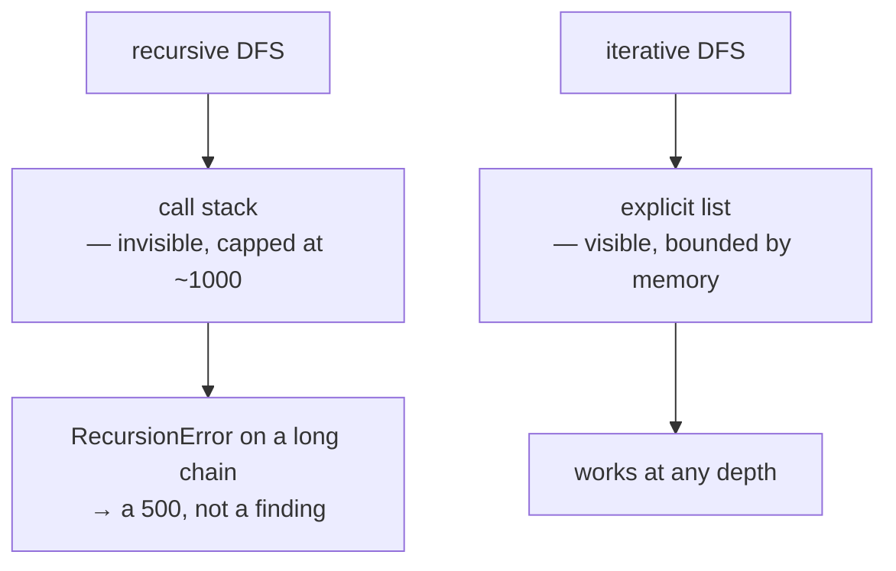

# Stacks and explicit recursion

Recursion uses a stack you cannot see. Making it visible removes a hidden limit —
which is exactly the fix applied to this project's cycle search.

## What it is

A **stack** is last-in-first-out. Recursion uses one implicitly: each call pushes
a frame holding the arguments and the position in the function, and returning
pops it.

That implicit stack is bounded. CPython's default recursion limit is **1000
frames**, and exceeding it raises `RecursionError` — not a memory error, a
Python-level guard. The limit exists because the C stack underneath would
otherwise overflow and crash the interpreter.

Converting to an explicit stack means storing the same information in a list you
control:

```
recursive:  visit(node)                  frames are invisible
iterative:  stack = [(node, index)]      frames are data
```

The traversal is identical. The difference is that the depth limit becomes
available memory instead of a fixed constant.

## The picture



## Where this project uses it

### Cycle detection, converted

`poggio_webapp/pipeline/harris_matrix.py` — the docstring records both the
problem and the guarantee:

```python
def _find_cycle(nodes, edges):
    """The first cycle found by a three-colour depth-first search, or None.

    ...

    The search keeps its own explicit stack rather than recursing. Every stored
    matrix is validated through here on load and on save, with no cap on unit
    count, so a long enough chain of relations turned a matrix that should
    merely be reported on into a RecursionError -- a 500 instead of a finding.
    Traversal order is unchanged: starts in sorted order, neighbours in the
    sorted order ``_adjacency`` already imposes.
    """
```

The stack entry is a pair:

```python
stack = [(start, 0)]

while stack:
    node, neighbor_index = stack[-1]
    neighbors = adjacent[node]
    if neighbor_index < len(neighbors):
        stack[-1] = (node, neighbor_index + 1)
        neighbor = neighbors[neighbor_index]
        if state[neighbor] == 0:
            ...
            stack.append((neighbor, 0))
        elif state[neighbor] == 1:
            return path[path_indexes[neighbor]:] + [neighbor]
        continue
    stack.pop()
    path.pop()
    path_indexes.pop(node)
    state[node] = 2
```

`(node, neighbor_index)` is precisely what a call frame would hold: which node,
and how far through its neighbour loop. `stack[-1] = (node, index + 1)` is the
loop counter advancing.

The `path` and `path_indexes` lists are maintained alongside, doing what the call
stack did implicitly — remembering the route back — so the cycle can still be
*named* rather than merely detected.

### Reachability, already iterative

The same file's `_path_exists` was iterative from the start:

```python
pending = [start]
visited = set()

while pending:
    node = pending.pop()
    if node == target:
        return True
    if node in visited:
        continue
    visited.add(node)
    pending.extend(reversed(adjacent.get(node, [])))
```

`pending.pop()` from the end makes it a stack, hence
[depth-first](depth-first-search.md). `reversed(...)` preserves the neighbour
order recursion would have used — a small detail that keeps the traversal
[deterministic](determinism-and-stable-sorting.md).

### Where recursion was kept

`poggio_webapp/pipeline/normalizer.py`:

```python
def clean_null_strings(obj, log, path="root"):
    if isinstance(obj, dict):
        for k, v in list(obj.items()):
            if isinstance(v, str) and v.strip().lower() in NULLISH:
                obj[k] = None
                log.append(f'nulled string at {path}.{k}')
            else:
                clean_null_strings(v, log, f"{path}.{k}")
    elif isinstance(obj, list):
        for i, v in enumerate(obj):
            clean_null_strings(v, log, f"{path}[{i}]")
```

and `validator.scan_null_strings` mirrors it. Both recurse over parsed JSON, and
both are fine: **JSON nesting depth is bounded by the schema**, not by user data
volume. A `FieldWallProfile` is perhaps six levels deep regardless of how many
loci it contains.

The distinction is the useful one. Recursion depth here scales with the
*structure*, which is fixed; in `_find_cycle` it scaled with the *data*, which is
not.

`poggio_webapp/pipeline/editor/geometry.py` recurses nowhere at all — its
polygon checks are nested loops.

## Why this and not something else

| Alternative | How it would work | Why it lost — or won |
|---|---|---|
| **Keep the recursion** | Shorter, clearer | Fails at ~1000 frames. For a function called on every load and every save, a data-dependent crash is not acceptable. |
| **Raise `sys.setrecursionlimit`** | Push the limit higher | Trades one crash depth for another, and a limit set too high segfaults the interpreter rather than raising. It also makes the safe depth depend on the platform's C stack size. |
| **Run in a thread with a larger stack** | `threading.stack_size()` | Works, and it is a strange amount of machinery to make a graph traversal safe, and it does not help in the browser or in any other runtime. |
| **Cap the unit count** | Reject matrices above N units | Reasonable, and it is what the *renderer* does (`_MAX_UNITS = 250`). Validation runs earlier than rendering, so it must handle whatever is stored. |
| **Explicit stack** *(chosen)* | Same traversal, visible frames | Removes the failure mode entirely rather than bounding it, with no dependency and no platform sensitivity. |

The judgement is about **where a limit should live**. A recursion limit is an
implementation artefact that produces a 500. A unit cap is a product decision
that produces a clear message. This repository has both, in the right places.

## What it costs

Same O(V + E) time. Memory moves from the C stack to the heap, which is larger.

The costs are in the code:

- **Roughly twice the lines**, and a `(node, index)` tuple a reader must decode.
  The docstring exists to pay that back.
- **Easy to get subtly wrong.** Advancing `stack[-1]` *before* pushing the
  neighbour matters; reversing it revisits or skips edges.
- **Manual bookkeeping.** `path` and `path_indexes` must be pushed and popped in
  step with the stack. Recursion maintained them for free.

Those costs are why the conversion was applied to one function rather than
across the codebase. Where recursion is safe — bounded by schema depth — it
stays.

## Where else you meet it

- **Language runtimes** — every call stack, and the reason a stack overflow is a
  crash rather than an exception in C.
- **Undo systems**, where the history is a stack.
- **Expression evaluation** — shunting-yard and RPN are stack algorithms.
- **Browser history** and navigation back-stacks.
- **Iterative deepening** in game AI, which bounds the stack deliberately.
- **Tail-call optimisation** in functional languages, which removes the frame
  entirely — something CPython deliberately does not do.

## Related pages

- [Depth-first search](depth-first-search.md) — the traversal converted.
- [Cycle detection](cycle-detection.md) — the caller.
- [Breadth-first search](breadth-first-search.md) — the queue-based
  counterpart.
- [Codebase review](../architecture/code-review.md) — the finding that prompted
  the change.
