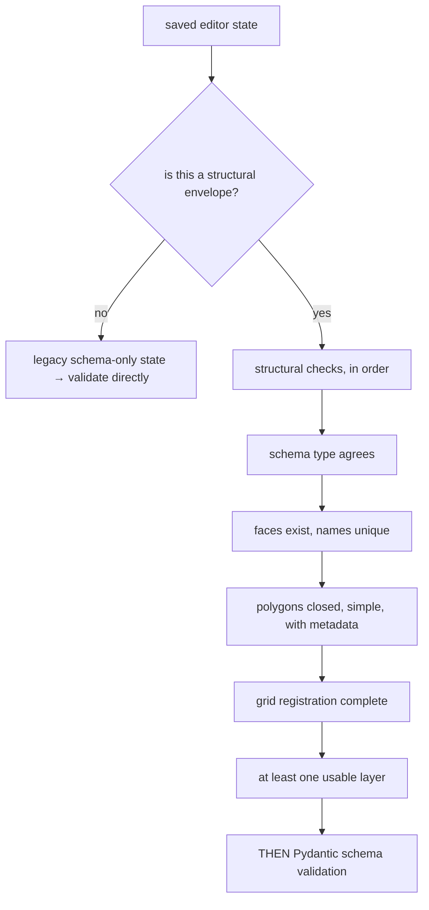

# Structural versus schema validation

Running the checks in the right order so the error message describes the real
problem. A half-drawn polygon is not a schema mismatch, and saying so is the
difference between a usable message and a confusing one.

## What it is

Two kinds of check, easily conflated:

**Schema validation** — is the data the right shape? Types, required fields,
value ranges. Answered by [Pydantic](json-schema-design.md).

**Structural validation** — is the data *complete and coherent* as a piece of
work? Is the polygon closed? Does it self-intersect? Has every face been
registered?

A half-finished drawing usually fails **both**: it is structurally incomplete,
and the assembled document it produces is missing fields. Which error the user
sees depends entirely on which check runs first.

Schema first: *"field `layers` is required."* The user is drawing on a canvas
and has never seen a field called `layers`.

Structural first: *"Face 'north' polygon 3 is not closed with at least three
distinct vertices."* The user knows exactly which shape to fix.

## The picture



## Where this project uses it

`poggio_webapp/pipeline/editor/validation.py` states the reason in its module
docstring:

> Structural checks on saved editor state, before schema validation.
>
> These run first because a Pydantic error on a half-drawn polygon reads as
> a schema mismatch when the real problem is that the drawing is not
> finished. Each check raises its own error from .errors.

The dispatch, in `finalize.py`:

```python
model_state = (
    _validate_editor_structure(state, schema_type)
    if _is_editor_envelope(state)
    else state
)
schema_models = {
    "ArchaeologicalDiagram": ArchaeologicalDiagram,
    "FieldWallProfile": FieldWallProfile,
}
model_class = schema_models[schema_type]
validated = model_class(**{**model_state, "source": "manual_editor"})
```

Structural first, schema second — and only when the payload *is* an envelope:

```python
def _is_editor_envelope(state) -> bool:
    return (
        isinstance(state, dict)
        and bool(EDITOR_ENVELOPE_KEYS.intersection(state))
    )
```

Sessions saved before the envelope existed are schema-only, and still finalize.
See [schema versioning](schema-versioning.md).

### The structural checks, ordered from general to specific

```python
def _validate_editor_structure(state, schema_type) -> dict:
    if not isinstance(state, dict):
        raise EditorStateStructureError(
            "Assembled editor state must be an object.")

    finalize_state = state.get("finalizeState")
    editor_state = state.get("editorState")
    saved_schema_type = state.get("schemaType")
    if saved_schema_type != schema_type:
        raise EditorSchemaMismatchError(
            f'Saved schemaType "{saved_schema_type}" conflicts with '
            f'session schema "{schema_type}".')
    ...
    faces = editor_state.get("faces")
    if not isinstance(faces, list) or not faces:
        raise EmptyEditorError(
            "Set up at least one face before finalizing.")
    if schema_type == "FieldWallProfile" and len(faces) != 1:
        raise FieldWallFaceCountError(
            "A FieldWallProfile must have exactly one face.")

    _validate_face_names(faces)
    _validate_polygons(state, editor_state, schema_type)
    _validate_grid_registration(editor_state, state.get("gridConfig"))
    _validate_usable_layers(finalize_state, schema_type)
    return finalize_state
```

The ordering is a design decision. Each check assumes the previous one passed —
`_validate_polygons` can iterate faces because `faces` has been proved a
non-empty list — and each failure is reported at the level a user thinks at:
first "is there a face?", then "does it have a shape?", then "is the shape
valid?", then "is it registered?"

Each raises [its own class](error-taxonomies.md):

```python
if _polygon_self_intersects(vertices):
    raise SelfIntersectingPolygonError(
        f'Face "{face_name}" polygon {polygon_id} '
        "self-intersects.")
```

The message names the face and the polygon, so it maps to something on screen.

### Checks a schema cannot express

Some of these are simply not expressible as types:

```python
if (
    polygon.get("closed") is not True
    or not isinstance(vertices, list)
    or _distinct_valid_vertex_count(vertices) < 3
):
    raise UnclosedPolygonError(
        f'Face "{face_name}" polygon {polygon_id} is not closed '
        "with at least three distinct vertices.")
```

`_distinct_valid_vertex_count` counts **distinct** coordinates, so a polygon
with three vertices at the same point is rejected. No type system expresses
that.

Nor this, in `_validate_polygon_stacking`:

```python
if has_explicit_order and explicit_orders != list(range(len(polygons))):
    raise PolygonStackingError(
        f'Face "{face_name}" polygon stack order must be unique, '
        "contiguous, and match the saved polygon order.")
```

Or the registration check, which combines presence, finiteness, and range:

```python
missing_fields = [
    field for field in GRID_REGISTRATION_FIELDS
    if not _is_finite_number(registration.get(field))
]
bearing = registration.get("bearing_deg")
if (
    "bearing_deg" not in missing_fields
    and not 0 <= bearing <= 360
):
    missing_fields.append("bearing_deg")

if missing_fields:
    raise IncompleteGridRegistrationError(
        f'Face "{face_name}" grid registration is incomplete: '
        f'{", ".join(missing_fields)}.')
```

An out-of-range bearing is folded into the *same* "incomplete" message rather
than raising separately — because to the user, a bearing of 400° is as unusable
as a missing one, and one message listing every bad field beats four separate
errors.

### The same layering elsewhere

`harris_store._validate_candidate` does it in the other order, for a different
reason:

```python
matrix = HarrisMatrix.model_validate(candidate)     # schema
...
report = validate_matrix_graph(matrix)              # semantic
```

Schema first here because the *graph* checks need typed objects to run at all.
The principle is the same: **two layers, ordered so each can assume the
previous.**

## Why this and not something else

| Alternative | How it would validate a drawing | Why it lost |
|---|---|---|
| **Schema only** | Let Pydantic reject the assembled document | Cheapest, and the message describes a JSON field the user has never seen. It also cannot express closure, self-intersection, or distinct-vertex counts. |
| **Schema first, structural second** | Shape, then coherence | Wrong order: the schema fails first on an incomplete drawing, so the structural message never appears. |
| **Structural first, schema second** *(chosen)* | Coherence, then shape | The user sees the real problem. The schema still runs, catching anything structural checks do not cover. |
| **One combined validator** | Custom Pydantic validators for everything | Possible, and it would tangle "is this a valid drawing?" with "is this a valid document?", and the errors would all be `ValidationError`. |
| **Validate in the browser only** | Check before submitting | Already done — `canvas/grid.mjs` has `validateEditorStateForFinalize`. Client checks are for feedback; the server must not trust them. |

The generalisable rule: **order validation from the user's mental model outward.**
A person drawing polygons thinks in faces and shapes, not in JSON fields, so the
checks that speak that language run first.

## What it costs

Both layers are microseconds.

The costs:

- **Duplication.** Some rules exist in both layers — a face needs a name
  structurally and the schema requires it too. Cheap insurance, since the
  structural layer is skipped for legacy states.
- **Ordering is load-bearing and invisible.** Reordering the calls in
  `_validate_editor_structure` changes which message a user sees, with no test
  failure to warn you. The module docstring is the guard.
- **Twelve exception classes** to maintain.
- **The browser duplicates the rules** in `canvas/grid.mjs`, so a change must be
  made twice. The trade is immediate feedback while drawing; the server remains
  the authority.

## Where else you meet it

- **Compilers**, which run lexing, parsing, and type checking in order so each
  error is reported at the right level — a syntax error is not reported as a
  type error.
- **Form validation**, where "this field is required" precedes "this value is
  invalid".
- **Document formats**, where well-formedness precedes validity (XML's own
  distinction).
- **Linters versus type checkers**, which answer different questions about the
  same source.

## Related pages

- [Validation at trust boundaries](validation-at-trust-boundaries.md) — the
  wider discipline.
- [Error taxonomies](error-taxonomies.md) — one class per rule.
- [JSON and schema design](json-schema-design.md) — the second layer.
- [Polygon self-intersection](polygon-self-intersection.md) — one of the
  structural checks.
- [Validation rules](../reference/validation-rules.md) — every message.
