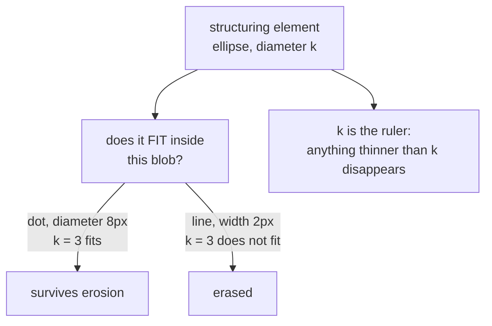

# Structuring elements

The small shape that morphological operations probe an image with. Choosing it
is choosing what "small" and "thin" mean — and in this repository it is chosen
in millimetres of paper, not pixels.

## What it is

Every [morphological operation](erosion.md) works by sliding a small binary
shape — the *structuring element*, or kernel — over the image and asking a
question at each position:

- Does the shape fit **entirely** inside the foreground here? → [erosion](erosion.md)
- Does the shape **touch** the foreground at all? → [dilation](dilation.md)

The structuring element is the probe. Its size sets the scale at which features
survive; its shape sets which orientations are treated equally.

Three common shapes:

| Shape | `cv2` constant | Behaviour |
|---|---|---|
| Rectangle | `MORPH_RECT` | Cheapest, and biased along the axes — a diagonal line erodes faster than a horizontal one |
| Ellipse / disk | `MORPH_ELLIPSE` | Isotropic: treats every direction the same |
| Cross | `MORPH_CROSS` | Very cheap, strongly axis-biased |

A structuring element must have a defined centre, which is why sizes are
**odd**. A 4×4 kernel has no centre pixel and the operation's result is shifted
by half a pixel.

## The picture



Rectangle versus ellipse on a diagonal stroke:

```
rectangle 3×3            ellipse 3×3
■ ■ ■                    · ■ ·
■ ■ ■                    ■ ■ ■
■ ■ ■                    · ■ ·

reaches √2 px diagonally  reaches 1 px in every direction
→ diagonal strokes erode  → all orientations erode equally
  faster than axial ones
```

On a drawing where boundary lines run at arbitrary angles, that anisotropy is a
real defect: an axis-aligned kernel would remove diagonal strokes more
aggressively than horizontal ones, biasing what survives.

## Where this project uses it

Both detectors specify an ellipse, and both size it deliberately.

### Sized in millimetres of paper

`poggio_webapp/pipeline/detect_markers.py`:

```python
# Pixels per paper millimeter.
mm_px = px_per_m * float(square_cm) / 1000.0

k = max(
    3,
    int(line_kill_paper_mm * mm_px) | 1,
)

opened = cv2.morphologyEx(
    ink,
    cv2.MORPH_OPEN,
    cv2.getStructuringElement(
        cv2.MORPH_ELLIPSE,
        (k, k),
    ),
)
```

`line_kill_paper_mm` defaults to **0.35 mm** — narrower than a recorder's dot,
wider than a drawn boundary line. The name says what it is for: kill the lines,
keep the dots. See [morphological opening](morphological-opening.md).

The conversion chain is the important part. `px_per_m` comes from the user's two
calibration clicks and the real distance between them; `square_cm` is the grid
square on the sheet. Together they give pixels per paper millimetre, so the
kernel is **0.35 mm of paper** on a 12-megapixel photo and on a 40-megapixel one
alike.

`| 1` forces odd. `max(3, ...)` sets a floor, since a 1×1 kernel does nothing.
And the module refuses outright when the photo cannot support the scale:

```python
if mm_px < 2:
    raise RuntimeError(
        "photo resolution too low for marker detection "
        f"({mm_px:.1f} px per paper mm) — retake closer or "
        "at higher resolution")
```

That refusal is the honest consequence of scale-relative sizing: below 2 px per
mm, a 0.35 mm kernel rounds to the floor and stops meaning anything.

### Fixed small, for gap repair

`poggio_webapp/pipeline/detect_features.py`:

```python
closing_kernel = cv2.getStructuringElement(
    cv2.MORPH_ELLIPSE,
    (3, 3),
)

edges = cv2.morphologyEx(
    edges,
    cv2.MORPH_CLOSE,
    closing_kernel,
    iterations=1,
)
```

Here the job is different — bridging one- or two-pixel gaps that
[Canny](canny-edge-detection.md) left in a hand-drawn outline — and the input
is already at a normalised scale, because
[the analysis copy is capped at 2200 px](area-averaging-downsampling.md). A
fixed 3×3 is the minimum that closes anything, and a larger one would start
merging genuinely separate features. See
[morphological closing](morphological-closing.md).

Two modules, two sizing strategies, each matched to whether the operation's
meaning is physical or pixel-local.

## Why this and not something else

| Alternative | How it would work here | Why it lost |
|---|---|---|
| **`MORPH_RECT`** | A square kernel | Cheapest, and separable, so genuinely faster at large sizes. It is anisotropic: diagonal strokes erode faster than axial ones. On a section drawing whose boundaries run at every angle, that biases which marks survive. |
| **`MORPH_CROSS`** | Plus-shaped | Cheapest of all and the most axis-biased. Fine for 4-connectivity work, wrong here. |
| **`MORPH_ELLIPSE`** *(chosen)* | Disk-shaped | Isotropic, so orientation does not affect survival. Slightly more expensive; irrelevant at k ≈ 3–7. |
| **A fixed pixel size** | `(5, 5)` regardless of input | One less computation and it makes the detector's behaviour depend on camera resolution. A kernel tuned on one phone would erase real dots on another. |
| **Scale-derived size** *(chosen)* | Convert paper millimetres through the calibration | The kernel means the same physical thing on every input. Requires calibration to exist first — which it does, since the same clicks set the coordinate system. |
| **Multiple kernel sizes, keep the best** | Run opening at several k, pick per-region | More robust to bad calibration, and it turns a deterministic filter into a search with a selection rule to justify. Against the grain of a module whose value is that its behaviour is inspectable. |

The generalisable idea is the same one behind
[area-averaging downsampling](area-averaging-downsampling.md) and
[adaptive thresholding's `blockSize`](adaptive-thresholding.md): **express
thresholds in units of the subject, not units of the sensor.** Every threshold
in `detect_markers.py` is in paper millimetres, which is why its defaults —
`min_marker_paper_mm=0.5`, `max_marker_paper_mm=2.5`,
`line_kill_paper_mm=0.35` — are numbers a person holding the drawing can sanity
check with a ruler.

## What it costs

For a k×k element over n pixels, O(n·k²) naively. Rectangular elements decompose
into two 1D passes for O(n·k); elliptical ones do not decompose exactly, so
OpenCV uses an optimised but still 2D scan. At k = 3–7 the difference is
irrelevant.

Building the element itself is `cv2.getStructuringElement`, a few dozen bytes,
constructed once per call.

## Where else you meet it

- **Photoshop's "Minimum" and "Maximum" filters**, and the expand/contract
  options on a selection.
- **PCB and wafer inspection**, where morphology with precisely sized elements
  measures trace widths.
- **Medical image analysis** — cleaning segmentation masks before measurement.
- **Fingerprint thinning**, which uses a sequence of carefully chosen elements
  to reduce ridges to single-pixel skeletons.
- **`ImageMagick -morphology`**, which exposes the full vocabulary directly.

## Related pages

- [Erosion](erosion.md) and [dilation](dilation.md) — the two primitive
  operations.
- [Morphological opening](morphological-opening.md) — the marker detector's use.
- [Morphological closing](morphological-closing.md) — the feature detector's use.
- [Convolution](convolution.md) — the similar-looking operation that is *not*
  morphology.
- [Adaptive thresholding](adaptive-thresholding.md) — the other place a window
  size is derived from paper millimetres.
