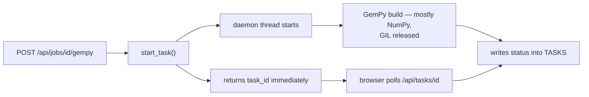

# Threads and the GIL

Running work in the background so an HTTP request can return immediately. Python
threads are genuinely concurrent for waiting and not for computing — and knowing
which applies here explains why this design works.

## What it is

A **thread** runs alongside others in the same process, sharing memory. That
sharing is the point and the danger.

CPython has a **Global Interpreter Lock**: only one thread executes Python
bytecode at a time. So threads give no speedup for pure-Python computation. What
they *do* give is concurrency whenever a thread releases the GIL, which happens
during:

- file and network I/O
- `time.sleep`
- calls into C extensions that release it — **NumPy, OpenCV, and pandas all do**

That last point is what makes this project's use of threads effective rather
than decorative. A GemPy build is almost entirely NumPy, so the worker thread
spends its time outside the GIL and the web server stays responsive.

A **daemon thread** does not keep the process alive. When the main thread exits,
daemon threads are killed without cleanup.

## The picture



## Where this project uses it

`poggio_webapp/backend/tasks.py`:

```python
def start_task(fn, *args, **kwargs):
    task_id = str(uuid.uuid4())
    accepts_progress = _accepts(fn, "progress_cb")
    accepts_log = _accepts(fn, "log_cb")

    with _TASKS_LOCK:
        TASKS[task_id] = {
            "status": "running",
            "result": None,
            "error": None,
            "log": [],
            "started_at": time.time(),
        }
        _evict_finished()

    def runner():
        try:

            def log_cb(msg):
                TASKS[task_id]["log"].append(str(msg))

            if accepts_progress:
                kwargs["progress_cb"] = log_cb
            if accepts_log:
                kwargs["log_cb"] = log_cb
            result = fn(*args, **kwargs)
            TASKS[task_id]["result"] = result
            TASKS[task_id]["status"] = "done"
        except Exception as e:
            TASKS[task_id]["error"] = _friendly_error(e)
            TASKS[task_id]["error_detail"] = f"{e}\n{traceback.format_exc()}"
            TASKS[task_id]["status"] = "error"

    threading.Thread(target=runner, daemon=True).start()
    return task_id
```

Four decisions.

**Introspection happens on the calling thread**, before the thread starts:

```python
accepts_progress = _accepts(fn, "progress_cb")
accepts_log = _accepts(fn, "log_cb")
```

If `fn` is a callable that cannot be introspected, that is discovered at
submission where the caller can see it — not inside a worker thread where it
would surface as a mysterious task failure.

**`daemon=True`.** A running build must not keep the process alive on Ctrl-C.
The trade is that a build in flight dies mid-write on shutdown — acceptable
because each pipeline stage writes into its own folder and `meta.json` records
how far it got, so a restart can see the state.

**Every exception is caught.** An uncaught exception in a thread prints to
stderr and vanishes; the task would stay `"running"` forever and the browser
would poll indefinitely. The `except Exception` converts it into a terminal
`"error"` state with a
[user-facing message](error-taxonomies.md) and the traceback preserved
separately.

**`log_cb` appends from the worker thread** while request threads read the same
list. `list.append` is atomic under the GIL, so no lock is needed for that
specific operation — see
[locks and critical sections](locks-and-critical-sections.md) for where a lock
*is* needed.

### Two locks in the pipeline service

`poggio_webapp/backend/services/editor_pipeline.py`:

```python
# Serializes the read-decide-write on meta.json in finalize_editor, so two
# concurrent finalize requests cannot both decide the job is idle and start
# the pipeline twice.
FINALIZATION_LOCK = threading.Lock()
META_LOCK = threading.Lock()
```

Two locks for two different shared resources — the finalize decision, and
`meta.json` writes from both request and worker threads.

## Why this and not something else

| Alternative | How it would run a build | Why it lost |
|---|---|---|
| **Synchronous in the request** | Block until the model is built | A GemPy build takes minutes. The browser would time out, and the user would see nothing until it finished. |
| **`multiprocessing`** | A separate process per build | Genuine parallelism for pure Python, and it needs the arguments pickled, gives no shared `TASKS` dict, and adds process management. The heavy work here is already NumPy, which releases the GIL, so a process buys little. |
| **`asyncio`** | Cooperative concurrency | Excellent for I/O-bound work. GemPy is CPU-bound and synchronous; it would block the event loop entirely, and Flask is not async. |
| **A task queue (Celery, RQ)** | A broker plus worker processes | The right answer for a multi-user deployment: durable, restart-surviving, observable. It needs Redis or RabbitMQ, a second process to run, and deployment complexity — against a project whose selling point is `make run` on a laptop with nothing uploaded anywhere. |
| **A daemon thread with an in-memory table** *(chosen)* | One thread per build | No dependency, no broker, and effective because the heavy work releases the GIL. |

The trade is stated plainly in the README's own limitations: *"Task state is in
memory. Restarting the server loses the status of a running build, though the
files it already wrote survive."*

That is the honest summary. This is a single-user local application, and
Celery's durability would buy nothing a re-run does not.

## What it costs

A thread is roughly 8 MB of stack address space and microseconds to start.

The real costs:

- **No parallelism for pure Python.** Two concurrent builds do not run twice as
  fast. In practice one user builds one model.
- **State dies with the process**, documented, and mitigated by every stage
  writing its own artifact and by `meta.json` recording progress.
- **Shared mutable state needs discipline.** `TASKS` is written by workers and
  read by request threads; the [lock](locks-and-critical-sections.md) covers the
  compound operations and the GIL covers the atomic ones.
- **Daemon threads die abruptly**, so a build killed at shutdown leaves a
  partial output folder rather than a clean rollback.
- **Exceptions must be caught explicitly**, or they disappear.

## Where else you meet it

- **Every web server**, which handles requests on threads or processes.
- **Desktop applications**, where long work must leave the UI thread free.
- **`concurrent.futures.ThreadPoolExecutor`**, the modern wrapper over this
  pattern.
- **NumPy, OpenCV, and PyTorch**, which release the GIL and are why
  scientific Python threads usefully at all.
- **Python 3.13's free-threaded build**, which makes the GIL optional and
  changes the calculus above.

## Related pages

- [Locks and critical sections](locks-and-critical-sections.md) — protecting the
  compound operations.
- [Race conditions](race-conditions.md) — what the locks prevent.
- [Bounded caches and eviction](bounded-caches-and-eviction.md) — why `TASKS`
  cannot grow forever.
- [Asynchronous tasks](../architecture/asynchronous-tasks.md) — the architecture
  page.
