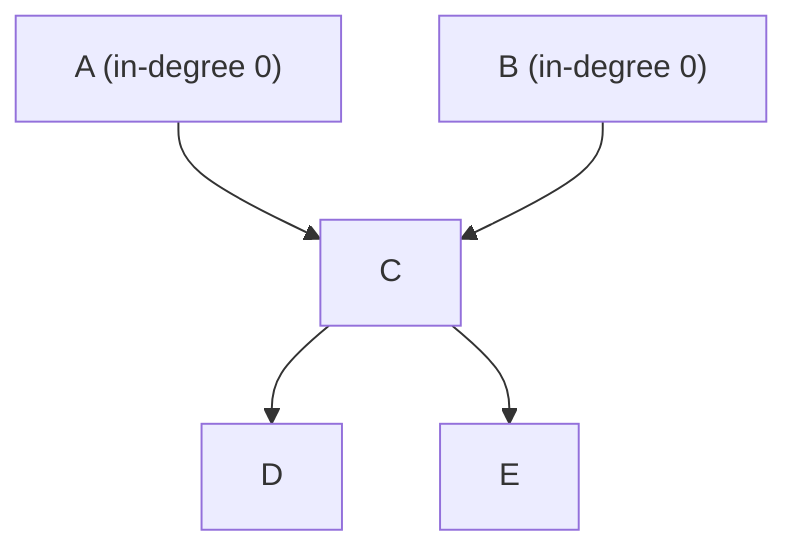

# Topological sorting

Turning a set of "this before that" constraints into one sequence that satisfies
all of them. How several walls' layer orders become one trench-wide
stratigraphic sequence, and how a Harris Matrix is put in reading order.

## What it is

Given a [DAG](directed-acyclic-graphs.md), produce a linear order in which every
node appears before all its successors.

**Kahn's algorithm** is the frontier-based formulation:

1. Count each node's **in-degree** — how many predecessors it has.
2. Put every node with in-degree 0 into a *ready* set.
3. Take one from the ready set, append it to the output, and decrement the
   in-degree of each of its successors. Any that reaches 0 joins the ready set.
4. Repeat.

If the output is shorter than the node count, some nodes never became ready —
which means a [cycle](cycle-detection.md).

The critical property is that **the answer is usually not unique**. Whenever
several nodes are ready simultaneously, any of them may come next. For a
chronology that is correct — two deposits with no recorded relationship
genuinely have no relative order — but it means the *reported* order depends on
which ready node is chosen, and an arbitrary choice makes the output
irreproducible.

Both implementations here solve that with a **min-heap** keyed on a stable
value.

## The picture



```
ready: {A, B}          both available — the choice is arbitrary
                       a heap keyed on first-seen position makes it A

take A → ready {B}
take B → C's in-degree hits 0 → ready {C}
take C → ready {D, E}
take D, take E

order: A B C D E
```

Without the heap, `ready` might be a set, and Python set iteration order would
decide — so the same matrix could render two different diagrams on two runs.

## Where this project uses it

### One trench-wide layer order from several walls

`poggio_webapp/pipeline/merge_walls.py`:

```python
def merged_series_order(merged):
    """One trench-wide young-to-old surface order for a merged document.

    ...
    Each face's layers[] is already top-to-bottom, i.e. young to old, so every
    adjacent pair within a face is an ordering constraint. The constraints from
    all faces are merged and topologically sorted (Kahn's algorithm). Ties are
    broken by first-seen input order, so the result is deterministic.

    Raises ValueError if the walls contradict each other (a cycle). Guessing an
    order there would invent stratigraphy, so it refuses.
    """
```

Constraints are gathered per face:

```python
for earlier, later in zip(sequence, sequence[1:]):
    if earlier == later:
        notes.append(
            f"face {fname!r} lists surface {earlier!r} in two adjacent "
            "layers; ignoring that self-constraint (it would look like "
            "a contradiction)")
        continue
    if later not in successors[earlier]:
        successors[earlier].add(later)
        indegree[later] += 1
```

Two guards. A **self-constraint** (`A → A`) would be an instant cycle, so a face
listing the same surface twice in a row is noted and skipped rather than
failing. And `if later not in successors[earlier]` prevents double-counting when
two walls assert the same constraint, which would leave `indegree` permanently
too high and make the node never become ready.

Then the sort:

```python
# Kahn's algorithm. The ready set is a heap of first-seen positions, so
# whenever several surfaces are simultaneously available the earliest-seen
# one wins and the output is stable.
by_index = {position: name for name, position in order_index.items()}
ready = [position for name, position in order_index.items()
         if indegree[name] == 0]
heapq.heapify(ready)
order = []
while ready:
    name = by_index[heapq.heappop(ready)]
    order.append(name)
    for later in sorted(successors[name], key=lambda n: order_index[n]):
        indegree[later] -= 1
        if indegree[later] == 0:
            heapq.heappush(ready, order_index[later])
```

The heap holds **first-seen positions**, not names — so ties break by document
order rather than alphabetically. That matters: `Locus 10` sorts before
`Locus 2` alphabetically, which would produce a stratigraphically misleading
tie-break.

The result also carries a caveat for under-constrained surfaces:

```python
if len(faces) > 1:
    for name in order:
        if len(faces_by_surface[name]) == 1:
            notes.append(
                f"surface {name!r} has layers on only one wall "
                f"({faces_by_surface[name][0]}); it is ordered from fewer "
                "constraints and will still be interpolated across the "
                "whole model extent")
```

### Reading order for a Harris Matrix

`poggio_webapp/pipeline/harris_matrix.py`:

```python
def _topological_sort(nodes, edges):
    adjacent = _adjacency(nodes, edges)
    indegree = {node: 0 for node in nodes}
    for _, older in edges:
        indegree[older] += 1

    ready = [
        node
        for node in nodes
        if indegree[node] == 0
    ]
    heapq.heapify(ready)
    order = []

    while ready:
        node = heapq.heappop(ready)
        order.append(node)
        for neighbor in adjacent[node]:
            indegree[neighbor] -= 1
            if indegree[neighbor] == 0:
                heapq.heappush(ready, neighbor)

    return order
```

Here the heap holds node IDs directly, which is fine because unit IDs are
content-addressed hashes — stable for a given unit, and carrying no misleading
ordering.

The public entry point checks for a cycle first and raises rather than returning
a partial order:

```python
def topological_order(matrix: HarrisMatrix) -> list[str]:
    """Return correlated display nodes in stable younger-to-older order."""
    components = correlation_components(matrix)
    nodes, relation_ids_by_edge = _collapsed_graph(matrix, components)
    edges = set(relation_ids_by_edge)
    cycle = _find_cycle(nodes, edges)
    if cycle is not None:
        raise ValueError(f"Cycle detected: {' -> '.join(cycle)}")
    return _topological_sort(nodes, edges)
```

Note it sorts the **collapsed** graph — [correlated](union-find.md) units are
one node — so the order is over display nodes rather than raw units.

## Why this and not something else

| Alternative | How it would order | Why it lost |
|---|---|---|
| **DFS-based topological sort** | Reverse post-order of a DFS | Equally valid and O(V + E), and its output order is determined by traversal order, which is harder to reason about than an explicit heap. Kahn's frontier makes "which nodes are simultaneously available" visible, which is exactly the archaeologically meaningful fact. |
| **Kahn with a plain list or set** | Arbitrary among ready nodes | Non-deterministic. The same matrix could render two different diagrams, and a diff of two saves would show spurious changes. |
| **Kahn with a min-heap** *(chosen)* | Earliest-seen among ready nodes | Deterministic, and the tie-break is a meaningful one — document order in `merge_walls`, stable IDs in `harris_matrix`. |
| **Sort by depth or elevation** | Order by measured Z | Tempting, and it ignores the recorded relationships in favour of geometry. Two deposits at the same depth on opposite sides of a trench are not contemporaneous just because their elevations match. |
| **Require the user to supply an order** | Ask | `merge_walls` allows exactly this — `body.get("series_order")` — and computes one only when the user has not. Both paths exist. |

The deciding argument is the same one that runs through the graph work: **the
evidence gives a partial order, and a topological sort is the minimal way to
turn it into a sequence without adding constraints that were not observed.**
Where the constraints conflict, both implementations refuse.

## What it costs

O(V + E) for the traversal, plus O(V log V) for the heap operations — the log
factor is the price of determinism.

The subtleties:

- **The answer is one of many valid orders.** It satisfies every constraint and
  is not "the" chronology; unrelated units could equally be swapped.
- **Double-counted edges break it silently.** A node whose in-degree was
  incremented twice for one relationship never reaches zero, so it vanishes from
  the output and looks like a cycle. Both implementations guard against this.
- **Self-loops are instant cycles**, hence the explicit skip in `merge_walls`.
- **A cycle yields a short output**, not an exception — so the caller must check
  the length. Both do.

## Where else you meet it

- **Build systems.** `make`, Bazel, and every package manager compute one to
  decide compilation or installation order.
- **Spreadsheets**, recalculating cells in dependency order.
- **Course prerequisites**, the textbook example.
- **Task schedulers and CI pipelines**, ordering jobs by their dependencies.
- **Compilers**, ordering module initialisation and instruction scheduling.
- **Data pipelines** — Airflow, dbt, and similar tools are topological sorts with
  a user interface.

## Related pages

- [Directed acyclic graphs](directed-acyclic-graphs.md) — the precondition.
- [Cycle detection](cycle-detection.md) — what happens when it fails.
- [Adjacency representations](adjacency-representations.md) — the in-degree map.
- [Heaps and priority queues](heaps-and-priority-queues.md) — the structure that makes it
  deterministic.
- [Union-Find](union-find.md) — how the Harris graph is collapsed first.
- [Combine walls into one trench](../workflows/09-multi-wall-trench.md) — the
  workflow.
