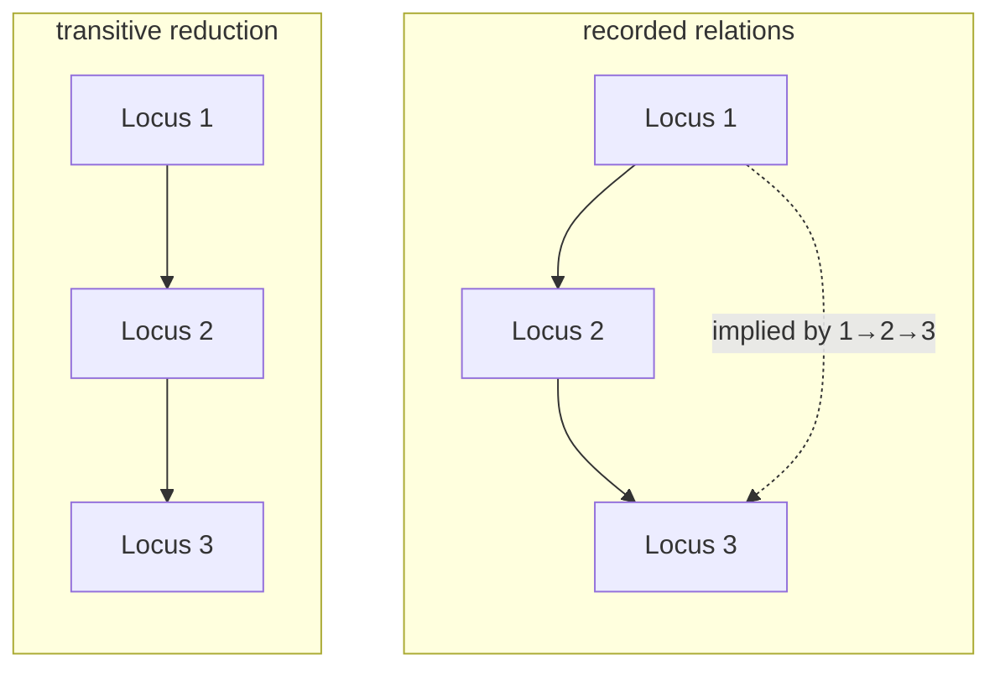

# Transitive reduction

Removing the edges a longer path already implies. What turns a tangle of
recorded relationships into a readable Harris Matrix, without deleting anything
an archaeologist wrote down.

## What it is

If `A → B` and `B → C`, then `A → C` follows. Drawing that third arrow as well
adds no information and adds clutter.

The **transitive reduction** of a [DAG](directed-acyclic-graphs.md) is the
smallest edge set with the same reachability. For a DAG it is **unique**, which
is what makes a Harris Matrix diagram well defined rather than a matter of
drafting style.

The rule is simple: an edge `A → C` is redundant when a path from A to C exists
*without using that edge*.

Its opposite, the transitive **closure**, adds every implied edge instead. Both
preserve reachability; one is the minimal representation and the other the
maximal.

Removing implied edges is not merely cosmetic in archaeology. A Harris Matrix
is conventionally drawn with only *immediate* relationships, because an arrow
between two units is read as "these are in direct stratigraphic contact." An
implied arrow makes a claim about contact that the evidence does not support.

## The picture



Both graphs say Locus 1 is older than Locus 3. The second says it without
claiming they touch.

## Where this project uses it

`poggio_webapp/pipeline/harris_matrix.py`:

```python
def _path_exists(start, target, edges, excluded_edge):
    adjacent = _adjacency(
        {node for edge in edges for node in edge},
        edges - {excluded_edge},
    )
    pending = [start]
    visited = set()

    while pending:
        node = pending.pop()
        if node == target:
            return True
        if node in visited:
            continue
        visited.add(node)
        pending.extend(reversed(adjacent.get(node, [])))
    return False


def _transitive_reduction_edges(edges):
    return {edge for edge in edges if not _path_exists(edge[0], edge[1], edges, edge)}
```

The definition, almost literally: keep an edge only if no other path connects
its endpoints. `edges - {excluded_edge}` is what makes the search look for an
*alternative* route rather than trivially finding the edge itself.

### The part that matters most: nothing is deleted

```python
order = _topological_sort(nodes, edges)
reduced_edges = _transitive_reduction_edges(edges)
display_edges = sorted(reduced_edges)

for edge in sorted(edges - reduced_edges):
    warnings.append(
        _issue(
            "redundant-relation",
            f"Saved relation {edge[0]} -> {edge[1]} is implied by "
            "a longer path and is omitted from display edges.",
            list(edge),
            relation_ids_by_edge[edge],
        )
    )
```

The name is **`display_edges`**. The reduction affects *what is drawn*, not what
is stored. Every recorded relation stays in `matrix.relations`; the redundant
ones become **warnings**, naming the specific relation IDs.

That distinction is the design decision on this page. An archaeologist who
recorded `Locus 1 → Locus 3` observed something and wrote it down. The software's
judgement that it is implied is an inference from the rest of the data, an
inference that would be wrong if one of the intermediate relations is later
corrected. Deleting the observation would destroy evidence to tidy a picture.

So: draw the reduction, keep the record, and report the difference.

The reduction runs **only on an acyclic graph**, because reachability is not
meaningful otherwise:

```python
cycle = _find_cycle(nodes, edges)
if cycle is not None:
    errors.append(...)
    order = []
    display_edges = []
else:
    order = _topological_sort(nodes, edges)
    reduced_edges = _transitive_reduction_edges(edges)
```

And it operates on the [collapsed graph](union-find.md), so
[correlated](../archaeology/index.md) units are already one node before
redundancy is assessed.

## Why this and not something else

| Alternative | How it would handle implied edges | Why it lost |
|---|---|---|
| **Draw every recorded relation** | No reduction | A matrix with 30 units and full relationships becomes unreadable, and every implied arrow makes a false claim of direct stratigraphic contact. |
| **Delete redundant relations from storage** | Reduce the data, not the display | Destroys an archaeologist's observation. If an intermediate relation is later corrected, the deleted one may no longer be implied, and it is gone. |
| **Transitive closure** | Add every implied edge | The opposite. Maximum clutter, and it manufactures contact claims wholesale. |
| **Reduce for display, warn, keep the data** *(chosen)* | Three separate outputs | The diagram is readable, the record is complete, and the user is told which relations were omitted and why. |
| **Matrix-based reduction (Floyd–Warshall)** | Compute closure, subtract | O(V³) time, O(V²) memory. For sparse chronologies the reachability approach is much cheaper. |
| **Let the user mark relations as direct** | Manual annotation | More faithful in principle: direct contact is an observation, not a derivation. It is work per relation, and the current `HarrisRelation.kind` field (above, cuts, fills, precedes, other) already carries some of that meaning. A reasonable future direction. |

## What it costs

The implementation is **O(E × (V + E))**: a reachability search per edge. For a
matrix of 100 units and 200 relations that is 200 searches over a small graph:
milliseconds.

Better algorithms exist. Reduction can be done in the time of a matrix
multiplication, and for sparse DAGs a single topological pass with reachability
bitsets is far faster. Neither is justified here: `_MAX_UNITS = 250` bounds
rendering, and real matrices are far smaller.

The subtler costs:

- A fresh [adjacency list](adjacency-representations.md) is built per edge,
  inside `_path_exists`. Wasteful, and it keeps each search independent, which
  makes the function trivially correct.
- It is only defined on a DAG. Guarded.
- A "redundant" edge may carry unique evidence. Two relations can imply the
  same reachability while resting on completely different observations:
  `kind="cuts"` versus `kind="above"`, say. This is precisely why the edge is
  omitted from *display* only, and why the warning names the relation IDs.

## Where else you meet it

- Package managers, pruning implied dependencies so a dependency tree is
  readable.
- Class hierarchy diagrams, where UML tools omit inherited relationships
  already implied by a chain.
- Makefile and build-graph visualisation.
- Database normalisation, where a minimal cover of functional dependencies is
  the same idea.
- Ontologies and taxonomies, where reasoners distinguish asserted from
  inferred subsumption: the identical stored-versus-displayed split this page
  describes.
- Citation and provenance graphs, showing direct sources rather than every
  ancestor.

## Related pages

- [Directed acyclic graphs](directed-acyclic-graphs.md): the precondition.
- [Depth-first search](depth-first-search.md): the reachability search.
- [Adjacency representations](adjacency-representations.md): why the edge set
  form suits the set difference.
- [Union-Find](union-find.md): the collapse that runs first.
- [Layered graph drawing](layered-graph-drawing.md): what consumes the reduced
  edges.
- [Build a Harris Matrix](../workflows/harris-matrix.md): the workflow.
