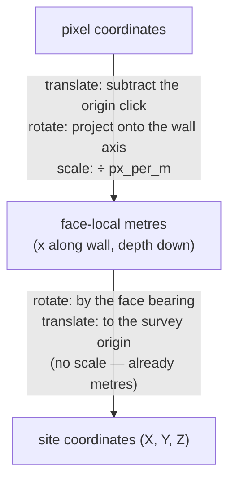

# Translation, rotation, and scaling

The three moves that get a point from a drawing to a survey grid. Every
coordinate conversion in this project is some combination of them, and knowing
which are present tells you what the conversion can and cannot distort.

## What it is

**Translation** — move by a fixed offset. `(x, y) → (x + a, y + b)`. Shape,
size, and orientation all unchanged.

**Rotation** — turn about a point by an angle.
`(x, y) → (x cos θ − y sin θ, x sin θ + y cos θ)`. Shape and size unchanged.

**Scaling** — multiply distances. Uniform scaling (the same factor both ways)
preserves shape and angles; non-uniform scaling does not, and turns a circle
into an ellipse.

The three compose, and the composition is **not commutative** — rotating then
translating is not the same as translating then rotating. Order is part of the
specification.

What is preserved defines the family:

| Family | Moves | Preserves |
|---|---|---|
| Rigid (Euclidean) | translate, rotate | distances and angles |
| [Similarity](similarity-transforms.md) | + uniform scale | angles and shape |
| [Affine](affine-transforms.md) | + shear, non-uniform scale | parallel lines |
| Projective (homography) | + perspective | straight lines only |

## The picture

The two conversions this project performs, and which moves each uses:



Both are **similarity** transforms, and the second is **rigid** — no scaling at
all, because metres are already metres.

## Where this project uses it

### Pixels to face-local metres

`poggio_webapp/pipeline/manual_extraction.py`:

```python
def convert(self, point):
    px, py = float(point[0]), float(point[1])
    dx, dy = px - self.origin_x, py - self.origin_y  # translate
    x_m = (dx * self.ux + dy * self.uy) / self.px_per_m  # rotate, scale
    depth_m = (dx * self.vx + dy * self.vy) / self.px_per_m  # rotate, scale
    return round(x_m, 4), round(depth_m, 4)
```

The rotation is not written as an angle — it is a
[projection onto an orthonormal basis](orthonormal-bases.md), which is the same
thing expressed in components rather than in trigonometry.

### Face-local metres to site coordinates

`poggio_webapp/pipeline/convert_coords.py`:

```python
X0, Y0 = cfg["originX"], cfg["originY"]
Z0 = cfg["surfaceZ"]
th = math.radians(cfg["bearing_deg"])
sin_t, cos_t = math.sin(th), math.cos(th)


def to_site(x, depth, X0=X0, Y0=Y0, Z0=Z0, sin_t=sin_t, cos_t=cos_t):
    X = X0 + x * sin_t
    Y = Y0 + x * cos_t
    Z = Z0 - depth
    return X, Y, Z
```

Rotation by the face bearing, then translation to the surveyed origin. **No
scale factor appears**, because both sides are in metres — and that absence is
itself a claim: the drawing's scale was already resolved by calibration, so no
further stretching is permitted here.

`sin` on X and `cos` on Y because the bearing is a compass angle, not a
mathematical one. See
[compass bearings versus mathematical angles](compass-bearings-vs-mathematical-angles.md).

`Z = Z0 − depth`, a *subtraction*, because depth increases downward while
elevation increases upward. One sign carrying the whole convention.

The default-argument binding is a deliberate Python detail, explained in place:

```python
# The registration values are bound as defaults rather than closed
# over: to_site is only ever called inside this iteration, but binding
# makes that explicit and keeps the closure from tracking the loop.
```

See [closure late-binding capture](closure-late-binding-capture.md).

### Rotation of an image, rather than of coordinates

`poggio_webapp/pipeline/preprocess.py` is the one place a rotation is applied to
*pixels*:

```python
M = cv2.getRotationMatrix2D((w / 2, h / 2), angle, 1.0)
rot = cv2.warpAffine(
    gray, M, (w, h), flags=cv2.INTER_CUBIC, borderMode=cv2.BORDER_REPLICATE
)
```

The `1.0` is the scale factor — rotation only. And unlike the coordinate
transforms, this one is **lossy**, because it resamples. See
[bilinear and bicubic interpolation](bilinear-and-bicubic-interpolation.md).
That asymmetry is why deskew is optional and coordinate projection is not.

## Why this and not something else

| Alternative | How it would work here | Why it lost |
|---|---|---|
| **Non-uniform scaling** | Different x and y factors | Would let a badly calibrated drawing appear self-consistent while being systematically stretched. Uniform scale means one number and one place to be wrong. |
| **Shear** ([affine](affine-transforms.md)) | Six parameters instead of four | Can represent a skewed sheet, and can also absorb a mis-clicked calibration point as apparent geometry rather than failing. |
| **Perspective** (homography) | Eight parameters, four clicks | Genuinely needed for a photograph taken at an angle, where the sheet is keystoned. Costs an extra click and is sensitive to its accuracy. A known limitation; the [drawing guidelines](../reference/drawing-guidelines.md) ask for a square-on photograph instead. |
| **Rotate the image, then read pixels** | [Deskew](hough-line-transform.md) first | Lossy — it resamples — and it corrects only the rotation an edge detector estimated, not the one the user's clicks define. |
| **Translate + rotate + uniform scale** *(chosen)* | Four parameters per conversion | The least expressive transform that can represent the truth, so a bad input fails rather than distorting. |

The principle: **the transform family you choose is a claim about what can vary.**
Choosing similarity says "the drawing may be shifted, turned, and at any scale,
but it is not stretched or skewed." That is a true statement about a flat sheet
photographed square-on, and a transform that could not represent a skew will
never invent one.

## What it costs

Each conversion is a handful of multiplies and adds — O(1) per point.

The costs are in what is *not* representable, and all three are real: perspective
from an angled photograph, non-uniform stretch from aged paper, and lens
distortion at the edges of a wide-angle phone shot. None is corrected, and the
mitigation is procedural rather than computational.

The other cost is **order sensitivity**. Rotating then translating differs from
translating then rotating, and the two conversions here use opposite orders —
pixels translate first (subtract the origin, then project); site coordinates
rotate first (scale by bearing, then add the survey origin). Both are correct
for their direction, and swapping either would produce plausible, wrong numbers.

## Where else you meet it

- **Every graphics API.** CSS `transform`, SVG `transform`, OpenGL model
  matrices.
- **Robotics**, where a kinematic chain is a product of rigid transforms.
- **GIS**, where map projections are these plus a curved-earth model.
- **Image registration** in medical imaging, aligning scans taken at different
  times.
- **Animation**, where a keyframe is usually a translation, a rotation, and a
  scale.

## Related pages

- [Similarity transforms](similarity-transforms.md) — this family, named.
- [Affine transforms](affine-transforms.md) — the next family up.
- [Homogeneous coordinates](homogeneous-coordinates.md) — how they compose into
  one matrix.
- [Compass bearings versus mathematical angles](compass-bearings-vs-mathematical-angles.md) —
  the rotation convention here.
- [Coordinate spaces](../concepts/coordinate-spaces.md) — the spaces involved.
