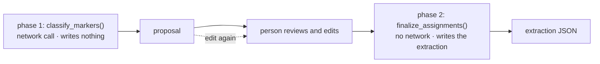

# Two-phase commit with review

Split an operation into "produce a proposal" and "commit the reviewed
proposal", with a person in between. The expensive, irreversible, or
non-deterministic part happens once; the decision happens afterwards.

## What it is

A single-phase operation does everything at once: call the service, transform
the result, write the file. If any part needs human judgement, there is nowhere
to put it.

Two-phase splits at the judgement point:

**Phase 1: propose.** Do the expensive or non-deterministic work. Produce a
proposal. **Write nothing.**

**Phase 2: commit.** Take the (possibly edited) proposal and produce the final
artifact, deterministically, with no external calls.

The properties that fall out:

- The costly call happens **once**, however many times the user edits.
- Phase 2 is **deterministic and offline**, so it is trivially testable.
- The user's edits are **first-class input**, not a correction applied afterwards.
- A failure in phase 2 leaves nothing half-written.

## The picture



## Where this project uses it

### Marker classification

`poggio_webapp/pipeline/assign_markers.py` states the split in a comment block:

```python
# entry points
#
# Two-phase API used by the webapp (/markers/assign then /markers/finalize):
#   classify_markers()     network call, returns the proposal for user review
#   finalize_assignments() no network, assembles the reviewed proposal + the
#                          immutable CV coordinates into the extraction JSON
# run_assign() below composes the two for one-shot/CLI use.
```

Phase 1 is explicit about writing nothing:

```python
def classify_markers(
    image_path, markers, square_cm, api_key, max_output_tokens=65536, progress_cb=None
):
    """Phase 1 (calls Gemini): classify each detected marker
    (top of locus N / final base / noise) and read the sheet's labels.
    Generates no geometry and writes nothing to disk. ...
    """
```

Phase 2 is explicit about not calling out:

```python
def finalize_assignments(markers, result_dict, out_path):
    """Phase 2 (no network call): assemble the (possibly user-edited)
    classification `result_dict` plus the immutable CV marker coordinates
    into the FieldWallProfile extraction JSON, write it to `out_path`, and
    return (raw_json_text, warning_or_None) like the other extraction
    runners."""
```

"possibly user-edited" is the point. The proposal is not a draft the code will
regenerate. It is **input**.

And the one-shot composition is kept for callers that do not need review:

```python
def run_assign(image_path, markers, square_cm, out_path, api_key, ...):
    """One-shot convenience wrapper: classify then immediately finalize,
    with no review step in between. Preserved for CLI/script use; the
    webapp calls the two phases separately. Returns
    (raw_json_text, warning_or_None) exactly as before the split."""
```

Splitting the phases did not break the single-call API, a refactor that
preserved its own interface.

Two payoffs worth naming:

**The expensive call happens once.** Each Gemini request re-uploads a
multi-megabyte image and spends metered quota. See
[retry budgets](retry-budgets.md). A user correcting three classifications does
not pay for three more calls.

**Phase 2 is deterministic and offline**, so `_assemble` is unit-testable with a
literal marker list and a literal classification dict, with no network and no
key.

### Suggestion review

`poggio_webapp/pipeline/harris_suggestions.py` uses the same shape across a
longer gap:

```python
def generate_suggestions(matrix, jobs_dir, tolerance_m=0.02) -> HarrisMatrix:
    """Return a copy containing deterministic, unaccepted suggestions."""
```

Every suggestion is created `status="pending"`. Nothing is applied. Phase 2 is
per-suggestion:

```python
def review_suggestion(matrix, suggestion_id, action) -> HarrisMatrix:
    """Accept or reject one suggestion without mutating the input matrix."""
```

and the commit is transactional, applied to a
[copy](immutability-and-defensive-copying.md), revalidated, and rolled back by
discarding the copy if it fails:

```python
if suggestion.suggestion_type == "ordering":
    _accept_ordering(reviewed, suggestion)
else:
    _accept_correlation(reviewed, suggestion)
suggestion.status = "accepted"

report = validate_matrix_graph(reviewed)
if not report["ok"]:
    raise _acceptance_error(suggestion, report)
return reviewed
```

Because suggestion IDs are
[content-addressed](content-addressed-identifiers.md), regenerating carries the
user's decisions across, so phase 1 can be re-run without discarding the
review.

### Editor save and finalize

The editor separates saving from committing:

```python
def save_editor_state(job_id: str, state: dict) -> None:
    """Overwrite the saved opaque editor state for an existing job."""
```

State is **opaque**: stored as given, unvalidated, so a half-finished drawing
can be saved and resumed. Finalization is the commit:

```python
def finalize_editor_session(job_id: str):
    """
    Validate saved editor state and write the corresponding extraction JSON.
    ...
    """
    model_state = (
        _validate_editor_structure(state, schema_type)
        if _is_editor_envelope(state)
        else state
    )
    ...
    validated = model_class(**{**model_state, "source": "manual_editor"})

    (session_dir / "extraction_output.json").write_text(
        validated.model_dump_json(indent=2)
    )
```

Validation happens at the commit, not at every save, which is what lets a
drawing be incomplete while in progress. See
[structural versus schema validation](structural-vs-schema-validation.md).

## Why this and not something else

| Alternative | How it would handle marker classification | Why it lost |
|---|---|---|
| **Single phase** | Call, assemble, write | No place for review. Any correction means re-calling: re-uploading the image and re-spending quota. |
| **Write the proposal, edit the file** | Persist phase 1's output, let the user edit the JSON | Workable, and it makes an unreviewed proposal look like a finished extraction. Nothing distinguishes them on disk. |
| **Interactive session** | Keep state server-side between calls | The proposal *is* the state, passed back explicitly. No session storage, no expiry. |
| **Optimistic apply with undo** | Commit, offer a reversal | Requires an undo log, and the artifact exists in the meantime, visible to anything watching the directory. |
| **Propose then commit** *(chosen)* | Two functions, proposal as data | The expensive call happens once, the commit is deterministic and testable, and nothing is written until the person decides. |

The key property is that **nothing is written in phase 1**. An unreviewed
proposal never exists as an artifact, so it can never be mistaken for a finished
one, which matters in a system whose outputs are archaeological records.

## What it costs

The proposal must round-trip through the client, so it is serialisable and its
shape is part of the API. `MarkerAssignmentResult` exists partly for that.

The costs:

- A larger API surface. Two endpoints, `/markers/assign` and
  `/markers/finalize`, instead of one.
- The client holds intermediate state. A closed tab loses the proposal, and
  phase 1 must be re-run, the one place the cost of the expensive call is paid
  twice.
- The proposal can go stale. If the markers are re-detected, an old
  classification refers to marker IDs that may have moved. `_assemble` handles it
  by reporting rather than failing: unknown IDs are ignored with a warning, and
  missing ones are treated as noise with a count.
- More code than one function. Justified by phase 2 being independently
  testable.

## Where else you meet it

- Database two-phase commit, where the name comes from: prepare, then
  commit.
- `git add` then `git commit`, with the staging area as the reviewable
  proposal.
- Terraform plan and apply, the clearest modern example.
- Pull requests, which are propose-review-merge at the level of code.
- Payment authorisation and capture, separating the hold from the charge.

## Related pages

- [Human-in-the-loop review](human-in-the-loop-review.md): why the gap exists.
- [Immutability and defensive copying](immutability-and-defensive-copying.md):
  how the commit rolls back.
- [Idempotency](idempotency.md): why re-running phase 1 is safe.
- [Retry budgets](retry-budgets.md): the cost of the phase-1 call.
- [Structural versus schema validation](structural-vs-schema-validation.md):
  validation at the commit.
