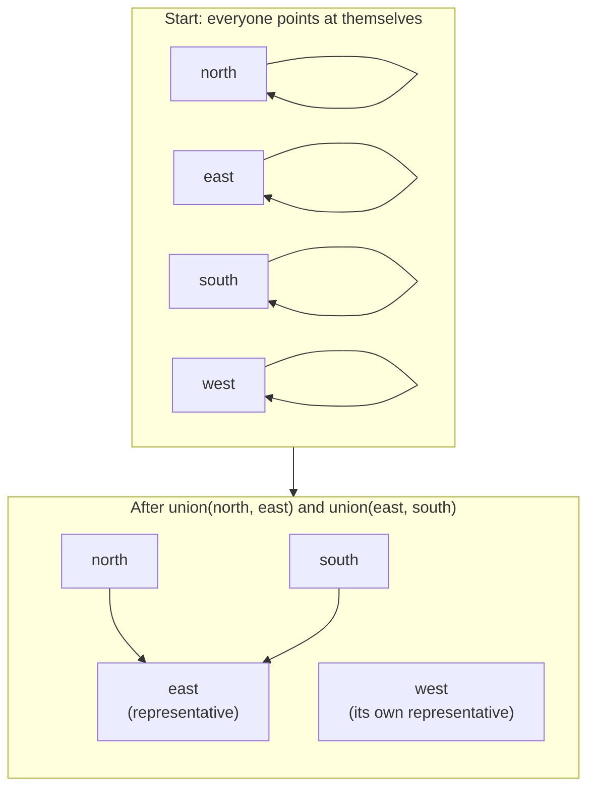

# Union-Find (disjoint sets)

A structure for answering one question over and over: *are these two things
already in the same group?*

## What it is

You have a pile of items and a stream of statements of the form "these two
belong together." You need to keep track of the groups that result, and you
need to be able to ask, at any moment, whether two items have ended up in the
same group.

The naive approach is to keep a list per group and search it. Union-Find does
something cleverer: **it never stores groups at all.** Each item stores a single
pointer to another item in its group. Follow the pointers and you eventually
reach an item that points at itself — that item is the group's *representative*.
Two items are in the same group exactly when they reach the same representative.

Two operations:

- **find(x)** — follow x's pointers to its representative.
- **union(a, b)** — point one representative at the other, merging two groups
  into one.

The trick that makes it fast is **path compression**: while walking up to the
representative, re-point the nodes you pass so they aim closer to the top. The
structure flattens as you use it.

## The picture

Four walls of a trench. Two statements arrive: "north meets east" and "east
meets south." West joins nothing.



`find(north)` and `find(south)` both return `east`, so they are connected.
`find(west)` returns `west`, so west is on its own — which is exactly the
finding this project wants to report.

Path compression, on a longer chain:

```
before find(d):   d → c → b → a        (a is the representative)
after  find(d):   d → a,  c → a,  b → a
```

The next `find(d)` is one hop instead of three, and it got that way as a side
effect of a query nobody had to plan.

## Where this project uses it

Twice, for two genuinely different jobs.

### 1. Are the walls of this trench actually joined?

A merged trench is only a pit if adjacent walls share corner coordinates. Each
wall contributes two endpoints in site coordinates; two walls are joined if any
of their endpoints land within survey tolerance of each other. Union-Find turns
that pairwise test into groups.

From `poggio_webapp/pipeline/merge_walls.py`:

```python
def _endpoint_components(endpoints, tolerance_m):
    """Group faces that meet at a corner. endpoints: {face: (start, end)}.
    Returns a list of face-name lists, each list in first-seen order."""
    names = list(endpoints)
    parent = {name: name for name in names}

    def find(name):
        while parent[name] != name:
            parent[name] = parent[parent[name]]  # path halving
            name = parent[name]
        return name

    for i, a in enumerate(names):
        for b in names[i + 1 :]:
            touching = any(
                math.dist(pa, pb) <= tolerance_m
                for pa in endpoints[a]
                for pb in endpoints[b]
            )
            if touching:
                parent[find(a)] = find(b)
```

The caller then takes the **largest** group as "the trench" and warns about
every wall outside it:

```python
trench = max(components, key=lambda g: (len(g), -min(order[n] for n in g)))
for name in endpoints:
    if name not in trench:
        warnings.append(
            f"face {name!r} is not connected to the rest of the trench: ..."
        )
```

Note the tie-break. When two groups are the same size, the one containing the
earliest face wins, so the warning never depends on dictionary iteration luck.
See [determinism and stable sorting](determinism-and-stable-sorting.md).

### 2. Which units are the same deposit?

In a [Harris Matrix](../archaeology/index.md), a **correlation** is the
archaeologist's judgement that two separately recorded units are one deposit.
Correlations are transitive: if A is the same as B, and B the same as C, then
A, B, and C are one node on the diagram.

From `poggio_webapp/pipeline/harris_matrix.py`:

```python
def correlation_components(matrix: HarrisMatrix) -> dict[str, str]:
    """Map each stored unit to its deterministic correlation representative."""
    unit_ids = sorted({unit.id for unit in matrix.units})
    parent = {unit_id: unit_id for unit_id in unit_ids}

    def union(first_id, second_id):
        first_root, second_root = find(first_id), find(second_id)
        if first_root == second_root:
            return
        representative = min(first_root, second_root)  # deterministic
        parent[max(first_root, second_root)] = representative
```

The representative is chosen by `min()` rather than by tree height. That is
deliberately *not* the textbook optimisation — see below.

The result feeds `_collapsed_graph()`, which rewrites every stratigraphic
relation in terms of representatives. That is what lets the renderer draw one
box labelled `Locus 4 = Locus 12` where the data holds two units.

## Why this and not something else

The question in both places is only ever "same group or not." Nothing needs the
groups enumerated until the very end.

| Alternative | How it would work here | Why it lost |
|---|---|---|
| **Repeated DFS or BFS flood fill** | Build an adjacency list of "touching" pairs, then traverse from each unvisited node to collect its component | Correct, and genuinely fine at four walls. But it has to be re-run from scratch whenever a correlation is added, and the correlation set changes on every accepted suggestion. Union-Find absorbs each new statement in near-constant time. |
| **A list of sets, merged on demand** | Keep `list[set[str]]`; on each union, find the sets containing each item and merge them | The "find the set containing x" step is a linear scan over sets. Merging is O(size). It reads naturally and degrades quietly as the matrix grows. |
| **An adjacency matrix with transitive closure** | Mark pairs, then run Floyd–Warshall to close the relation | O(n³) time and O(n²) memory to answer a question Union-Find answers in near-O(1), and it computes a full reachability table nobody asked for. |
| **A dictionary from item to group id, rewritten on merge** | On union, rewrite every member of the smaller group | This *is* Union-Find, just without the pointer indirection — and it pays the rewrite cost up front on every merge instead of amortising it. |
| **Union by rank or size** (the textbook pairing for path compression) | Attach the shorter tree under the taller one | Rejected on purpose. Union by rank picks the representative by tree shape, which depends on the *order statements arrived in*. This project needs the representative to be a stable function of the data, because it becomes the node id in the rendered diagram and in `display_edges`. `min()` guarantees the same matrix always produces the same representative; path compression alone already keeps the trees flat enough at this scale. |

That last row is the interesting one. It is a case where the repository
knowingly gives up an asymptotic guarantee to buy **determinism**, and the
reasoning is written into the docstring: *"Map each stored unit to its
deterministic correlation representative."*

## What it costs

| Variant | Amortised cost per operation |
|---|---|
| No optimisation | O(n) worst case — the tree can degenerate into a chain |
| Path compression only *(what this project uses)* | O(log n) amortised |
| Path compression + union by rank | O(α(n)) — inverse Ackermann, under 5 for any n you will ever have |

Memory is one dictionary entry per item.

At this project's scale the difference is unmeasurable. A trench has a handful
of walls; a Harris Matrix has tens to low hundreds of units. The reason to know
the table is to know that the deterministic choice costs nothing real here, and
where it *would* start to cost something.

The corner-adjacency site also does an **O(n²) pairwise scan** before ever
calling `union` — comparing every wall's endpoints against every other wall's.
That, not the Union-Find, is the dominant term. It is fine at four walls and
would need a spatial index at four thousand. (The correlation site has no such
scan: it unions the members of each recorded correlation directly.)

## Where else you meet it

- **Kruskal's minimum spanning tree** — the classic use. Sort edges by weight,
  add an edge only if its ends are not already connected.
- **Image segmentation** — connected-component labelling merges neighbouring
  pixels of the same value; the two-pass algorithm uses Union-Find for the
  equivalences discovered in the first pass.
- **Percolation and network reliability** — does a path exist from top to
  bottom as connections are added one at a time?
- **Compilers** — type inference unifies type variables; Union-Find tracks which
  variables have been proven equal.
- **`git merge-base`-style ancestry questions** and cycle detection in
  dependency resolvers.
- **Spreadsheets and CRMs** — "merge duplicate records" is exactly this problem.

## Related pages

- [Connected components](connected-components.md) — the concept Union-Find computes here.
- [Determinism and stable sorting](determinism-and-stable-sorting.md) — why the representative is chosen
  by `min()`.
- [Directed acyclic graphs](directed-acyclic-graphs.md) and [cycle detection](cycle-detection.md) — what the
  collapsed Harris graph is checked for once components are known.
- [Combine walls into one trench](../workflows/09-multi-wall-trench.md) — the
  workflow whose corner-adjacency warning this produces.
- [Build a Harris Matrix](../workflows/harris-matrix.md) — the workflow whose
  correlations this collapses.
- [Algorithm index](../architecture/algorithm-index.md) — everything else in
  these two modules.
