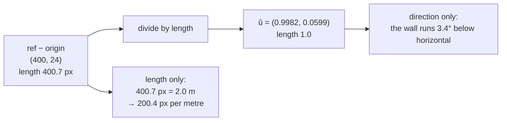

# Unit vectors and normalisation

Dividing a vector by its own length so only its direction remains. The step that
separates *which way the wall runs* from *how big the photograph is*.

## What it is

A **unit vector** has magnitude exactly 1. **Normalising** produces one:

```
û = v / ‖v‖
```

Since the length is now fixed, the only information left is direction. That
separation is what makes unit vectors useful: scale and direction become
independent, and each can be handled by the code that cares about it.

The consequences that matter downstream:

- A [dot product](dot-product.md) with a unit vector is a pure **projection** —
  "how far along this direction," in the original units.
- Rotating a unit vector keeps it a unit vector, so a basis built from one stays
  well behaved.
- Division by zero is the only failure mode, and it happens exactly when the
  input has no direction to extract.

## The picture



Direction and scale, cleanly separated from one subtraction.

## Where this project uses it

### Building the along-wall axis

`poggio_webapp/pipeline/manual_extraction.py`:

```python
dx, dy = rx - ox, ry - oy
pixel_span = math.hypot(dx, dy)
if pixel_span < 2:
    raise ValueError("the two top calibration points are too close together")

ux, uy = dx / pixel_span, dy / pixel_span
# One of the two perpendiculars points toward the user's lowest click.
vx, vy = -uy, ux
toward_lowest = (lx - ox) * vx + (ly - oy) * vy
if toward_lowest < 0:
    vx, vy = -vx, -vy
```

Three things happen in six lines:

1. **`pixel_span` guard first.** A zero-length vector has no direction; the
   check precedes the division rather than trailing it.
2. **`(ux, uy)` is the along-wall direction**, normalised.
3. **`(vx, vy) = (−uy, ux)`** is the perpendicular — and because `u` is a unit
   vector, so is `v`, for free. Rotating a unit vector by 90° cannot change its
   length.

The scale is kept *separately*:

```python
px_per_m=pixel_span / ref_meters,
```

so the conversion is a projection followed by one division:

```python
x_m     = (dx * self.ux + dy * self.uy) / self.px_per_m
depth_m = (dx * self.vx + dy * self.vy) / self.px_per_m
```

Had `u` not been normalised, its length would be tangled into both projections
and the division would be wrong by that factor.

### The same construction, twice more

`poggio_webapp/pipeline/detect_markers.py`:

```python
horizontal_x = horizontal_dx / reference_width_px
horizontal_y = horizontal_dy / reference_width_px

# Clockwise perpendicular to the horizontal axis.
downward_x = -horizontal_y
downward_y = horizontal_x
```

`poggio_webapp/static/visualizer/coordinates.mjs`:

```javascript
const referenceLength = Math.hypot(referenceX, referenceY);

if (referenceLength === 0) {
  throw new RangeError(
    "calibration origin_px and ref_px must be different points.",
  );
}

const u = { x: referenceX / referenceLength, y: referenceY / referenceLength };
let v = { x: -u.y, y: u.x };
```

Three implementations — Python manual tracing, Python CV, browser overlay — of
the same construction, in three languages, each with its own degenerate-input
guard. Each is pinned by its own tests to fixed expected values, because a
browser overlay that disagreed with the stored coordinates would silently
misplace every drawn boundary.

## Why this and not something else

| Alternative | How it would work here | Why it lost |
|---|---|---|
| **Keep the raw vector, divide later** | Project with the un-normalised vector and divide by `‖v‖²` | Algebraically equivalent, and it entangles scale with direction at every use site. Normalising once means every later projection is a plain [dot product](dot-product.md). |
| **Store an angle instead** | `θ = atan2(dy, dx)`, then `cos θ`, `sin θ` | Equivalent, and it costs an inverse trig function plus two forward ones, and reintroduces angle-wrapping concerns. The components *are* the cosine and sine already. |
| **Normalise the whole transform to a matrix** | Build a 2×2 or 3×3 matrix | What [affine transforms](affine-transforms.md) do, and it is the right choice when transforms compose. Here exactly one transform is applied, so two unit vectors and a scalar are more legible than a matrix nobody would read. |
| **Skip normalisation, use a scale factor everywhere** | Carry `‖v‖` alongside | Every consumer must remember to divide, and one that forgets is wrong by a factor that looks plausible. |
| **Normalise once, keep scale separate** *(chosen)* | `û`, `v̂`, `px_per_m` | Direction and scale are independent, each guarded once, and the projection reads as what it is. |

The deeper reason is **separating concerns in the data model**. Direction is a
property of the drawing's orientation; scale is a property of the photograph.
Keeping them apart means a tilted photo and a zoomed photo are handled by
different numbers, and a bug in one cannot masquerade as a bug in the other.

## What it costs

One `hypot` and two divisions per axis. Negligible.

The failure mode is division by zero, and all three implementations guard it
explicitly with a message aimed at the user who caused it — "click the wall's
two top corners" rather than "ZeroDivisionError."

There is also a small precision consideration: `û` is stored as floats, so
`‖û‖` is 1.0 only to within floating-point tolerance. Nothing here compares it
against exactly 1, which is the discipline that keeps that harmless. See
[epsilon comparison](epsilon-comparison.md).

## Where else you meet it

- **Surface normals** in 3D graphics, which must be unit length for lighting
  calculations to be correct.
- **Cosine similarity** in search and machine learning: normalise both vectors,
  then a [dot product](dot-product.md) *is* the cosine of the angle between
  them.
- **Physics simulations**, where a direction of force is separated from its
  magnitude.
- **Navigation and robotics**, where a heading is a unit vector.
- **Gradient descent**, where normalised gradients keep step sizes controlled.

## Related pages

- [Vectors and magnitude](vectors-and-magnitude.md) — what is being normalised.
- [Dot product](dot-product.md) — the operation unit vectors make meaningful.
- [Orthonormal bases](orthonormal-bases.md) — what `û` and `v̂` form together.
- [Similarity transforms](similarity-transforms.md) — the transform they build.
- [Vector projection](vector-projection.md) — what the projection actually
  computes.
