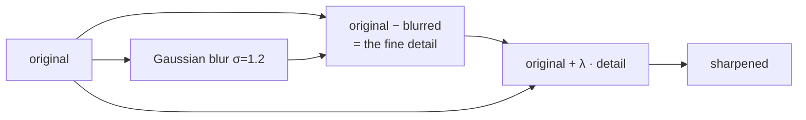

# Unsharp masking

Sharpen an image by subtracting a blurred copy of itself. The name is
backwards on purpose — the "unsharp mask" is the blur, and it is what gets
subtracted.

## What it is

Blur an image and you keep the slow, smooth parts and lose the fine detail.
Subtract the blur from the original and you are left with exactly the detail
that the blur removed. Add that detail *back* to the original, amplified, and
the fine structure stands out more:

```
sharpened = original + λ · (original − blurred)
```

Rearranged, that is:

```
sharpened = (1 + λ)·original − λ·blurred
```

which is why the implementation is a single weighted sum of two images.

λ controls the strength. The blur's σ controls the *scale* of detail
emphasised: a narrow blur sharpens fine strokes, a wide one exaggerates broad
shapes.

The technique is older than digital imaging. In a darkroom, printers made a
blurred negative on a separate plate, sandwiched it with the original, and
exposed through both.

## The picture

Across a boundary line, one row of pixels:

```
original        220  218  110  215  219      ← a dark stroke at the centre
blurred (σ=1.2) 216  190  160  192  216      ← the stroke has smeared outward
difference       +4  +28  −50  +23   +3      ← the detail the blur removed
sharpened        224  246   60  238  222      ← λ = 0.5, detail added back
```

The stroke went from 110 to 60 — darker — and its neighbours went brighter. The
edge is now steeper than it was in the original.



The characteristic side effect is visible in the numbers above: the pixels
flanking the stroke got *brighter* than they started. That bright rim is
**halo**, and it is inherent to the method — it is the price of the boost.

## Where this project uses it

`poggio_webapp/pipeline/preprocess.py`, the last step of `clean()`:

```python
blur = cv2.GaussianBlur(eq, (0, 0), sigmaX=1.2)
sharp = cv2.addWeighted(eq, 1.5, blur, -0.5, 0)
return sharp
```

`addWeighted(eq, 1.5, blur, -0.5, 0)` computes `1.5·eq − 0.5·blur`, which is the
rearranged form with **λ = 0.5**.

Both parameters are deliberately mild, and the docstring says so — "flatten →
upscale → CLAHE → **mild** sharpen":

- **σ = 1.2** targets detail a couple of pixels wide, which after a 2× upscale
  is the width of an original boundary stroke. A wider σ would emphasise the
  wrong scale entirely.
- **λ = 0.5** is gentle. Typical photo-editing defaults sit at 1.0 or higher and
  produce obvious halos.

Position in the chain matters. Sharpening runs **last**, after
[background flattening](homomorphic-illumination-correction.md),
[upscaling](lanczos-resampling.md), and [CLAHE](clahe.md). Every one of those
steps softens the image slightly, so sharpening earlier would have its effect
partly undone.

Crucially, this output is the image a **human traces on**. It is not fed to a
detector that would be confused by halos. That distinction licenses the whole
operation — see below.

## Why this and not something else

Every sharpening technique boosts noise along with detail; they differ in how
gracefully.

| Alternative | How it would work here | Why it lost |
|---|---|---|
| **Laplacian sharpening** | Add a scaled second derivative: `out = in − k·∇²in` | Closely related — a single 3×3 kernel instead of a blur and a subtraction — and much more noise-sensitive, because the Laplacian is a second derivative with no smoothing built in. Unsharp masking's Gaussian is a low-pass filter that keeps speckle out of the boost. |
| **High-pass filter, then add** | Same idea in the frequency domain | Mathematically equivalent. Costs two FFTs to achieve what two convolutions already do. |
| **Deconvolution** (Richardson–Lucy, Wiener) | Model the blur that degraded the scan and invert it | *Physically* the right answer, and it needs an estimate of the point-spread function. Different scanners, different lenses, forty-year-old paper — no reliable estimate exists, and deconvolution with a wrong PSF produces confident-looking ringing artefacts. Exactly the failure mode this project spends effort avoiding elsewhere. |
| **Learned super-resolution** | A neural upscaler-sharpener | Genuinely impressive on photographs, and it **invents plausible detail**. On a drawing whose whole evidential value is where the ink actually is, hallucinated strokes are worse than a soft image. Ruled out by the same principle that keeps a language model away from geometry in `assign_markers.py`. |
| **No sharpening at all** | Ship the CLAHE output | The safest option, and it makes faint boundary lines harder for a human to follow accurately on a low-DPI archival scan. |

The deciding question is **who consumes the output**. This image is for a human
tracing boundaries, so a mild perceptual boost is straightforwardly useful.
Nothing measures it. `high_contrast()`, whose output *is* consumed
mechanically, skips sharpening entirely and goes straight to
[adaptive thresholding](adaptive-thresholding.md).

## What it costs

One separable [Gaussian blur](gaussian-blur.md) — O(n·σ) — plus one weighted
sum, O(n). At σ = 1.2 the kernel is around 9 wide; this is the cheapest step in
`clean()`.

The genuine cost is **halo**, and its consequence: the boosted image is no
longer photometrically faithful. Two things follow, and the repository honours
both — nothing measures intensity on this image, and the untouched original
stays in `01_scan/` so the enhancement is always reversible by going back to
the source.

## Where else you meet it

- **Every camera and photo editor.** "Sharpness" in Lightroom, Photoshop's
  Unsharp Mask, and the sharpening baked into JPEG processing on every phone.
- **Print production**, where it compensates for ink spread on paper — the
  darkroom origin of the name.
- **Telescope and microscope imaging**, to counter atmospheric and optical blur.
- **Ultrasound**, where edge enhancement helps clinicians see tissue
  boundaries.
- **Text rendering.** Font hinting and subpixel antialiasing are solving a
  related problem at the glyph level.

## Related pages

- [Gaussian blur](gaussian-blur.md) — the mask itself.
- [Convolution](convolution.md) — the underlying mechanism.
- [CLAHE](clahe.md) — the step immediately before.
- [Homomorphic illumination correction](homomorphic-illumination-correction.md) —
  the same two ingredients, divided rather than subtracted, for the opposite
  purpose.
- [Prepare the image](../workflows/02-prepare-image.md) — the workflow step.
