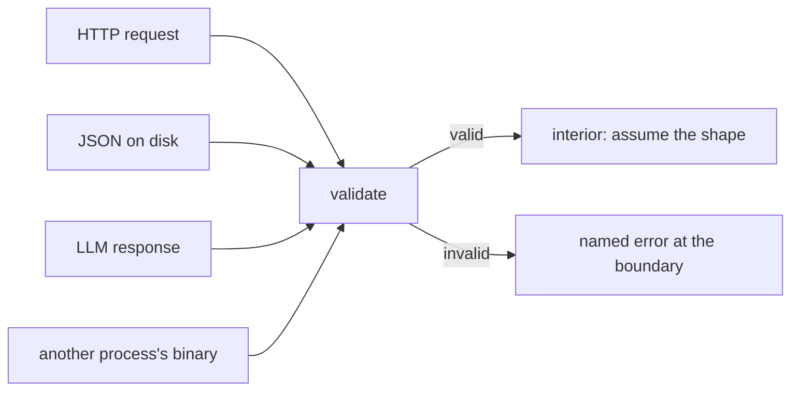

# Validation at trust boundaries

Check data where it crosses from somewhere you do not control into somewhere you
do. Doing it at the boundary means everything inside can assume the data is
sound.

## What it is

A **trust boundary** is any point where data arrives from outside the code's own
control: an HTTP request, a file on disk, another process, a language model's
output, or a module written by someone else.

The discipline is to validate **at** the boundary rather than at the point of
use. Two payoffs:

- **Errors are attributable.** A malformed manifest is reported as a malformed
  manifest, not as a `TypeError` three functions later.
- **The interior simplifies.** Code past the boundary can assume shape and type,
  so it needs no defensive checks.

The boundaries in this application are not only the obvious network ones. A file
written by an earlier run of the *same program* is a boundary — it may have been
written by a different version, edited by hand, or truncated by a crash.

## The picture



## Where this project uses it

### The viewer manifest — validate, then degrade

`poggio_webapp/backend/services/viewer_files.py` states the policy in its
docstring:

> Everything the visualizer can auto-load for a job, checked before it is
> offered: a manifest that is malformed, points outside the job directory, or
> names artifacts that are not there must degrade to a smaller payload rather
> than hand the browser a broken reference.

```python
def _has_valid_manifest_fields(manifest):
    ...
    return (
        type(manifest.get("schema_version")) is int
        and manifest["schema_version"] == 1
        and manifest.get("kind") == "gempy-surface-model"
        and isinstance(coordinate_system, dict)
        and coordinate_system.get("units") == "m"
        and coordinate_system.get("up_axis") == "Z"
        and isinstance(extent, list)
        and len(extent) == 6
        and all(_valid_number(value) for value in extent)
        and extent[0] < extent[1]
        and extent[2] < extent[3]
        and extent[4] < extent[5]
        ...
    )
```

Note `type(...) is int` rather than `isinstance` — because `bool` is a subclass
of `int` in Python, and `True` would otherwise pass as a schema version. The
same trap is handled explicitly in the number check:

```python
def _valid_number(value):
    return (
        isinstance(value, (int, float))
        and not isinstance(value, bool)
        and math.isfinite(value)
    )
```

That exact pattern appears four times across the codebase — here,
`true_dip._number`, `editor/geometry._point_coordinates`, and
`manual_extraction._positive_number` — each at a point where untrusted JSON
becomes a number.

Semantic checks sit alongside the type checks: `extent[0] < extent[1]` is not a
type constraint, it is the statement that a bounding box must be non-degenerate.

### Artifact paths — containment, not just existence

```python
def _resolve_manifest_artifact(manifest_directory, job_directory, path_str):
    if not isinstance(path_str, str) or not path_str:
        return None
    relative = Path(path_str)
    if relative.is_absolute() or ".." in relative.parts:
        return None
    candidate = (manifest_directory / relative).resolve()
    if not _is_within(candidate, job_directory) or not candidate.is_file():
        return None
    return candidate
```

The manifest is a file this application wrote — and it is still treated as
untrusted, because a file on disk can be edited. Absolute paths and `..`
segments are rejected, then containment is verified after resolution. See
[path traversal and containment](path-traversal-and-containment.md).

### Both ends of a binary contract

`poggio_webapp/pipeline/build_gempy.py` validates **before writing**:

```python
if values.size != expected_count:
    raise ValueError(...)
if values.dtype.kind not in "iuf":
    raise ValueError("lithology block values must be numeric")
if not np.isfinite(values).all():
    raise ValueError("lithology block values must be finite")
if np.any(values < 0):
    raise ValueError("lithology block values must be non-negative")
if np.any(values != np.floor(values)):
    raise ValueError("lithology block values must be integers")
if np.any(values > 65535):
    raise ValueError("lithology block values must not exceed 65535")
```

and `poggio_webapp/static/visualizer/volume3d-core.mjs` validates **after
reading**:

```javascript
if (!Number.isInteger(id) || id < 0 || id > MAX_UINT16) {
  throw new TypeError(
    `${path}.id must be an integer from 0 through ${MAX_UINT16}`,
  );
}
```

Neither side trusts the other's word, and the boundary is crossed twice — once
into a file, once into a different language runtime. See
[binary serialisation](binary-serialisation.md).

### Storage — validate on read *and* on write

`poggio_webapp/backend/harris_store.py`:

```python
def _validate_candidate(candidate) -> HarrisMatrix:
    try:
        matrix = HarrisMatrix.model_validate(candidate)
    except ValidationError as error:
        raise InvalidMatrixError("Matrix schema is invalid.") from error

    report = validate_matrix_graph(matrix)
    if not report["ok"]:
        ...
        raise InvalidMatrixError(...)
    return matrix
```

Called by `create_matrix`, by `save_matrix`, and by `load_matrix`. Validating on
*load* is the part people skip — and it is what catches a file edited by hand,
written by an older version, or corrupted.

Two layers: Pydantic for shape, `validate_matrix_graph` for
[semantic invariants](directed-acyclic-graphs.md) no schema can express, like
acyclicity.

And the ID is validated before any filesystem access:

```python
def _validate_matrix_id(matrix_id: str) -> str:
    if not isinstance(matrix_id, str) or _MATRIX_ID.fullmatch(matrix_id) is None:
        raise InvalidMatrixIdError(
            "Matrix ID must be exactly 12 lowercase hexadecimal characters."
        )
    return matrix_id
```

**Order matters.** Validate, then touch the disk — never the reverse.

## Why this and not something else

| Alternative | Where it would check | Why it lost |
|---|---|---|
| **Trust the input** | Nowhere | Errors surface as `TypeError` or `KeyError` far from the cause, and a malformed file becomes a stack trace rather than a message. |
| **Validate at the point of use** | Wherever a field is read | The same field is read in several places, so the check is duplicated and eventually one copy is missed. |
| **Types only** | Type hints | Not enforced at runtime. Malformed JSON populates the object happily. |
| **A schema library only** | Pydantic | Excellent for shape, and it cannot express "the graph is acyclic" or "extent min < max". Hence two layers. |
| **Validate at the boundary, in layers** *(chosen)* | Shape, then semantics, then containment | Errors are attributable, the interior is simple, and each layer catches what the previous cannot express. |

The subtle judgement is **what counts as a boundary**. This codebase treats its
*own* previously-written files as untrusted, which is unusual and correct: a job
directory is a long-lived artifact that outlives the code version that wrote it.

## What it costs

Microseconds per document. Irrelevant next to the work being guarded.

The costs:

- **Verbosity.** `_has_valid_manifest_fields` is a 35-line boolean expression.
  The alternative is discovering the problem in the browser.
- **Duplication across the boundary.** The volume contract is asserted in Python
  and again in JavaScript. Genuine duplication, and deliberate: a single shared
  schema would need a build step the frontend does not have.
- **Strictness can reject valid data.** `extra="forbid"` means a document from a
  newer version is refused. That is the intended trade — see
  [schema versioning](schema-versioning.md).
- **It cannot check meaning.** A manifest can be perfectly well-formed and
  describe a model built on placeholder registration. That is what
  [fabrication detection](fabrication-detection.md) and the
  [validator](error-taxonomies.md) are for.

## Where else you meet it

- **Web application security**, where the rule is "validate all input at the
  perimeter" — the origin of the phrase.
- **Parser design**, and "parse, don't validate": turn untrusted input into a
  type that cannot be malformed.
- **Microservice boundaries**, where each service validates its own inputs
  rather than trusting its callers.
- **Database constraints**, the last line of defence inside the store.
- **Foreign function interfaces**, where data crossing a language boundary is
  always suspect.

## Related pages

- [Structural versus schema validation](structural-vs-schema-validation.md) —
  the two-layer split in the editor.
- [JSON and schema design](json-schema-design.md) — the shape layer.
- [Path traversal and containment](path-traversal-and-containment.md) — the
  filesystem boundary.
- [Error taxonomies](error-taxonomies.md) — how failures are reported.
- [Fail-closed design](fail-closed-design.md) — what happens when validation
  fails.
