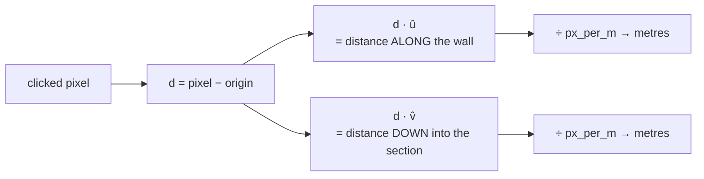

# Vector projection

Measuring how far something extends along a chosen direction. The operation that
converts a click on a tilted photograph into a distance along the wall.

## What it is

The projection of `a` onto direction `b` is the length of `a`'s shadow when the
light shines perpendicular to `b`:

```
proj = (a · b) / ‖b‖
```

When `b` is a [unit vector](unit-vectors-and-normalisation.md), the division
disappears and the projection is just the [dot product](dot-product.md).

The important property: projection **discards** everything perpendicular to `b`.
That is not a loss. It is the point. A trench wall has a single meaningful
horizontal axis, and how far a mark sits from that axis in the *photograph's*
frame is an artefact of how the camera was held.

Project onto two perpendicular directions and you have both coordinates in the
new frame. That is a [change of basis](orthonormal-bases.md).

## The picture



Why this makes tilt irrelevant:

```
photograph held level:    û = (1.000, 0.000)
photograph tilted 3.4°:   û = (0.998, 0.060)

the same physical mark projects to the same distance along the wall
in both cases, because û was derived from the DRAWN edge, not from
the image's rows
```

## Where this project uses it

### Pixels to face-local metres

`poggio_webapp/pipeline/manual_extraction.py`:

```python
def convert(self, point):
    px, py = float(point[0]), float(point[1])
    dx, dy = px - self.origin_x, py - self.origin_y
    x_m = (dx * self.ux + dy * self.uy) / self.px_per_m
    depth_m = (dx * self.vx + dy * self.vy) / self.px_per_m
    return round(x_m, 4), round(depth_m, 4)
```

Two projections, two coordinates. The `/ px_per_m` is the only place scale
enters, because `û` and `v̂` are unit vectors.

`poggio_webapp/pipeline/detect_markers.py` spells the same operation out with
named parts:

```python
def pixel_to_section_coordinates(pixel_x, pixel_y, transform):
    """
    Convert an image-pixel coordinate to section coordinates in meters.

    Returns:
        (horizontal_distance_m, depth_m)
    """
    relative_x = float(pixel_x) - transform.origin_x
    relative_y = float(pixel_y) - transform.origin_y

    horizontal_px = (
        relative_x * transform.horizontal_x + relative_y * transform.horizontal_y
    )

    depth_px = relative_x * transform.downward_x + relative_y * transform.downward_y

    return (
        horizontal_px / transform.pixels_per_meter,
        depth_px / transform.pixels_per_meter,
    )
```

The docstring of its companion `create_section_coordinate_transform` states
the payoff:

> This corrects measurements when the photographed or scanned section is tilted
> in the image.

And the results are **sorted by the projected coordinate**, not by raw image x:

```python
# Sort by the corrected section-local x coordinate rather than raw image
# x. This remains left-to-right even when the photograph is tilted.
projected.sort(key=lambda item: item[0])
```

A subtle bug avoided: on a tilted photograph, image-x order and along-wall order
are not the same, and a boundary whose vertices came out in the wrong order
would produce a zig-zag polyline.

### Site coordinates onto a wall's bearing

`poggio_webapp/pipeline/true_dip.py`:

```python
angle = math.radians(bearings[face])
s = (x * math.sin(angle)) + (y * math.cos(angle))
```

Projecting a site position onto the wall's own direction, to recover an
along-wall coordinate for a slope fit. The docstring notes the constant offset
and why it does not matter: only the slope against `s` is ever used.

### Building a common axis for two polylines

`poggio_webapp/static/visualizer/layer-fill.mjs` needs to clip two boundary
polylines to their shared span, which requires one shared parameter:

```javascript
const ux = axis.dx / axis.length;
const uy = axis.dy / axis.length;
const addAlong = (point) => ({
  ...point,
  along: (point.x * ux) + (point.y * uy),
});
```

The axis chosen is the longer of the two polylines' end-to-end vectors, so the
projection is well conditioned. Every point then carries an `along` value, and
[clipping](polyline-clipping.md) becomes a one-dimensional problem.

## Why this and not something else

| Alternative | How it would work here | Why it lost |
|---|---|---|
| **Rotate the image, then read pixel coordinates** | [Deskew](hough-line-transform.md) first, then use raw x and y | Available here, and it **resamples**, which is lossy, and it only corrects a rotation the detector managed to estimate. Projection corrects exactly the tilt the user's own clicks define, with no resampling. It is why `deskew_flag=False` by default. |
| **Trigonometry** | `x_m = d·cos(θ − φ)` from angles | Equivalent, and it requires computing angles with `atan2`, handling wraparound, and reasoning about sign conventions. The dot product does it with two multiplies. |
| **Matrix multiplication** | Build a rotation matrix, multiply | Identical arithmetic, wrapped. Right when transforms **compose**; here exactly one transform applies, so the explicit form is more readable. See [affine transforms](affine-transforms.md). |
| **Homography / perspective correction** | Four corner clicks, full perspective transform | Genuinely better for a photograph taken at an angle to the sheet, where the drawing is *keystoned* rather than merely rotated. It needs four clicks instead of three, and a bad fourth point distorts everything. A deliberate limitation, and a candidate for the [roadmap](../project/roadmap.md). |
| **Projection onto an orthonormal basis** *(chosen)* | Two dot products | Exact, lossless, no resampling, three clicks, and it works identically in Python and JavaScript. |

## What it costs

Two multiplies and an add per axis. Free.

The precondition is that the basis be **orthonormal**: perpendicular and unit
length. `v̂ = (−û_y, û_x)` guarantees both by construction, which is why no code
here ever checks it.

The real limitation is what projection **cannot** correct: it assumes the
drawing plane maps to the image plane by a rotation and a uniform scale. A photo
taken from an angle introduces perspective, where scale varies across the sheet.
Nothing in a three-click calibration can detect that, and the result would be
systematically wrong across the wall. The
[drawing guidelines](../reference/drawing-guidelines.md) address this by asking
for a square-on photograph.

## Where else you meet it

- Principal component analysis, which is projection onto the directions of
  greatest variance.
- 3D graphics, where the view transform projects world coordinates onto
  camera axes.
- Physics, resolving a force into components along and perpendicular to a
  slope.
- Least squares, which is geometrically a projection onto the column space
  of a matrix. See [ordinary least squares](ordinary-least-squares.md).
- Signal processing, where a Fourier coefficient is the projection of a
  signal onto one sinusoid.

## Related pages

- [Dot product](dot-product.md): the operation.
- [Unit vectors and normalisation](unit-vectors-and-normalisation.md): the
  precondition.
- [Orthonormal bases](orthonormal-bases.md): two projections as one transform.
- [Similarity transforms](similarity-transforms.md): what this builds.
- [Coordinate spaces](../concepts/coordinate-spaces.md): the spaces being moved
  between.
