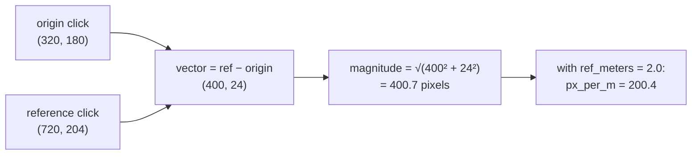

# Vectors and magnitude

A direction with a length. The idea underneath every coordinate conversion in
this project, and the reason "how far apart are these?" is one line of code.

## What it is

A **vector** is a pair (or triple) of numbers describing a displacement:
"420 pixels right and 110 pixels down." Unlike a *point*, which is a position, a
vector is a **difference between** positions. Subtracting two points gives a
vector; that is the operation that starts nearly every calculation here.

Its **magnitude** — its length — is the Pythagorean distance:

```
‖v‖ = √(vₓ² + v_y²)             two dimensions
‖v‖ = √(vₓ² + v_y² + v_z²)      three
```

Two everyday operations:

- **Scaling** — multiply both components; the direction is unchanged, the length
  scales.
- **Adding** — add componentwise; the displacements compose.

One performance note that appears repeatedly in real code: **comparing lengths
does not require computing them.** Since squaring is monotonic for non-negative
numbers, `‖a‖ < ‖b‖` exactly when `‖a‖² < ‖b‖²`, and the squared form avoids a
square root.

## The picture



That is the whole of calibration: one subtraction, one magnitude, one division.

## Where this project uses it

### Establishing scale from two clicks

`poggio_webapp/pipeline/manual_extraction.py`:

```python
dx, dy = rx - ox, ry - oy
pixel_span = math.hypot(dx, dy)
if pixel_span < 2:
    raise ValueError("the two top calibration points are too close together")

ux, uy = dx / pixel_span, dy / pixel_span
...
px_per_m=pixel_span / ref_meters,
```

`math.hypot` rather than `math.sqrt(dx*dx + dy*dy)` — it is written to avoid
intermediate overflow and underflow, and it is clearer. The degenerate check
comes first, because a zero-length vector has no direction and everything after
would divide by zero.

`detect_markers.py` performs the same computation with the same guard, phrased
for its own user:

```python
ref_dist_px = math.hypot(rx - ox, ry - oy)

if ref_dist_px < 20:
    raise RuntimeError(
        "the top-left and top-right clicks are almost the "
        "same pixel — click the wall's two top corners")
```

### Comparing distances without square roots

`poggio_webapp/pipeline/detect_markers.py`, in
[deduplication](non-maximum-suppression.md):

```python
is_separate = all(
    (
        (entry["cx"] - existing["cx"]) ** 2
        + (entry["cy"] - existing["cy"]) ** 2
    )
    > (0.5 * min_d) ** 2
    for existing in kept
)
```

Squared distance against a squared threshold. Over hundreds of candidates each
compared against everything kept, that is thousands of square roots avoided for
no loss of exactness — and it is *more* exact, since no rounding is introduced.

### Distance in site coordinates

`poggio_webapp/pipeline/merge_walls.py`:

```python
touching = any(
    math.dist(pa, pb) <= tolerance_m
    for pa in endpoints[a] for pb in endpoints[b])
```

Here `math.dist` is used directly, because the threshold is a **survey
tolerance in metres** that a person reads and reasons about. Clarity beats the
saved square root when the comparison runs a handful of times and the constant
is meaningful to a human.

Two idioms, each chosen for its context — the hot loop uses squares, the
readable rule uses the real distance.

## Why this and not something else

| Alternative | How it would work here | Why it lost |
|---|---|---|
| **Track angles and lengths separately** | Store a bearing and a distance | Adding two of them requires converting to components anyway, and every conversion involves trigonometry. Vectors add by addition. |
| **Complex numbers** | Represent 2D points as `x + iy` | Genuinely elegant for 2D: rotation is multiplication. It does not extend to the 3D work in [true dip](cross-product.md), so the codebase would need two representations. |
| **A vector library (NumPy arrays everywhere)** | `np.array([x, y])` throughout | Used already inside the image pipeline. For two- and three-element geometry in the coordinate code, plain tuples and floats are faster (no array allocation) and read more directly. |
| **Manhattan distance** | `|Δx| + |Δy|` | Cheaper, no square root, and it is not the distance a surveyor means. Corner-adjacency tolerances are physical. |
| **Plain tuples plus `math.hypot` / `math.dist`** *(chosen)* | Standard library | Correct, readable, no dependency, and the squared-comparison optimisation is available where it matters. |

## What it costs

O(1) per operation. `math.hypot` is slightly slower than a raw `sqrt` because it
guards against overflow; irrelevant at these call rates and worth it for
correctness.

The costs that actually bite are conceptual:

**Zero-length vectors have no direction.** Every place this project derives a
direction from a difference guards against it first — the `pixel_span < 2` and
`ref_dist_px < 20` checks above, and in `detect_markers.py`:

```python
if reference_width_px <= 1e-9:
    raise ValueError(
        "The top-left and top-right calibration points must be different")
```

**Points and vectors are different things.** Adding two positions is
meaningless; subtracting them is a displacement. The code keeps this straight by
always deriving vectors from named subtractions.

## Where else you meet it

- **Physics**, where velocity, force, and acceleration are all vectors.
- **Game engines** — every position, velocity, and normal.
- **Machine learning**, where an embedding is a vector and similarity is
  measured by [dot product](dot-product.md) or cosine.
- **Navigation**, where a course is a vector and dead reckoning is vector
  addition.
- **Computer graphics**, where lighting is computed from surface normals and
  light-direction vectors.

## Related pages

- [Unit vectors and normalisation](unit-vectors-and-normalisation.md) — turning
  a vector into pure direction.
- [Dot product](dot-product.md) — combining two vectors into a number.
- [Cross product](cross-product.md) — combining two 3D vectors into a third.
- [Similarity transforms](similarity-transforms.md) — what calibration builds
  from these.
- [Coordinate spaces](../concepts/coordinate-spaces.md) — the spaces vectors
  move points between.
