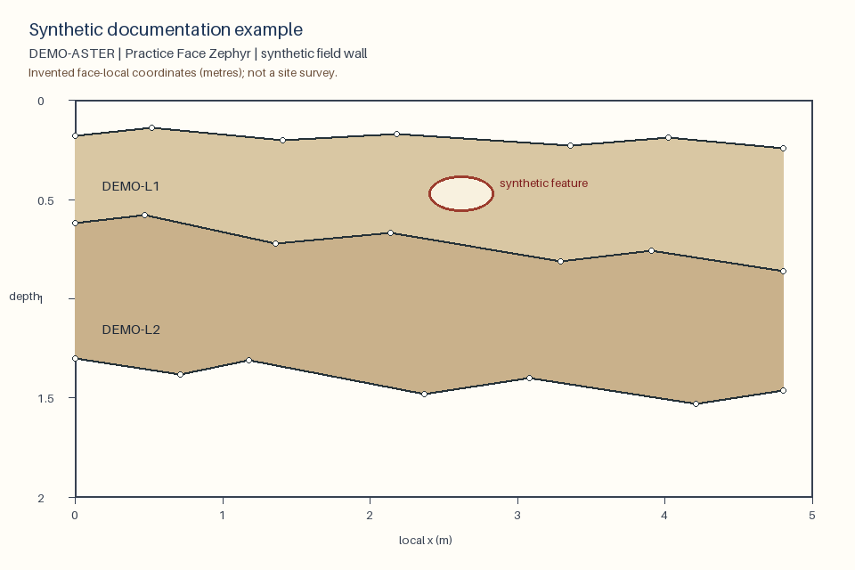
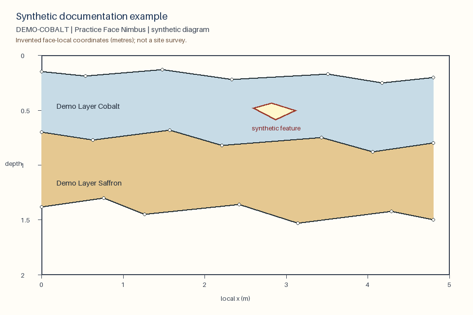

# Synthetic documentation fixtures

**Synthetic documentation example:** every label, coordinate, boundary, layer,
and feature on this page was invented for documentation. These files are not
archaeological evidence and must not be used for scientific interpretation.

## What is included

The [field-wall JSON fixture](demo-fieldwall.json) follows the
`FieldWallProfile` schema. It contains two invented loci, two layers, and one
internal feature.



*Caption: A generated field-wall source image. The unevenly spaced circular
markers show that boundary vertices are not sampled at a uniform interval.*

The [illustrator JSON fixture](demo-illustrator.json) follows the
`ArchaeologicalDiagram` schema. It contains one invented face, two layers, and
one outlined internal feature.



*Caption: A generated illustrator-style source image. Layer names, patterns,
and all face-local measurements are fictional.*

## Safety and validation

The generator draws both images from the fixture data; it does not read, copy,
crop, or alter repository scans. The examples contain no real people, job
identifiers, API keys, survey origins, or site coordinates. Their small metric
values are local positions measured from the invented left edge and surface.

Both JSON files validate against the current Pydantic models and produce zero
errors and zero warnings from the repository validator. Running the generator
twice produces byte-identical JSON and PNG files.

## Rebuild the fixtures

From the repository root, run:

```bash
./.venv/bin/python tools/docs/generate_demo_assets.py
```

The command rewrites only the two JSON fixtures and two source images listed
above. Do not edit a generated asset by hand; update the generator and rebuild
all four together.
