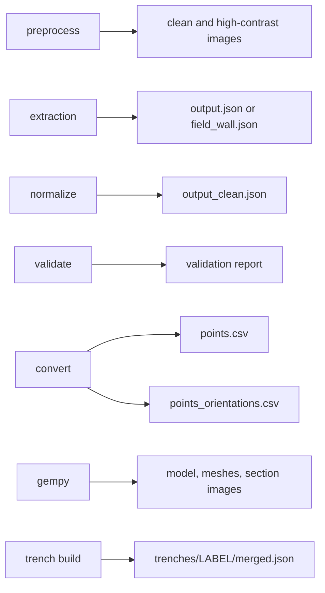

# Output Files

This reference documents all files generated by the application pipeline stages.



*What lands on disk, and which stage is responsible for it.*

## Job Folder Structure

```
<JOBS_DIR>/<job_id>/
├── meta.json                     # Job state (always present)
├── editor_meta.json              # Manual editor state (if applicable)
├── extraction_output.json        # Manual extraction result (if applicable)
│
├── 01_scan/
│   ├── <filename>.*              # Original uploaded scan (PNG, JPG, PDF, TIFF)
│   └── ...
│
├── 02_preprocess/
│   ├── <name>_clean.png          # Deskewed, brightness-normalized image
│   ├── <name>_highcontrast.png   # Optional viewing aid, not used downstream
│   └── ...
│
├── 03_extraction/
│   ├── output.json               # Illustrator extraction (Gemini-generated)
│   ├── field_wall.json           # Field-wall extraction (Gemini-generated)
│   ├── uploaded.json             # User-provided JSON (if uploaded)
│   └── ...
│
├── 04_normalize_validate/
│   ├── output_clean.json         # Normalized extraction
│   └── validation_report.json    # (embedded in meta.json)
│
├── 05_convert_coords/
│   ├── points.csv                # Site-wide 3D coordinates
│   ├── points_orientations.csv   # Layer orientation seeds
│   └── ...
│
└── 06_gempy_model/
    ├── trench_model.gempy        # Pickled GemPy model
    ├── trench_model_lith_block.npz
    ├── trench_model_lith_block.bin # Raw browser volume
    ├── trench_model_viewer.json  # Durable browser-viewer manifest
    ├── trench_model_meshes/
    │   └── <surface>.obj          # One site-coordinate mesh per surface
    └── ...
```

---

## Meta Files

### `meta.json`

Main job state file. Format:

```json
{
  "job_id": "abc123def456",
  "sheet_type": "illustrator" | "fieldwall",
  "scan_path": "/full/path/to/01_scan/image.png",
  "scan_filename": "image.png",
  "clean_image_path": "/full/path/to/02_preprocess/clean.png",
  "extraction_path": "/full/path/to/03_extraction/output.json",
  "extraction_task_id": "<uuid>" | null,
  "normalized_path": "/full/path/to/04_normalize_validate/output_clean.json",
  "normalization_log": "...",
  "validation_report": {
    "errors": [...],
    "warnings": [...],
    "ok": true | false
  },
  "points_csv": "/full/path/to/05_convert_coords/points.csv",
  "orientations_csv": "/full/path/to/05_convert_coords/points_orientations.csv",
  "task_id": "<uuid>" | null,
  "gempy_task_id": "<uuid>" | null,
  "status": "editing" | "extracted" | "finalizing" | "normalizing" | "validating" | "converting" | "building" | "complete" | "error",
  "stage": "finalizing" | "normalizing" | "validating" | "converting" | "building" | "complete" | null,
  "message": "Human-readable status message",
  "pipeline_error": "Error message if status is error" | null,
  "model_outputs": {...} | null,
  "updated_at": "2025-01-15T10:30:00+00:00"
}
```

All paths are absolute filesystem paths. Times are ISO 8601 UTC.

Updated whenever job state changes (after each stage completes or fails).

### `editor_meta.json`

Manual editor session marker. Format:

```json
{
  "schema_type": "FieldWallProfile" | "ArchaeologicalDiagram",
  "created_at": "2025-01-15T10:00:00+00:00"
}
```

Created when a manual tracing session begins. The session's `job_id`,
`sheet_type`, `source`, `status`, timestamps, and any trench/wall labels go
into the draft `meta.json` instead.

### `extraction_output.json`

Result of manual tracing (created only if user completes manual editor). Format:

Either `FieldWallProfile` or `ArchaeologicalDiagram` schema with `"source": "manual_editor"`.

---

## Stage 01: Scan Upload

### Input

User uploads one file via `POST /api/jobs/<job_id>/scan`:

- Filename: user-provided (e.g., `T23_South.jpg`)
- Formats: PNG, JPG/JPEG, PDF, TIF/TIFF
- Size: no documented limit (depends on system memory)

### Output

**Location:** `01_scan/<filename>.<ext>`

**File:** Binary image or PDF, unchanged from upload

**Metadata in meta.json:**

```json
{
  "scan_path": "/full/path/to/file",
  "scan_filename": "original.jpg",
  "sheet_type": "illustrator" | "fieldwall"
}
```

---

## Stage 02: Preprocessing

### Input

`01_scan/<filename>` + preprocessing parameters:

- `upscale`: 1.0, 2.0, 3.0, or 4.0 (default 2.0)
- `deskew`: true/false (default false)
- `highcontrast`: true/false (default false)
- `pdf_dpi`: 150, 200, 300, 600 (default 300)
- `pdf_page`: 1-based page number (default 1)

### Output

**Location:** `02_preprocess/`

| File | Format | Purpose |
|------|--------|---------|
| `<name>_clean.png` | PNG | Main preprocessed image (input for extraction) |
| `<name>_highcontrast.png` | PNG | Optional viewing aid; **not** the image later stages consume |

`<name>` is the stem of the uploaded file, so the names follow the source
rather than being fixed.

The deskew angle is **not** written to disk. It comes back in the preprocess
response as `deskew_angle`, alongside the `outputs` map. Nothing persists it,
so a job folder alone does not record how far the sheet was rotated.

**Metadata in meta.json:**

```json
{
  "clean_image_path": "/full/path/to/02_preprocess/clean.png"
}
```

---

## Stage 03: Extraction

Two modes: **AI extraction** (Gemini) or **JSON upload** (user-provided).
(Demo-seeded jobs are a third producer: `make demo` writes
`03_extraction/extraction.json` directly, bypassing both.)

### AI Extraction

**Input:**

- `02_preprocess/clean.png`
- `GEMINI_API_KEY` (from request or environment)
- Sheet type: `"illustrator"` or `"fieldwall"`
- For field-wall: `square_cm` (grid square size)

**Output:**

**Location:** `03_extraction/`

| File | Format | Purpose |
|------|--------|---------|
| `output.json` | JSON (ArchaeologicalDiagram) | Illustrator diagram extraction |
| `field_wall.json` | JSON (FieldWallProfile) | Field-wall extraction |

**Schema:** See [Data Schemas](./data-schemas.md)

**Metadata in meta.json:**

```json
{
  "extraction_path": "/full/path/to/output.json",
  "extraction_task_id": "<async_task_uuid>"
}
```

### JSON Upload

**Input:**

- Multipart upload of `.json` file
- Schema must be either `ArchaeologicalDiagram` (has `trenchProfiles`) or `FieldWallProfile` (has `loci`/`layers`)

**Output:**

**Location:** `03_extraction/`

| File | Format | Purpose |
|------|--------|---------|
| `uploaded.json` | JSON | User-provided extraction (unchanged) |

**Metadata in meta.json:**

```json
{
  "extraction_path": "/full/path/to/uploaded.json",
  "sheet_type": "illustrator" | "fieldwall" (auto-detected)
}
```

### Manual Tracing

**Input:**

- User traces boundaries in browser
- Calibration points (3 clicks on image)
- Boundary polylines (pixel coordinates)
- Optional feature polygons
- Real-world reference distance (in meters)

**Output:**

**Location:** `extraction_output.json` (root job folder)

| File | Format | Purpose |
|------|--------|---------|
| `extraction_output.json` | JSON | Either FieldWallProfile or ArchaeologicalDiagram with `"source": "manual_editor"` |

**Metadata in meta.json:**

```json
{
  "extraction_path": "/full/path/to/extraction_output.json",
  "source": "manual_editor",
  "sheet_type": "fieldwall" | "illustrator"
}
```

---

## Stage 04: Normalization & Validation

### Input

`03_extraction/output.json` (or uploaded/manual extraction)

### Output

**Location:** `04_normalize_validate/`

| File | Format | Purpose |
|------|--------|---------|
| `output_clean.json` | JSON | Normalized extraction (same schema as input) |

**Normalization operations:**

- Replace null-like strings (`"null"`, `"none"`, `"n/a"`, `""`) with real nulls
- Drop a trench-floor feature that duplicates the deepest layer's bottom
  boundary
- Remove features duplicated across layers (kept in the deepest layer)

Each change is recorded in the returned normalization log. The normalizer does
not adapt field-wall documents to the trench-profile shape — the validator and
converter do that on the fly.

**Validation report** (never saved as its own file; the editor finalisation
pipeline embeds it in `meta.json`, while the explicit `/validate` route only
returns it):

```json
{
  "validation_report": {
    "errors": [
      "[ERROR] <location>: <message>",
      ...
    ],
    "warnings": [
      "[WARN]  <location>: <message>",
      ...
    ],
    "ok": true | false
  }
}
```

**Metadata in meta.json** (`normalization_log` and `validation_report` appear
only when the editor finalisation pipeline ran; the `/normalize` route stores
just `normalized_path`):

```json
{
  "normalized_path": "/full/path/to/04_normalize_validate/output_clean.json",
  "normalization_log": "...",
  "validation_report": {...}
}
```

---

## Stage 05: Coordinate Conversion

### Input

- `04_normalize_validate/output_clean.json` (or original extraction)
- Grid configuration — a `faces` map keyed by face name, each face carrying
  its own registration:

```json
{
  "faces": {
    "South": {"originX": 150.0, "originY": -25.0, "surfaceZ": 24.16, "bearing_deg": 270.0},
    "North": {"originX": 150.0, "originY": -20.0, "surfaceZ": 24.28, "bearing_deg": 90.0}
  }
}
```

The starter config from `/api/jobs/<job_id>/gridconfig/starter` wraps this in
extra metadata (`site_grid`, `source`, `vertical`, a `_comment`); the
converter reads only `faces`.

### Output

**Location:** `05_convert_coords/`

| File | Format | Purpose |
|------|--------|---------|
| `points.csv` | CSV | Site-wide 3D points (for GemPy) |
| `points_orientations.csv` | CSV | Layer orientation seeds (for GemPy) |

**`points.csv` format:**

```
X,Y,Z,surface,face
155.0,-20.0,24.13,Locus 1,east wall
155.0,-20.5,24.13,Locus 1,east wall
...
```

Columns:

- `X` — site-wide X coordinate (meters, rounded to 4 decimals)
- `Y` — site-wide Y coordinate (meters)
- `Z` — site-wide elevation (meters; `surfaceZ` minus the drawn depth)
- `surface` — the layer/locus surface name (the identity GemPy fuses on)
- `face` — face label (from `trenchProfiles[].face`)

**Conversion formulas** (θ is `bearing_deg` in radians):

```python
X = originX + x * sin(θ)
Y = originY + x * cos(θ)
Z = surfaceZ - depth
```

**`points_orientations.csv` format:**

```
X,Y,Z,surface,face,dip,azimuth,polarity
155.0,-22.5,24.13,Locus 1,east wall,0.0,0.0,1
...
```

One row per layer with two or more usable bottom-boundary points, placed at
the boundary's midpoint. `dip` comes from the least-squares slope of the
boundary, `azimuth` is the face bearing (or its opposite when the boundary
slopes the other way), and `polarity` is always `1`.

**Metadata in meta.json:**

```json
{
  "points_csv": "/full/path/to/05_convert_coords/points.csv",
  "orientations_csv": "/full/path/to/05_convert_coords/points_orientations.csv",
  "surface_labels": {"Locus 1": "Locus 1 (10YR 5/3 brown)"}
}
```

---

## Stage 06: GemPy 3D Model

### Input

- `05_convert_coords/points.csv`
- `05_convert_coords/points_orientations.csv`
- Model parameters (optional):
  - resolution (default `[50, 50, 30]`)
  - extent (spatial bounds; default inferred from the points, padded 2 m
    horizontally and 1 m vertically)
  - series order (layer sequence)

### Output

**Location:** `06_gempy_model/`

| File | Format | Purpose |
|------|--------|---------|
| `trench_model.gempy` | Binary (pickle) | Serialized GemPy model object |
| `trench_model_lith_block.npz` | NumPy archive | Lithology block plus resolution and extent for scientific use or download |
| `trench_model_lith_block.bin` | Raw binary | Headerless browser copy of the lithology block as little-endian `uint16` values |
| `trench_model_meshes/<surface>.obj` | Wavefront OBJ | One triangle mesh for each exported GemPy boundary surface |
| `trench_model_viewer.json` | JSON | Durable, portable browser-viewer manifest |
| optional section images | PNG | Full and zoomed 2D cross-section plots when plotting succeeds |

OBJ vertices are exported in site coordinates, in metres. GemPy returns mesh
vertices in its internal transformed space, so the exporter applies the
model's inverse input transform before writing each `v` line. Faces remain
one-based OBJ triangle indices. Unsafe filename characters are replaced for
the file on disk, while the original surface name is retained in the OBJ
comment and viewer manifest.

### Viewer manifest schema

**Location:** `06_gempy_model/trench_model_viewer.json`

Schema version 2 (version 2 adds `surfaces[].label`; a version 1 manifest has
no labels and is still valid — the viewer falls back to the surface name):

```json
{
  "schema_version": 2,
  "kind": "gempy-surface-model",
  "coordinate_system": {
    "units": "m",
    "up_axis": "Z"
  },
  "extent": [0, 10, 0, 5, 90, 100],
  "resolution": [50, 50, 30],
  "series_order": ["Topsoil", "Fill"],
  "series_order_provenance": {
    "source": "harris-matrix",
    "note": "stratigraphic order came from the trench's Harris matrix",
    "arbitrary_pairs": []
  },
  "single_face_note": null,
  "surfaces": [
    {
      "name": "Topsoil",
      "label": "Topsoil (10YR 5/3 brown)",
      "mesh_path": "trench_model_meshes/Topsoil.obj"
    }
  ],
  "lith_block_path": "trench_model_lith_block.npz",
  "wallTraces": [
    {
      "face": "east wall",
      "surface": "Topsoil",
      "points": [[155.0, -25.0, 24.13], [155.0, -24.5, 24.13]]
    }
  ],
  "volume": {
    "schema_version": 1,
    "format": "raw",
    "dtype": "uint16-le",
    "layout": "C",
    "axes": ["x", "y", "z"],
    "shape": [50, 50, 30],
    "path": "trench_model_lith_block.bin",
    "lithologies": [
      {
        "id": 1,
        "name": "Topsoil"
      }
    ]
  }
}
```

Every `*_path` is relative to the manifest's parent directory and uses `/`
separators. The manifest never contains an absolute job path or a browser
URL. `surfaces` preserves model series order and may be empty when mesh export
is disabled; each surface's `name` is the identity GemPy fused on, while
`label` is the display text (Munsell colour attached). `series_order_provenance`
records where the stratigraphic order came from and which pairs of surfaces
were ordered arbitrarily. `wallTraces` carries the source boundary polylines
in site coordinates, one per face/surface pair, so the viewer can draw the
measured lines against the interpolated model. `single_face_note` is either
`null` or the builder's warning that a surface constrained by one face is
interpolated across the full extent.

The browser-facing route resolves and checks these paths beneath the job
directory before constructing URLs. It does not send `mesh_path` or
`lith_block_path` to the browser.

### Browser volume binary

`trench_model_lith_block.bin` has no embedded header. Its manifest entry is
required to decode it:

- each value is an unsigned 16-bit integer stored least-significant byte first;
- `shape` is `[nx, ny, nz]`, `axes` is exactly `["x", "y", "z"]`, and layout
  is C order;
- the payload contains exactly `nx × ny × nz` values and therefore
  `2 × nx × ny × nz` bytes;
- cell `(x, y, z)` is stored at flat index
  `(x * ny + y) * nz + z`.

The `.npz` remains unchanged as the scientific/download artifact. The raw
binary is a browser transport that avoids requiring NumPy in JavaScript.

The builder obtains ID/name pairs from GemPy's volume-element enumerator and
volume-element names. It does not infer volume names from `series_order`.
Missing or unusable names fall back to `Lithology <id>`, and a value absent
from browser metadata receives the same fallback. ID `0` is treated as an
ordinary classification unless GemPy explicitly supplies a verified name.

**Metadata in meta.json** (written by the editor finalisation pipeline; the
`/gempy` route only returns a task id):

```json
{
  "task_id": "<async_task_uuid>",
  "gempy_task_id": "<async_task_uuid>",
  "status": "building" | "complete" | "error",
  "model_outputs": {
    "model": "/full/path/to/trench_model.gempy",
    "lith_block_binary": "/full/path/to/trench_model_lith_block.bin",
    "lith_block": "/full/path/to/trench_model_lith_block.npz",
    "meshes": ["/full/path/to/trench_model_meshes/Topsoil.obj", ...],
    "viewer_manifest": "/full/path/to/trench_model_viewer.json",
    "section": "/full/path/to/trench_model_section_y.png",
    "section_zoom": "/full/path/to/trench_model_section_y_zoom.png"
  }
}
```

The saved-job results page and `/visualizer?job=<job_id>` share one OBJ
renderer for interpolated boundary surfaces. The interactive visualizer also
renders the raw binary as classified grid cells. Boundary meshes are
continuous triangles at contacts; volume cells are discrete,
resolution-dependent classifications and should not be described as smooth
closed geological solids.

### Local browser runtime

The browser renderer is shipped with pinned Three.js `0.185.1` files:

```text
poggio_webapp/static/vendor/three/three.core.min.js
poggio_webapp/static/vendor/three/three.module.min.js
poggio_webapp/static/vendor/three/addons/controls/OrbitControls.js
poggio_webapp/static/vendor/three/addons/loaders/OBJLoader.js
poggio_webapp/static/vendor/three/LICENSE
poggio_webapp/static/vendor/three/VERSION
```

These are application static dependencies, not job outputs. Both viewer pages
use the same local import map and make no runtime Three.js CDN request.

---

## Harris Matrix files and exports

Harris matrices are separate trench-level workspaces, not numbered drawing
job stages:

```text
poggio_webapp/matrices/
└── a1b2c3d4e5f6/
    └── matrix.json
```

`matrix.json` contains the complete version 1 schema: editable metadata,
source job IDs, units with provenance references, saved relationships,
correlations, suggestion review state, revision, and timestamps. It contains
no server filesystem path. Writes use a temporary file in the same matrix
directory followed by atomic replacement.

The browser can download:

| Route | Media type | Contents |
|---|---|---|
| `/api/harris-matrices/<matrix_id>/export.json` | `application/json` | Complete saved version 1 matrix |
| `/api/harris-matrices/<matrix_id>/export.svg` | `image/svg+xml` | Deterministic diagram with youngest units at the top |
| `/api/harris-matrices/<matrix_id>/export.svg?inline=1` | `image/svg+xml` | The same SVG for the editor preview |

JSON and SVG are generated from `matrix.json` and are not stored as extra
server artifacts. The renderer collapses confirmed correlations and applies
transitive reduction to the display only; redundant relationships remain in
the JSON. **Print / Save as PDF** uses browser print output and does not
create a server-side PDF.

Import reads a supported source job's normalized or extraction JSON but does
not edit that job. Matrix operations do not modify source `meta.json`, editor
state, finds, coordinate CSVs, or GemPy files.

---

## Accessing Files from the API

All files in a job folder can be retrieved via:

```
GET /api/jobs/<job_id>/file?path=<relative_path>
```

Example:

```
GET /api/jobs/abc123def456/file?path=02_preprocess/clean.png
GET /api/jobs/abc123def456/file?path=03_extraction/output.json
GET /api/jobs/abc123def456/file?path=meta.json
```

Response: binary file data (with appropriate Content-Type header).

---

## File Lifecycle and Cleanup

### Persistence

All job files persist on disk after job completion. Matrix JSON also persists
across Flask restarts. There is no automatic cleanup.

### Disk Space

- Scans: 5–50 MB (depends on source resolution)
- Preprocessing: +20–200 MB (depends on upscale factor)
- Extractions: <1 MB (JSON)
- Normalizations: <1 MB (JSON)
- Coordinates: <10 MB (CSV)
- GemPy models: 50–500 MB (depends on resolution)
- Harris matrices: normally <1 MB each; the first release supports at most
  250 imported units

**Total per job:** Typically 100 MB – 1 GB

### Manual Deletion

To delete a job and all its files:

```bash
rm -rf <JOBS_DIR>/<job_id>
```

(No API endpoint for deleting a regular job; must be done manually or via
external cleanup scripts. The one exception is `DELETE /api/demo`, which
removes only the seeded demonstration trenches and their jobs.)

---

## Error and Temporary Files

### If a Stage Fails

- Incomplete output files may remain in the stage directory
- `meta.json` is updated with error status
- Logs may be stored in stderr/stdout (not captured in output files)

### Retry Behavior

To retry a failed stage:

1. Use the same `job_id`
2. Call the same endpoint again with the same parameters
3. Outputs may be overwritten (if they exist)

---

## Under the Hood

All file I/O uses Python's `pathlib.Path` for cross-platform compatibility. File names are hardcoded (not user-configurable) for consistency and security.

The application does not validate file sizes or disk space before writing; large extractions or models can fill available disk space.
