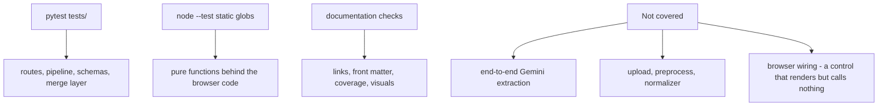

# Running the tests

Three independent suites cover this repository: Python, JavaScript, and the
documentation checks. None of them requires GemPy, a Gemini API key, or network
access.



*Three suites and the space they leave uncovered, including browser wiring.*

## The three commands

Python, from the repository root:

```bash
python -m pytest tests/ -q
```

JavaScript, using Node's built-in runner. **The globs must be quoted, and a
directory must never be passed instead**:

```bash
node --test "poggio_webapp/static/**/*.test.mjs" "docs/javascripts/**/*.test.mjs"
```

Passing a directory does not under-discover; it over-discovers. Node collects
every `.js` file it finds, including the browser-only glue, and dies with:

```
Error [ERR_MODULE_NOT_FOUND]: Cannot find package 'three'
imported from poggio_webapp/static/shared/model3d-viewer.js
```

That reads as a broken install and is not one. `three` is vendored under
`poggio_webapp/static/vendor/three/` and resolved in the browser by the import
map in `poggio_webapp/templates/index.html`; Node has no import map, and the two
files that need it (`shared/model3d-viewer.js` and `visualizer/volume3d.js`)
also need WebGL, a canvas, and a `document`, so making the specifier resolve
would not make them runnable. They are browser-only by nature, not by
convention.

`poggio_webapp/static/module-layering.test.mjs` keeps that boundary true rather
than assumed. It fails if any file outside those two imports `three`, if either
of them stops importing it, or if any import chain starting at a test file
reaches one of them, transitively, because the mistake that actually happens is
one hop removed: a core module grows an import of the glue, and a test nowhere
near it starts failing with a module-resolution error.

The second glob covers the documentation's interactive components. It matters
most for the coordinate converter, which re-implements in JavaScript arithmetic
that already exists in Python. Its tests pin the two together using values
produced by running the Python.

Documentation:

```bash
python tools/docs/check_docs.py .
```

```bash
python tools/docs/check_coverage.py .
```

```bash
python tools/docs/validate_visual_manifest.py .
```

```bash
python tools/docs/check_readme_sync.py .
```

Or, in one command, everything CI runs plus the `ruff` lint (which CI leaves
to `make`):

```bash
make check
```

`make` is the shortest path to a correct invocation: `make test` for Python,
`make test-js` for JavaScript (which owns the glob so nobody has to retype it),
`make check-docs` for the four checkers plus a strict site build, and
`make diagrams` to regenerate the SVGs and fail if the committed ones are stale.

All four checkers should pass with no failures. Exact totals move as tests are added,
so treat a green run rather than a specific count as the signal.

`check_coverage.py` reports any module under `poggio_webapp/pipeline/` or
`poggio_webapp/backend/` that no documentation page names by full path. It is a
coverage floor: it proves a module was named, not that it was explained.

`validate_visual_manifest.py` checks `docs/assets/visual-manifest.yml` against
the pages, in both directions: entries must be well formed, and every embedded
image must resolve to an `approved` entry.

`check_readme_sync.py` holds the root README against the site's navigation:
every nav section needs a README heading, every link into `docs/` must reach a
page that is actually in the navigation, and every embedded image must be an
approved manifest entry.

## What each suite covers

### Python: `tests/`

61 modules. Grouped by area rather than filename:

| Area | Modules |
|---|---|
| Multi-wall trenches | `test_merge_walls`, `test_merge_integration`, `test_trench_routes`, `test_trench_labels`, `test_trench_page`, `test_true_dip`, `test_trench_frames`, `test_trench_identity`, `test_surface_identity` |
| Site records and grids | `test_geospatial_sheet`, `test_locus_import`, `test_trench_layout`, `test_trench_records_routes`, `test_local_records`, `test_provenance`, `test_series_order`, `test_site_elevation`, `test_site_grid`, `test_site_vocab`, `test_site_vocab_parity` |
| Harris matrices | `test_harris_schema`, `test_harris_graph`, `test_harris_graph_scale`, `test_harris_store`, `test_harris_import`, `test_harris_suggestions`, `test_harris_routes`, `test_harris_pages`, `test_harris_render` |
| Canvas editor | `test_editor_routes`, `test_editor_session`, `test_editor_finalize`, `test_editor_status`, `test_editor_pipeline_service` |
| Text extraction | `test_extract_text`, `test_extract_text_contract`, `test_text_metadata_routes`, `test_text_autofill_workflow`, `test_verified_text_manual_integration` |
| GemPy and visualizer | `test_gempy_mesh_export`, `test_gempy_viewer_manifest`, `test_gempy_volume_export`, `test_visualizer_files_route`, `test_visualizer_calibration_integration`, `test_visualizer_static_dependencies`, `test_wall_traces` |
| Tracing and boundaries | `test_manual_routes`, `test_locus_top_boundaries` |
| Finds | `test_finds`, `test_finds_routes` |
| Schema and validation | `test_validator`, `test_schema_source_field` |
| Markers | `test_markers_calibration` |
| Demo and worked example | `test_demo`, `test_demo_routes`, `test_t905_worked_example` |
| Structure and conventions | `test_job_meta`, `test_job_path_containment`, `test_naming`, `test_tasks_runtime`, `test_url_map` |

`tests/fixtures/` and `tests/fixtures_merge.py` supply shared inputs.

The densest coverage is the merge layer (64 tests across `test_merge_walls`,
`test_merge_integration`, `test_trench_routes`, and `test_true_dip`), because
it is the part of the pipeline where a silent error produces a
plausible-looking wrong model rather than a crash.

### JavaScript: the documentation components

`docs/javascripts/` holds three progressive-enhancement modules: the coordinate
converter, the before/after comparison slider, and the pipeline stage explorer.
Each enhances markup that already stands on its own, so a reader with
JavaScript disabled loses the interaction, not the content.

Only the converter is tested, because only the converter duplicates logic that
exists elsewhere.

### JavaScript: `poggio_webapp/static/`

20 files, colocated with the modules they test rather than gathered into a test
directory. They cover the pure functions the browser code depends on: grid and
coordinate maths, Munsell colour handling, boundary labelling, site vocabulary,
the Harris schema core, the 3D surface and volume renderers, view-mode policy,
and the demo card's presentation logic.

Anything requiring a DOM is not tested here. The suites test extracted logic,
which is why they need no browser and no build step.

### Documentation: `tests/docs/`

Five modules (`test_check_docs`, `test_check_coverage`, `test_visual_manifest`,
`test_check_readme_sync`, and `test_generate_demo_assets`) test the tooling in
`tools/docs/`, not the prose. The prose is checked by running the tool itself.

`check_docs.py` verifies four things across every page in `docs/` and the root
`README.md`: relative links resolve inside the repository, images have non-empty
alt text, nav pages carry the five required front-matter keys, and no page is
missing from the MkDocs navigation.

## Running a subset

One module:

```bash
python -m pytest tests/test_merge_walls.py -q
```

One test by name:

```bash
python -m pytest tests/ -k "placeholder" -q
```

One JavaScript file:

```bash
node --test poggio_webapp/static/canvas/grid.test.mjs
```

## Before a documentation change lands

Run all four. The strict build catches link problems the checker permits,
because MkDocs rejects links from `docs/` to files outside it:

```bash
python tools/docs/check_docs.py . && python tools/docs/check_coverage.py . && python tools/docs/validate_visual_manifest.py . && python tools/docs/check_readme_sync.py . && mkdocs build --strict && python -m pytest tests/docs -q
```

## What is not covered

Worth knowing before trusting a green run:

- No end-to-end extraction test. Gemini extraction requires a key and
  network access; `test_schema_source_field` covers output provenance, not the
  network call.
- No upload, preprocessing, or normalizer test. See
  [capability status](../project/capability-status.md), which records this per
  capability.
- No browser-level test. The JavaScript suites test extracted logic, so a
  wiring regression (a control that renders but calls nothing) passes.

That last gap is exactly how the canvas editor sat in a `blocked` state while
its routes and canvas tests all passed.

## Related

- [Capability status](../project/capability-status.md): which tests back which
  capability.
- [Synthetic fixtures](../fixtures/README.md): the sanitized inputs used by
  documentation tests.
