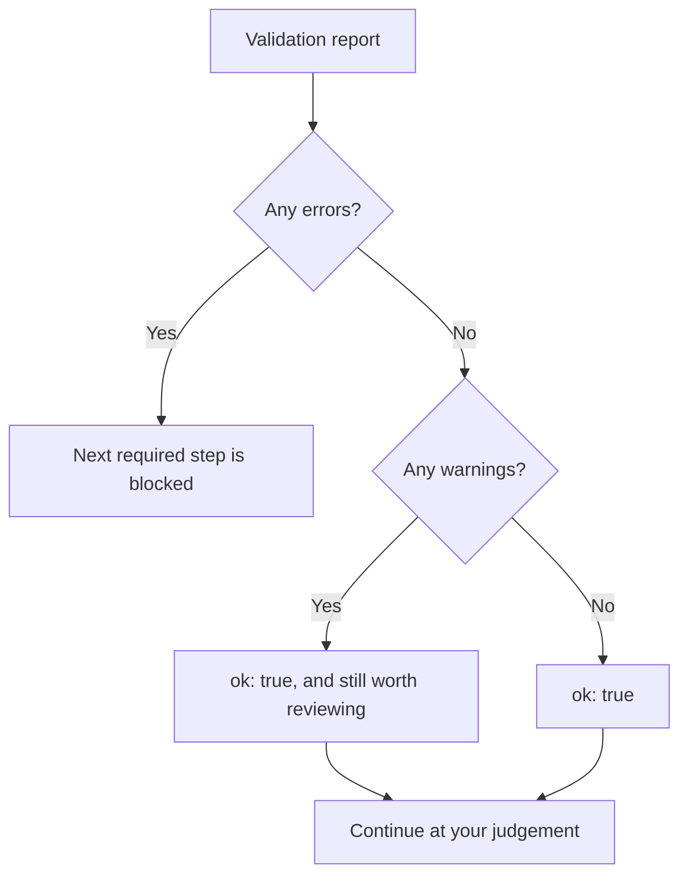

# Validation Rules

This reference documents all data-validation checks performed by the application. Validators run automatically during editor finalisation (after normalization) or when explicitly requested via `/api/jobs/<job_id>/validate`.



*A report can carry warnings and still report ok. Clean is not the same as correct.*

## Validation Defaults

All thresholds can be overridden in validation requests; these are the application defaults:

```python
DEFAULT_MONOTONIC_TOLERANCE_M = 0.02  # 2 cm
DEFAULT_TOP_CONTINUITY_TOLERANCE_M = 0.10  # 10 cm
DEFAULT_MAX_PLAUSIBLE_DEPTH_M = 5.0  # 5 meters
```

## Validation Report

The validator returns:

```json
{
  "errors": [
    "[ERROR] <location>: <message>",
    ...
  ],
  "warnings": [
    "[WARN]  <location>: <message>",
    ...
  ],
  "ok": true | false
}
```

(The `[WARN]` prefix carries two spaces, aligning it with `[ERROR]`.)

- **`ok: true`** — no errors (warnings permitted)
- **`ok: false`** — one or more errors; data should not proceed to conversion

---

## Rule Categories

### 1. Structural Checks

| Rule | Level | Trigger | Message |
|------|-------|---------|---------|
| Null-string detection | warning | Field contains `"null"`, `"None"`, `"n/a"` (as strings) | `literal string "<value>" — should this be a real null?` |
| Root structure | error | No `trenchProfiles` AND not a field-wall profile | `root: no trenchProfiles` |
| Face structure | warning | Face has no layers | `<face>: no layers` |

### 2. Coordinate Validity

| Rule | Level | Trigger | Notes |
|------|-------|---------|-------|
| Non-null coordinate pairs | error | Boundary point has one coordinate null but no confidence note | `boundary[i]: null coordinate with no confidence note explaining why` |
| Negative depth | error | Any `depthMeters` or `yCoordinateMeters` < 0 | `boundary[i]: negative depth <value> (depth is positive-down)` |
| Implausible depth | warning | Any depth > `max_plausible_depth` (default 5.0 m) | `boundary[i]: implausibly deep (<value> m)` |
| X-monotonicity | warning | Boundary x-coordinates not left-to-right | `boundary: x-coordinates not left-to-right: <list>` |

### 3. Layer Geometry

| Rule | Level | Trigger | Notes |
|------|-------|---------|-------|
| Layer crossing | **error** | Bottom of layer N is ABOVE bottom of layer N-1 by > `monotonic_tolerance` | `<layer>: bottom at x=<x> is ABOVE <prev_layer>'s bottom — layers cross` |
| Layer overlap/void | warning | Top of layer N differs from bottom of layer N-1 by > `top_continuity_tolerance` | `<layer>: top at x=<x> is far from <prev_layer> bottom — possible void/overlap` |
| Grid label mismatch | warning | `gridLabels` and `gridLabelXMeters` length differ | `<face>: gridLabels (...) and gridLabelXMeters (...) differ in length` |

### 4. Fabrication Detection

These warnings flag automatic extraction results that may be computer-generated rather than hand-traced. Both checks are skipped when the document's `source` is `"manual_editor"` — hand-traced boundaries are exempt.

#### Uniform Spacing (Field-Wall and Illustrator)

| Rule | Level | Trigger | Notes |
|------|-------|---------|-------|
| Regular intervals | warning | Boundary vertices spaced at uniform intervals with coefficient of variation < 0.02 | `<layer> bottom: boundary vertices are evenly spaced every <interval> m — signature of estimated points, not marked vertices` |

**Coefficient of Variation (CV):** $\text{CV} = \frac{\sigma}{\mu}$ of x-interval spacings. Real boundaries: CV ≈ 0.20; fabricated: CV ≈ 0.00.

#### Parallel Offset (Field-Wall and Illustrator)

| Rule | Level | Trigger | Notes |
|------|-------|---------|-------|
| Copied boundaries | warning | Two layers have identical boundary shapes offset by constant depth within 0.5 cm tolerance | `layers <layer1> and <layer2> have identical boundary shapes offset by a constant <offset> m — almost certainly one boundary copied down` |

---

## Feature-Level Validation

### Feature Placement

| Rule | Level | Trigger | Notes |
|------|-------|---------|-------|
| Missing geometry | warning | Feature has no `shapePoints` AND no `approx*` coordinates | `<feature>: no shapePoints and no approx* coords — geometry may be trapped in description` |
| Shape outside layer band | warning | Feature polygon depth outside [layer top, layer bottom] by > `monotonic_tolerance` | `<feature>[i]: point depth <value> lies outside layer band [<top>, <bottom>]` |

---

## Field-Wall Specific Checks

These checks apply only to `FieldWallProfile` extractions (identified by `loci` and `layers`).

### Locus Tracking

| Rule | Level | Trigger | Notes |
|------|-------|---------|-------|
| Missing locus entry | warning | `layers[].locusNumber` references a locus not in `loci[]` | `<face>: layer references locus <num>, which has no entry in loci[] (no Munsell reading)` |
| Duplicate locus | warning | `loci[]` contains the same `locusNumber` more than once (readings are not compared) | `<face>: locus <num> appears <count> times in loci[] with different Munsell readings — the converter will use the first` |

### Grid Tie Points

| Rule | Level | Trigger | Notes |
|------|-------|---------|-------|
| Scale mismatch | warning | Ratio of label span to drawn span > 1.5 or < 0.67 (needs two or more numeric tie-point labels) | `<face>: tie-point labels span <span> units but were placed across only <extent> m of the drawing (<ratio>x apart). If those labels are metre marks, the extracted scale is wrong.` |

---

## Illustrator Specific Checks

### Grid Label Consistency

Applied to all `TrenchProfile` diagrams:

| Rule | Level | Trigger | Notes |
|------|-------|---------|-------|
| Grid mismatch | warning | `trenchProfile.gridLabels` and `gridLabelXMeters` differ in length | `<face>: gridLabels (...) and gridLabelXMeters (...) differ in length` |

---

## Validation Flow

### Step 1: Null-String Scan

Entire document is scanned for literal strings like `"null"`. Warnings are emitted for every occurrence.

```python
def scan_null_strings(obj, path, report):
    # Recursively scans dict, list, and string values
```

### Step 2: Root Structure

- If document lacks `trenchProfiles`, check if it's a field-wall profile (has `loci` or `layers`)
- If neither, error
- If field-wall, adapt it to a `TrenchProfile` format for unified checks

```python
# Field-wall adaptation creates synthetic trenchProfiles from loci/layers
adapted, notes = convert_coords.fieldwall_to_profiles(data)
```

### Step 3: Per-Face Validation

For each face in `trenchProfiles`:

1. Check grid label/x-coordinate array lengths
2. For field-wall source: check locus tracking and grid tie points
3. For each layer: check layer crossing and continuity
4. For each layer: check fabrication (uniform spacing, copied boundaries)
5. For each feature: check placement

```python
def check_face(face, report, ...):
    # Orchestrates layer-by-layer checks
```

### Step 4: Return Report

```python
return {
    "errors": report.errors,
    "warnings": report.warnings,
    "ok": len(report.errors) == 0,
}
```

---

## Adjusting Tolerances

Validation accepts override parameters:

```bash
POST /api/jobs/<job_id>/validate
{
  "monotonic_tolerance": 0.05,
  "top_continuity_tolerance": 0.15,
  "max_depth": 10.0
}
```

| Parameter | Unit | Interpretation |
|-----------|------|-----------------|
| `monotonic_tolerance` | meters | Layers below this distance apart don't trigger "crossing" error; still warn at top_continuity_tolerance |
| `top_continuity_tolerance` | meters | Layer bottoms and tops further apart than this trigger "possible void/overlap" warning |
| `max_depth` | meters | Coordinates deeper than this trigger "implausibly deep" warning (not error) |

### Example Use Cases

- **High overlap tolerance** (e.g., 0.20 m): Accept drawings with larger gaps between layers
- **Strict monotonicity** (e.g., 0.01 m): Catch even small layer inversions
- **Deep trench** (e.g., 15 m): Suppress implausible-depth warnings in very deep excavations

---

## Handling Validation Failures

### If `ok: false` (Errors Present)

Do not proceed to coordinate conversion. Errors indicate:

- Missing critical geometry (entire layer, face)
- Layer inversion (stratigraphy contradiction)
- Broken data structure (no profiles/loci)

Fix extraction or tracing and re-run validation.

### If `ok: true` but Warnings Exist

Data can proceed. Warnings are informational:

- Feature geometry hints suggest manual review
- Fabrication patterns suggest re-extraction
- Scale mismatches hint at transcription errors

The user can accept warnings and continue, or re-extract/re-trace.

---

## Common Validation Scenarios

### Scenario 1: AI Extraction with Uniform Spacing

**Symptom:** High uniform-spacing warning on field-wall bottom boundaries

**Cause:** Gemini may estimate points at fixed intervals rather than reading marked vertices

**Resolution:** Request manual tracing or re-extract with a clearer image

### Scenario 2: Layer Crossing Error After Manual Tracing

**Symptom:** `bottom at x=<x> is ABOVE <prev_layer>'s bottom — layers cross`

**Cause:** User traced layer bottom above the previous layer's bottom (possible calibration or tracing error)

**Resolution:** Re-open the manual editor, review calibration, and re-trace the affected layers

### Scenario 3: Grid Scale Mismatch Warning

**Symptom:** `tie-point labels span X units but were placed across only Y m of the drawing (Zx apart)`

**Cause:** Transcribed grid-cell labels don't match drawn grid extent; scale may be wrong

**Resolution:** Verify that the drawn grid cells and transcribed labels agree; adjust `gridSquareCm` if needed

---

## Under the Hood

Validation is deterministic and uses no external services or ML models. All checks use only the extracted/traced JSON and the threshold parameters.

The validator does not modify data; it only reports issues. To fix issues, users:

- Re-run extraction with different parameters
- Re-trace manually with corrected calibration
- Upload corrected JSON
- Adjust validation thresholds if warnings are acceptable

All validation errors and warnings are printed to a structured report that the frontend can display with appropriate severity colors or icons.
