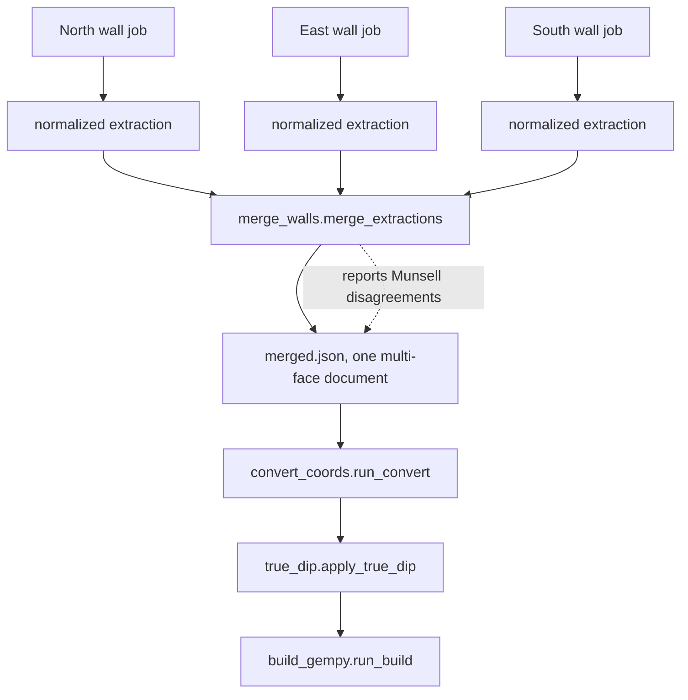

# Combine walls into one trench

Merge several single-wall drawings into one document and build a single 3D
model of the whole trench.

!!! note

    **This workflow has a page, but nothing links to it.** Open <http://localhost:5000/trenches> directly. Like the [finds page](logging-finds.md), it works and is tested, but you have to know the address — no control anywhere else in the application will take you there. See [capability status](../project/capability-status.md).

    The page lists every trench, shows which walls are ready, and runs the build (the button is labelled "Build the combined model") with task polling. When a stored registration exists for a trench the page pre-fills the grid textarea from it (see step 2), and demonstration trenches carry a provenance badge on their heading. The HTTP requests documented below are what it calls, and remain the way to script the workflow or read a response in full.


*Correct registration is what turns four independent drawings into one trench.*

## Before you start

A trench is not a job. One job holds **one sheet**, and a field sheet records
**one wall**, so a four-walled trench lives across four jobs. Read
[jobs, sheets, and trenches](../concepts/jobs-sheets-and-trenches.md) first if
that split is unfamiliar.

Each wall's job must already have:

- a **trench label**, identical across all the walls you want to combine;
- a **wall label**, different for every wall in that trench;
- a **normalized extraction**, produced by [clean up the data](04-clean-data.md).

Both labels are optional form fields on upload, handled in
`poggio_webapp/backend/routes/scans.py`, as are the season, site grid, and
locus epoch fields the build consults before combining sheets. A job with no
trench label is skipped silently — most jobs are single sheets that were never
assigned to a trench.

You also need real surveyed registration for every wall. This workflow will
refuse to build without it, and that refusal is deliberate: see
[Why placeholders are fatal here](#why-placeholders-are-fatal-here).



*The merge runs before coordinate conversion, because everything after extraction is already multi-face.*

## Do this

### 1. See how the jobs are grouped

```bash
curl http://localhost:5000/api/trenches
```

The response maps each trench label to its member jobs, with `has_normalized`
telling you which walls are ready:

```json
{
  "trenches": {
    "DEMO-TRENCH": [
      {"job_id": "…", "wall_label": "North", "sheet_type": "fieldwall", "has_normalized": true},
      {"job_id": "…", "wall_label": "South", "sheet_type": "fieldwall", "has_normalized": true}
    ]
  }
}
```

Members also carry the `season`, `locus_epoch`, `site_grid`, and
`recorded_label` fields from upload, plus a `demo` provenance block for seeded
demonstration data. A top-level `label_variants` map appears when a trench's
jobs were recorded under more than one spelling of its label.

### 2. Ask for a starter configuration

Post a build with no `grid` key. Nothing is written; you get a starter config
and the merge notes back.

```bash
curl -X POST http://localhost:5000/api/trenches/DEMO-TRENCH/build \
  -H 'Content-Type: application/json' -d '{}'
```

The response has `"needs_grid": true`, a `starter` config with one entry per
face, and a `notes` list. **Read the notes.** They record every judgement the
merge made — derived wall labels, disagreeing Munsell readings, and inferred
layer ordering.

You may not need the starter at all. When a registration has already been
derived and stored for this trench (a `grid_config.json` in its trench
directory, as the demo seeder writes), `GET
/api/trenches/<label>/registration` returns it along with its `source`
(`surveyed`, `placeholder`, or `unknown`) and notes; a 404 means none is
stored, the ordinary case for hand-entered values. The trenches page calls
this on load and pre-fills the grid textarea from it, so pasting a config into
an empty textarea is only the fallback. Configs can also be derived on demand
from survey records — see [place on site](06-place-on-site.md) for `POST
/api/trenches/<label>/layout` and `POST /api/trenches/geospatial-sheet`.

### 3. Replace every placeholder value

For each face, set `originX`, `originY`, `surfaceZ`, and `bearing_deg` from
your site records, exactly as in [place on site](06-place-on-site.md).

A starter config only becomes a trench if adjacent walls actually share their
corner coordinates. A per-sheet starter cannot know that, which is why the
starter's own `_comment` says so.

### 4. Build

```bash
curl -X POST http://localhost:5000/api/trenches/DEMO-TRENCH/build \
  -H 'Content-Type: application/json' \
  -d '{"grid": {"faces": {"North": {"originX": 0, "originY": 0, "surfaceZ": 100, "bearing_deg": 90}}}}'
```

A successful response returns a `task_id`, the accumulated `notes`, and
`grid_warnings`. Poll the task as described in
[asynchronous tasks](../architecture/asynchronous-tasks.md).

`grid_warnings` are non-fatal geometry observations — walls that do not meet at
a corner, for instance. The repository's convention is to report rather than
guess, so judging them is yours.

### 5. Retrieve the outputs

```bash
curl 'http://localhost:5000/api/trenches/DEMO-TRENCH/file?path=merged.json'
```

## What the application creates

Under `poggio_webapp/trenches/<safe-label>/`:

| Path | Contents |
|---|---|
| `merged.json` | One multi-face `trenchProfiles` document combining every wall |
| `points.csv` | Interface points in site coordinates |
| `points_orientations.csv` | Orientation rows for the same points |
| `06_gempy_model/` | The built model and its exports |

The label is made filesystem-safe by collapsing each run of characters outside
`A-Za-z0-9_.-` into an underscore, so `T104 South` becomes `T104_South`.

Nothing under `jobs/` is modified. The merge reads each wall's normalized
extraction and never mutates its input.

## Check your result

- Every wall you expected appears in `merged.json` under `trenchProfiles`.
- The notes list contains no surprises — particularly no derived wall labels
  you did not intend and no Munsell disagreements you have not reviewed.
- The face count in `points.csv` matches the number of walls.

## Common problems

Each of these is a deliberate refusal with a specific message, not a crash.

| Message | Cause | Fix |
|---|---|---|
| `no jobs are labelled trench …` | No job's `meta.json` carries that trench label | Set a trench label on each wall's job |
| `these jobs have no normalized extraction yet` | A wall stopped before normalization | Run [clean up the data](04-clean-data.md) on that job |
| `two or more sheets claim the same wall` | Duplicate wall labels, compared case-insensitively | Give each job a distinct wall label |
| `these sheets declare different locus numbering epochs …` | Locus numbers restart at each epoch, so one number means different deposits | Build each epoch as its own trench |
| `these sheets span non-consecutive seasons …` | Numbering may have restarted across the gap, and the app will not guess | Set a locus epoch on each job |
| `these sheets are recorded against different site grids …` | The two local grids' origins are about 1.5 million metres apart | Record the same site grid on every wall |
| `these faces still carry the starter placeholder registration` | Step 3 was skipped | Enter real survey values |
| `the grid config has no entry for these faces` | A face would be silently dropped | Add the missing face to the config |
| `these faces have no surfaceZ in the grid config` | The corner's opening elevation was never recorded, so depths convert to no elevation | Supply the elevation, or build the registered walls on their own |
| `conversion produced no interface points` | The walls' layers have no boundary points | Check the tracing on each wall |
| `gempy import failed` | GemPy is not installed | `pip install gempy gempy_viewer --break-system-packages` |

A contradiction between walls raises a different error. If wall A puts locus 3
above locus 5 and wall B puts 5 above 3, the ordering has a cycle and the build
stops, naming the surfaces actually on the cycle. It does not guess an order.

### Why placeholders are fatal here

A single-sheet build tolerates the starter values `0, 0, 100, 90` because one
face has no neighbours to be wrong about. Merged models amplify
mis-registration instead: identical placeholders lay every wall along the same
bearing, producing a row of parallel walls roughly 10 m apart rather than four
walls around a pit. The result looks like a confident model and is a model of
nothing, so the build refuses rather than producing it.


*Why placeholder registration is fatal for a merged build: a confident-looking model of nothing.*

## Under the hood

`pipeline/merge_walls.py` exists because everything downstream of extraction —
grid config, conversion, and the GemPy build — is already multi-face, while a
`FieldWallProfile` sheet is single-wall. The merge has to happen *before*
coordinate conversion.

One rule shapes the whole module: **GemPy fuses interface points into a
surface by exact string match on the surface name.** The same locus recorded on
two walls is one deposit and must receive one identical name; two different
deposits must never collide.

A surface's name is therefore its **identity**, and only a deposit's identity
belongs in it. Field sheets name surfaces `Locus N` — the locus number alone.
The Munsell reading travels beside it as a display label, `Locus 6 (10YR 5/3
brown)`, which is what you see in the viewer.

This used to work the other way, and the difference is worth knowing if you
have older models. When the reading was part of the name, two walls describing
one deposit slightly differently produced two model surfaces — so the merge
computed a trench-wide canonical reading and rewrote every sheet to use it,
forcing a field observation to agree so that an identity would. Taking the
colour out of the identity removed the failure and the workaround together. A
disagreement between walls is still reported as a note; it is simply no longer
resolved on your behalf, and your sheets are no longer edited.

When the same deposit was recorded under *different* locus numbers on different
walls, pass a `correlation` map of `"wall:locus"` to the canonical number.

Series order is derived rather than assumed, from the best evidence available.
An order supplied in the build request (`series_order`) wins; failing that, a
Harris matrix recorded for this trench is used (two matrices for one trench is
a refusal); failing that, the layer sequence recorded on the walls. For the
recorded sequence, each face's layers are already top-to-bottom, so every
adjacent pair is an ordering constraint; the constraints from all faces are
merged and topologically sorted, with ties broken by first-seen order so the
result is deterministic. If none of these yields an order, the build falls
back to sorting by mean elevation and labels that as a warning in the notes.

### Merged orientations and true dip

Coordinate conversion gives every orientation seed the azimuth of the wall it
was measured on, and the dip measured *along* that wall. On one wall that is
all anyone can know. On a merged trench that is wrong in a systematic way: one
surface arrives with a seed dipping toward the north wall's bearing and another
toward the east wall's, and an apparent dip is always shallower than the true
dip — so the model would fit a compromise plane matching neither drawing.

`poggio_webapp/pipeline/true_dip.py` solves the real problem: two walls that
are not parallel pin a plane down exactly, giving one true dip and dip azimuth
per surface. The trench build applies it after conversion:
`true_dip.apply_true_dip` rewrites the orientations CSV in place, changing
only each corrected seed's dip and azimuth — its position stays on its own
wall — and adds a note per corrected surface. Single-sheet builds never run
this pass, because one wall alone cannot determine the plane.

Where a solve is not available — a surface drawn on only one wall, or two walls
too nearly parallel — the seed keeps its apparent dip and the notes say why,
rather than inventing an orientation that would look like an improvement.

## Next

- [Create the model](07-create-model.md) for what the GemPy build does with
  these CSV exports.
- [Coordinate spaces](../concepts/coordinate-spaces.md) for the registration
  formula the merge relies on.
- [Running the tests](../reference/running-the-tests.md) — the merge layer has
  the densest test coverage in the repository.
