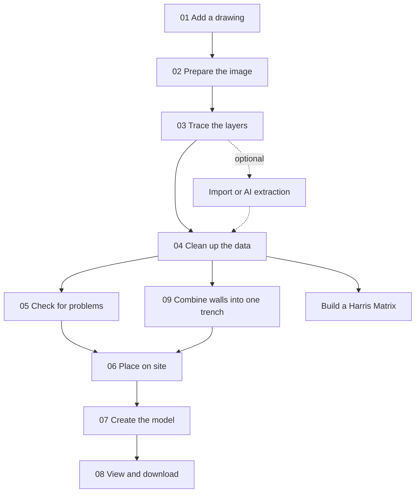

# Workflow overview

This path takes a trench drawing from upload to a saved manual extraction.

*The numbered path covers one sheet. Two branches leave it.*

## Before you start

Make sure the local app is running and that you have either a trench drawing or a synthetic example ready. The beginner path uses the manual tracing workflow, not an API key. Between preparing the image and tracing, the app inserts a "Check the writing" step for reviewing a sheet's written labels; automatic reading needs a Gemini API key, but the step can always be completed by continuing without it.

For a safe example, use the generated fixtures described in [docs/fixtures/README.md](../fixtures/README.md). The repository also accepts PNG, JPEG, TIFF, and PDF uploads.

## Do this

1. Input: a supported source file and a local app session.
   - Action: choose the drawing type, then upload the image or PDF.
   - Artifact: the job stores the uploaded scan and records the sheet type.
2. Input: the uploaded drawing.
   - Action: prepare the image so the lines are easier to see.
   - Artifact: a clearer working copy and optional high-contrast copy.
3. Input: the prepared image.
   - Action: calibrate the drawing, trace the relevant boundaries, and add names or notes.
   - Artifact: a manual extraction JSON file and any warnings from the save step.

## What the application creates

- A job directory under the repository's job workspace for each attempt.
- An uploaded scan artifact in the job's scan folder.
- A prepared working image in the preprocess folder.
- A manual extraction JSON in the extraction folder, plus metadata about calibration and the selected sheet type.

## Check your result

- The upload step reaches a preview and shows the drawing is ready.
- The preprocess step creates a clear working copy and leaves the original file unchanged.
- The trace step produces a saved JSON artifact with the expected boundary and feature counts.

## Common problems

- The upload is rejected because the file type is not allowed.
- The preprocess step looks too small, too dark, or too tilted.
- The trace step fails because the calibration points are too close together or the required lines are missing.

## Under the hood

The browser steps in `poggio_webapp/static/app/stages/scan.js`, `poggio_webapp/static/app/stages/preprocess.js`, and `poggio_webapp/static/app/stages/draw.js` drive the workflow. The server routes in `poggio_webapp/backend/routes/scans.py`, `poggio_webapp/backend/routes/preprocess.py`, and `poggio_webapp/backend/routes/manual.py` store the uploaded file, the prepared image, and the manual extraction.

## Where the path branches

The numbered steps above describe **one sheet**, which is what a job holds. Two
branches leave that path:

- Several walls of one trench. A hand-drawn field sheet records a single
  wall, so a whole trench spans several jobs. Take each wall through step 4
  (normalization) independently, then [combine walls into one
  trench](09-multi-wall-trench.md) to merge them and build one model. An
  illustrated sheet may already carry several faces, in which case no merge is
  needed. See [jobs, sheets, and
  trenches](../concepts/jobs-sheets-and-trenches.md).
- Chronology rather than geometry. A [Harris Matrix](harris-matrix.md) is
  built separately from any drawing job, and can import units from several
  finished jobs without changing them.

## Next

Start with [Add a drawing](01-add-drawing.md), then continue to [Prepare the image](02-prepare-image.md) and [Trace the layers](03-trace-layers.md).
